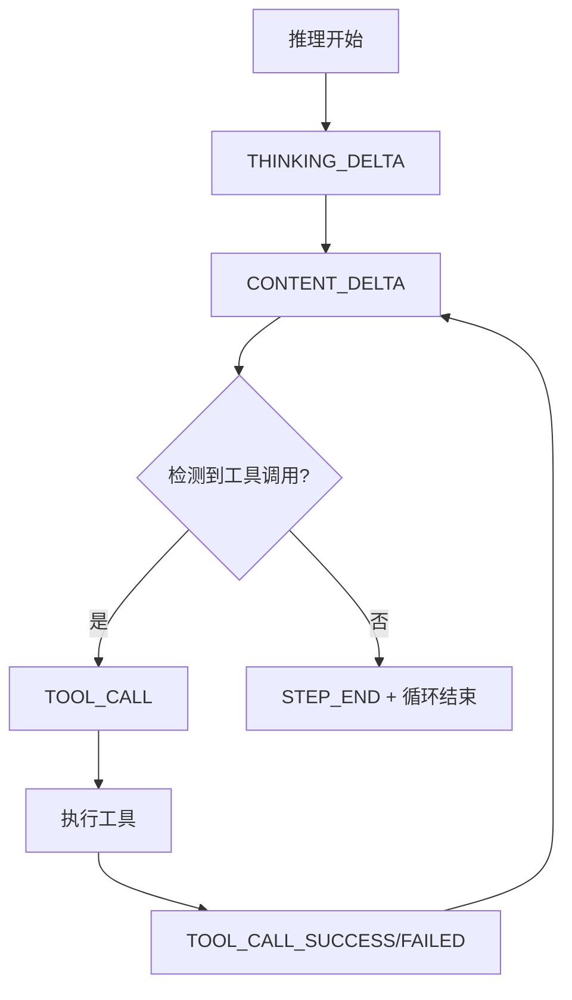

阶段五是六阶段分析流水线的核心执行层，负责对经过评分排序的模块进行深度代码分析。与前序阶段主要依赖 LLM 推理不同，深度研究阶段通过 **ReAct Agent** 实现自主化代码探索——Agent 具备文件系统工具访问能力，可主动读取源码、搜索引用、追踪调用链，最终生成结构化的模块分析报告。

Sources: [researcher.py](pipeline/researcher.py#L1-L40), [run.py](pipeline/run.py#L79-L113)

## 架构概览

### 阶段定位与数据流

```
┌─────────────┐    ┌─────────────┐    ┌─────────────┐    ┌─────────────┐
│  阶段四     │ →  │  阶段五     │ →  │  阶段六     │
│  模块打分   │    │  深度研究   │    │  汇总报告   │
└─────────────┘    └─────────────┘    └─────────────┘
      │                  │                  │
  ctx.modules      Module.research_report  ctx.final_report
  (带评分排序)       (每个模块独立生成)     (整合所有报告)
```

阶段五接收 `ctx.modules` 列表，每个 Module 包含 `name`（模块名）、`description`（描述）、`files`（文件路径列表）、`score`（评分）。输出时每个 Module 的 `research_report` 字段被填充为该模块的深度分析报告。

Sources: [types.py](pipeline/types.py#L13-L19), [run.py](pipeline/run.py#L79-L91)

### 执行模式

阶段五支持两种执行模式，通过配置项 `research_parallel` 控制：

| 模式 | 配置 | 适用场景 | 性能 |
|------|------|----------|------|
| **串行模式** | `research_parallel=False` | 模块数≤3 或调试阶段 | 逐一处理，易于追踪 |
| **并行模式** | `research_parallel=True` | 模块数≥4 且需要快速完成 | 多线程并发，默认 4 线程 |

并行模式下使用 `ThreadPoolExecutor` 提交任务，通过 `as_completed()` 实时汇报完成状态：

```python
with ThreadPoolExecutor(max_workers=ctx.research_threads) as executor:
    futures = {
        executor.submit(_observed_research_module, ctx, m, tools, report_dir, file_tree, session_id): m
        for m in ctx.modules
    }
    for future in as_completed(futures):
        # 实时打印完成状态
```

Sources: [run.py](pipeline/run.py#L82-L97)

## 核心流程详解

### 研究准备阶段

`prepare_research()` 函数在主循环开始前执行初始化，为所有模块研究共享同一套工具集和文件树信息：

```python
def prepare_research(ctx: PipelineContext) -> tuple:
    set_project_root(ctx.project_root)
    tools = [read_file, list_directory, glob_pattern, grep_content]
    file_tree = build_file_tree(ctx.all_files)
    return tools, file_tree
```

**文件树构建**采用递归渲染策略，将 `all_files` 列表转换为 ASCII 树形结构文本，作为 Agent 理解项目结构的上下文输入：

```
project/
├── agent/
│   ├── __init__.py
│   └── react_agent.py
├── pipeline/
│   ├── __init__.py
│   ├── researcher.py
│   └── ...
```

Sources: [researcher.py](pipeline/researcher.py#L11-L15), [utils.py](pipeline/utils.py#L5-L20)

### 单模块研究循环

`research_one_module()` 是核心执行单元，为每个 Module 独立执行 ReAct Agent 分析：

```python
def research_one_module(ctx, module, tools, report_dir, file_tree):
    module_files_json = json.dumps(module.files, ensure_ascii=False, indent=2)
    messages = get_compiled_messages("sub-agent",
        project_name=ctx.project_name,
        module_name=module.name,
        file_tree=file_tree,
        module_files_json=module_files_json,
    )
    events = react_stream(messages=messages, tools=tools, config=ctx.pro_config, max_steps=ctx.max_sub_agent_steps)
    module.research_report = collect_report(events)
```

**关键参数**：
- `pro_config`：使用 Pro 模型配置（如 Claude-3.5-Sonnet），平衡分析质量与成本
- `max_sub_agent_steps`：单个模块最大迭代次数，默认 30 步
- `module_files_json`：将文件列表序列化为 JSON，供 Agent 批量处理

结果写入报告文件：`报告目录/模块分析报告-{module.name}.md`

Sources: [researcher.py](pipeline/researcher.py#L18-L39)

### 报告提取机制

`collect_report()` 从 ReAct Agent 的事件流中提取最终报告内容：

```python
def collect_report(events) -> str:
    contents = [e.content for e in events if e.type == EventType.STEP_END and e.content]
    return contents[-1] if contents else "（未能生成报告）"
```

该函数监听 `STEP_END` 事件，取最后一个包含内容的步骤输出作为最终报告。当 Agent 判定任务完成（无新的 tool_call）时退出循环，最终报告即为最后一步的输出内容。

Sources: [utils.py](pipeline/utils.py#L35-L39), [base/types.py](base/types.py#L10-L11)

## ReAct Agent 工具集

### 工具定义与注册

文件系统工具通过 `@tool` 装饰器从普通函数转换为 LLM 可调用的 Tool 对象：

```python
@tool
def read_file(file_path: str) -> str:
    """Read the full contents of a file."""
    # ...
```

装饰器自动解析函数签名和 docstring，构建符合 OpenAI/Anthropic 协议的工具 schema：

```python
Tool(
    name="read_file",
    description="Read the full contents of a file",
    parameters={"file_path": ToolProperty(type="string", description="...")},
    required=["file_path"],
    func=read_file
)
```

Sources: [fs_tool.py](tool/fs_tool.py#L26-L35), [types.py](base/types.py#L137-L180)

### 四大核心工具

| 工具 | 用途 | 限制 |
|------|------|------|
| **read_file** | 读取文件完整内容 | 单文件最多 20KB，超出截断并提示 |
| **list_directory** | 列出目录下的文件和子目录 | 区分 DIR/FILE 并显示大小 |
| **glob_pattern** | 按 glob 模式搜索文件 | 自动过滤点开头的隐藏目录 |
| **grep_content** | 正则表达式全文搜索 | 最多返回 100 条匹配结果 |

工具设计强调**安全边界**：所有路径基于 `get_project_root()` 解析，防止 Agent 访问项目外部文件。`grep_content` 默认搜索所有文件，可通过 `file_pattern` 参数限定范围。

Sources: [fs_tool.py](tool/fs_tool.py#L37-L135)

### 线程安全的项目根配置

并行模式下多个模块同时研究，需要线程隔离的项目根路径。采用 `ContextVar` 实现线程安全的状态传递：

```python
_project_root_var: ContextVar[str] = ContextVar('project_root', default='')

def set_project_root(path: str) -> None:
    _project_root_var.set(path)

def get_project_root() -> str:
    return _project_root_var.get()
```

每个 `research_one_module` 调用前通过 `set_project_root()` 设置上下文，确保文件读取操作解析到正确的项目目录。

Sources: [fs_tool.py](tool/fs_tool.py#L18-L30)

## ReAct Agent 执行引擎

### 流式事件循环

`react_stream()` 实现 Observe → Think → Act 的 ReAct 循环，通过生成器模式实现流式事件输出：

```python
def stream(messages, tools, config, max_steps=MAX_STEP_CNT):
    adaptor = LLMAdaptor(config)
    step = 1
    
    while not react_finished and step <= max_steps:
        yield Event(type=EventType.STEP_START, step=step)
        
        # 1. LLM 推理（流式）
        for event in _stream(adaptor, messages, tools):
            yield event  # 透传流式事件
            if event.type == EventType.TOOL_CALL:
                tool, args = resolve_and_execute(event)
                tool_results[event.tool_id] = result
        
        # 2. 追加工具结果到消息历史
        messages.append(AssistantMessage(...))
        for raw_tc in raw_tool_calls:
            messages.append(ToolMessage(...))
        
        # 3. 检测是否需要继续循环
        if not raw_tool_calls:
            react_finished = True
```

每个步骤输出 `STEP_START` 和 `STEP_END` 事件，便于追踪和计时。工具调用结果通过 `ToolMessage` 追加到消息历史，供下一轮推理使用。

Sources: [react_agent.py](agent/react_agent.py#L47-L108)

### 事件类型体系



`STEP_END` 事件包含该步骤的完整 content 输出，即 Agent 的思考/分析文本。最终报告从最后一个 `STEP_END` 事件中提取。

Sources: [types.py](base/types.py#L7-L24)

## 提示词工程

### sub-agent 提示词结构

深度研究阶段使用 "sub-agent" 提示词模板，包含 System 和 User 两部分：

**System Prompt（SUB_AGENT_SYSTEM）** 定义：
- **角色**：资深软件工程师 & 代码架构分析师
- **工具说明**：四大工具的使用方式和限制
- **分析思路**：读文件 → 找关键代码 → 分析关系 → 生成报告
- **报告结构**：强制要求包含 Mermaid 图、代码片段、函数级别分析

**User Prompt（SUB_AGENT_USER）** 提供：
- 项目名称
- 模块名称
- 项目文件树（上下文）
- 本模块文件列表

```python
messages = get_compiled_messages("sub-agent",
    project_name=ctx.project_name,
    module_name=module.name,
    file_tree=file_tree,
    module_files_json=module_files_json,
)
```

Sources: [pipeline_prompts.py](prompt/pipeline_prompts.py#L139-L192), [langfuse_prompt.py](prompt/langfuse_prompt.py#L12-L23)

### 报告结构强制要求

提示词明确要求输出结构包含七大章节：

1. **模块定位**：职责、在项目中的地位
2. **核心架构图**：Mermaid flowchart 描述调用链和数据流
3. **关键实现**：1-2 个核心函数的代码片段和设计分析
4. **数据流**：Mermaid sequenceDiagram 描述处理流程
5. **依赖关系**：本模块引用和被引用情况（函数级别）
6. **对外接口**：公共 API 清单
7. **总结**：设计亮点、潜在问题、改进方向

强调"必须有实际代码片段"、"不能泛泛而谈"，确保报告具有实际参考价值。

Sources: [pipeline_prompts.py](prompt/pipeline_prompts.py#L143-L175)

## 集成与观测

### Langfuse 追踪集成

阶段五的每个模块研究都包装在 Langfuse 观察器中，便于追踪和分析性能瓶颈：

```python
def _observed_research_module(ctx, module, tools, report_dir, file_tree, session_id):
    with propagate_attributes(session_id=session_id):
        return observe(name=f"research_module:{module.name}")(research_one_module)(...)
```

并行模式下每个模块的追踪相互独立，可单独分析耗时分布。ReAct Agent 内部同样通过 `@observe` 装饰器记录推理和工具调用详情。

Sources: [run.py](pipeline/run.py#L115-L128), [react_agent.py](agent/react_agent.py#L38)

### 执行日志输出

运行时实时输出进度，便于监控长时研究的执行状态：

```
阶段 5/6: 子模块深度研究
  并行模式: 4 线程, 6 个模块
  ✓ 模块完成: core-agent
  ✓ 模块完成: llm-provider
  ✗ 模块失败: legacy-utils - ConnectionError
```

成功和失败分别标记，便于后续诊断。

Sources: [run.py](pipeline/run.py#L86-L98)

## 与其他阶段的关系

### 前序依赖

阶段五依赖阶段四的输出质量。若评分阶段遗漏重要模块或文件归类不当，深度研究将无法生成完整的项目分析。配置 `max_sub_agent_steps`（默认 30）限制单个模块的最大迭代次数，防止 Agent 在复杂模块上无限循环。

### 后续衔接

阶段五完成后，所有 Module 的 `research_report` 字段已填充。阶段六（汇总报告）读取这些报告，结合原始文件树和重要文件列表，由另一个 ReAct Agent 整合生成最终的项目深度分析报告。

```
阶段五输出          →  阶段六输入
Module.research_report  →  aggregator 提示词中的 <module_reports>
```

Sources: [aggregator.py](pipeline/aggregator.py#L16-L27), [run.py](pipeline/run.py#L100-L113)

## 配置参数

| 参数 | 默认值 | 说明 |
|------|--------|------|
| `max_sub_agent_steps` | 30 | 单模块最大 ReAct 迭代步数 |
| `research_parallel` | False | 是否启用并行模式 |
| `research_threads` | 4 | 并行模式线程数 |
| `pro_config.model` | - | 深度研究使用的模型配置 |

通过 `settings.json` 或 `settings.yaml` 配置，并跟随项目统一初始化到 `PipelineContext`。

Sources: [types.py](pipeline/types.py#L20-L28), [run.py](pipeline/run.py#L36-L40)

## 下一步

完成深度研究后，流水线进入 [阶段六：报告汇总](11-jie-duan-liu-bao-gao-hui-zong)，由聚合 Agent 整合所有模块报告生成最终的项目深度分析文档。

如需了解 ReAct Agent 的完整实现细节，请参阅 [ReAct Agent实现](13-react-agentshi-xian)。文件系统工具的设计可参考 [工具装饰器实现](20-gong-ju-zhuang-shi-qi-shi-xian) 和 [文件系统工具集](15-wen-jian-xi-tong-gong-ju-ji)。