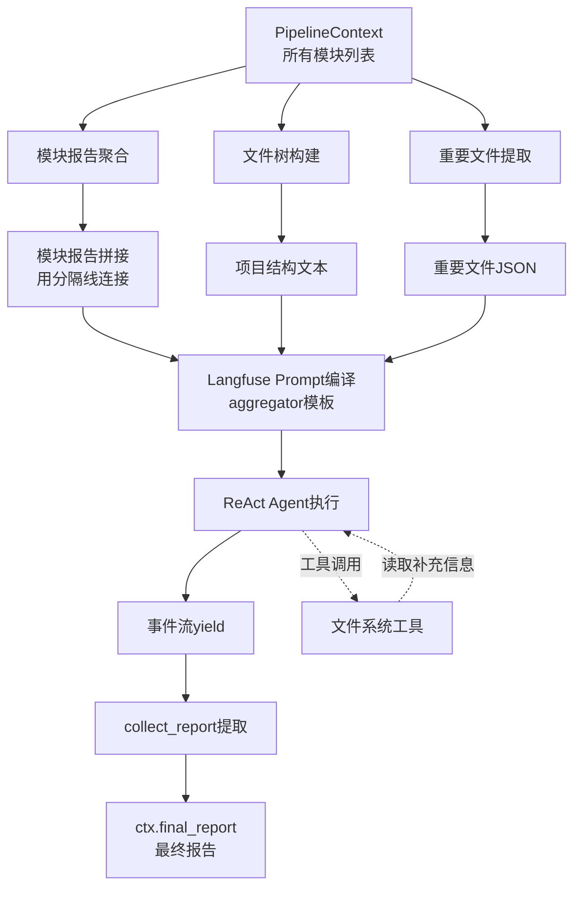
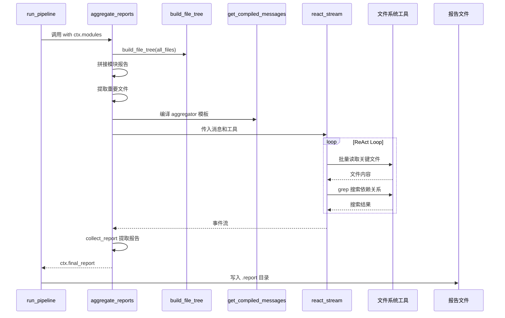

阶段六是整个六阶段分析流水线的最终环节，负责将前序阶段生成的各模块深度分析报告聚合成一份完整的项目分析报告。本阶段采用 ReAct Agent 模式，通过 LLM 驱动的自主探索和工具调用，完成从"碎片化模块报告"到"结构化综合报告"的升华。

## 核心流程架构

报告汇总阶段的工作流程可概括为三个核心步骤：上下文准备、ReAct Agent 自主探索、报告提取与输出。



整个流程由 `aggregate_reports` 函数驱动，该函数位于 `pipeline/aggregator.py` 的第 11-27 行，是阶段六的唯一入口函数。

Sources: [aggregator.py](pipeline/aggregator.py#L11-L27)

## 上下文准备机制

在启动 ReAct Agent 之前，阶段六需要完成三项准备工作：模块报告聚合、文件树构建、重要文件列表提取。

### 模块报告聚合

阶段五为每个模块生成了独立的深度分析报告，存储在 `Module` 对象的 `research_report` 属性中。`aggregate_reports` 函数使用换行分隔线将所有模块报告拼接成一个字符串：

```python
module_reports = "\n\n---\n\n".join(f"### 模块：{m.name}\n\n{m.research_report}" for m in selected)
```

这种拼接方式有两个优势：Markdown 分隔符使报告边界清晰，便于 LLM 识别不同模块的边界；每个模块报告作为独立章节，便于后续结构化整合。

Sources: [aggregator.py](pipeline/aggregator.py#L15)

### 文件树构建

`build_file_tree` 函数将阶段一扫描得到的文件列表转换为文本形式的目录树，采用缩进和连线符模拟真实的树形结构：

```python
def build_file_tree(files) -> str:
    tree = {}
    for f in files:
        parts = Path(f.path).parts
        node = tree
        for part in parts[:-1]:
            node = node.setdefault(part + "/", {})
        node[parts[-1]] = None
    lines = ["project/"]
    _render_tree(tree, lines, "")
    return "".join(lines)
```

文件树为 ReAct Agent 提供项目结构的全局视图，使其能够理解模块在整体架构中的位置。

Sources: [utils.py](pipeline/utils.py#L7-L19)

### 重要文件列表提取

阶段二通过 LLM 过滤标记的重要文件（`is_important=True`）被提取为 JSON 数组，供 ReAct Agent 在补充调研时优先关注：

```python
important_files = list({f for m in selected for f in m.files})
```

通过集合去重确保每个文件只出现一次，JSON 格式便于 LLM 直接解析和使用。

Sources: [aggregator.py](pipeline/aggregator.py#L17)

## Langfuse Prompt 模板编译

汇总阶段的提示词通过 Langfuse 平台管理，模板名称为 `aggregator`。`get_compiled_messages` 函数从 Langfuse 获取预定义的 system 和 user 消息模板，并将变量注入编译：

```python
messages = get_compiled_messages("aggregator",
    project_name=ctx.project_name,
    file_tree=file_tree,
    important_files=json.dumps(important_files, ensure_ascii=False, indent=2),
    module_reports=module_reports,
)
```

Langfuse 平台集中管理提示词，支持版本控制和 A/B 测试，而 `get_compiled_messages` 函数封装了获取和变量替换的逻辑，简化了调用方式。

Sources: [langfuse_prompt.py](prompt/langfuse_prompt.py#L10-L22)

### 汇总 Agent 提示词设计

汇总阶段的提示词采用"自主探索 + 结构化输出"的设计模式，系统提示词定义角色和工具后，用户提示词强调立即行动的紧迫性：

**系统提示词核心要点**：
- 角色定位为"技术架构分析师"
- 工具集包含 read_file、list_directory、glob_pattern、grep_content 四类文件操作工具
- 工作流程分三阶段：批量读取关键文件 → grep 补充 → 输出报告

**用户提示词约束**：
- 必须在 1-2 步内完成工具调用补充信息
- 收集足够信息后立即输出完整报告，不再调用工具
- 输出必须包含五个固定章节：项目概述、架构总览、模块详细分析、跨模块洞察、总结与建议

Sources: [pipeline_prompts.py](prompt/pipeline_prompts.py#L206-L269)

## ReAct Agent 执行机制

`react_stream` 函数封装了完整的 ReAct 循环，它接收消息列表、工具列表和配置参数，返回一个事件流生成器：

```python
events = react_stream(messages=messages, tools=tools, config=ctx.max_config, max_steps=ctx.max_sub_agent_steps)
ctx.final_report = collect_report(events)
```

### 工具配置

阶段六使用的工具与阶段五保持一致，均来自 `tool/fs_tool.py`：

| 工具名称 | 功能描述 | 并发安全 |
|---------|---------|---------|
| `read_file` | 读取文件内容，单次上限 20KB | ContextVar 隔离 |
| `list_directory` | 列出目录结构和文件大小 | ContextVar 隔离 |
| `glob_pattern` | 按 glob 模式搜索文件 | ContextVar 隔离 |
| `grep_content` | 正则搜索文件内容，最多 100 条 | ContextVar 隔离 |

所有工具通过 `set_project_root(ctx.project_path)` 设置项目根目录，确保文件路径解析的正确性。

Sources: [aggregator.py](pipeline/aggregator.py#L12-L13)

### 模型配置

汇总阶段使用 `max_config` 配置，该配置通常指向能力最强的模型（如 Claude Opus 或 GPT-4），以确保最终报告的质量。原因在于汇总阶段需要综合理解所有模块报告并生成结构化输出，对模型的理解能力和生成质量要求最高。

```python
config = ctx.max_config  # max_config 通常指向最优模型
max_steps = ctx.max_sub_agent_steps  # 默认 30 步
```

Sources: [aggregator.py](pipeline/aggregator.py#L26)

## 事件流与报告提取

ReAct Agent 的执行结果以事件流形式返回，每个事件包含类型和内容：

```python
def collect_report(events) -> str:
    """从 ReAct agent 事件流中提取最终报告内容。"""
    contents = [e.content for e in events if e.type == EventType.STEP_END and e.content]
    return contents[-1] if contents else "（未能生成报告）"
```

`collect_report` 函数从事件流中提取所有 `STEP_END` 类型事件的内容，取最后一个有效内容作为最终报告。这种设计基于一个假设：最终报告在 ReAct Agent 的最后一个完整步骤中输出，之前步骤的输出可能是中间思考或部分草稿。

Sources: [utils.py](pipeline/utils.py#L35-L38)

## 流水线集成

在 `run_pipeline` 中，阶段六作为流水线最后一个环节被调用：

```python
# ====== 阶段 6: 汇总报告 ======
print(f"\n{'='*60}\n阶段 6/6: 汇总最终报告\n{'='*60}")
_observed("aggregate_reports", aggregate_reports, ctx, ctx.modules, session_id=session_id)

final_path = os.path.join(report_dir, f"最终报告-{ctx.project_name}.md")
with open(final_path, "w", encoding="utf-8") as f:
    f.write(ctx.final_report)
```

Langfuse 的 `_observed` 包装器用于追踪阶段六的执行，支持性能监控和调用链路分析。最终报告以 Markdown 格式保存到 `.report/{project_name}/{timestamp}/` 目录下。

Sources: [run.py](pipeline/run.py#L110-L121)

## 完整数据流

阶段六的数据流可概括为以下路径：



## 输出质量保障

为确保最终报告的质量，提示词设计中包含以下约束：

| 约束类型 | 具体要求 |
|---------|---------|
| 结构约束 | 必须包含五个固定章节 |
| 语言约束 | 必须使用中文输出 |
| 内容约束 | 必须包含 Mermaid 架构图 |
| 代码约束 | 必须引用实际代码片段 |
| 风格约束 | 禁止废话铺垫，直接输出正文 |

这些约束通过 `AGGREGATOR_SYSTEM` 和 `AGGREGATOR_USER` 模板中的 `critical_reminders` 部分强调，确保 LLM 输出的报告符合预期格式。

Sources: [pipeline_prompts.py](prompt/pipeline_prompts.py#L253-L256)

## 与前序阶段的衔接

阶段六依赖于前序阶段的输出，这些依赖关系通过 `PipelineContext` 数据结构隐式传递：

| 前序阶段 | 输出数据 | 用途 |
|---------|---------|-----|
| 阶段一扫描 | `all_files: list[FileInfo]` | 构建项目文件树 |
| 阶段二过滤 | `FileInfo.is_important` | 提取重要文件列表 |
| 阶段五研究 | `Module.research_report` | 拼接模块报告 |

这种设计使阶段六成为纯粹的"聚合器"，无需关心报告是如何生成的，只需将已有的输出整合为最终报告。

Sources: [types.py](pipeline/types.py#L22-L41)

## 后续步骤

完成阶段六后，整个分析流水线结束。如需了解更多流水线整体设计，可阅读：

- [六阶段分析流水线](5-liu-jie-duan-fen-xi-liu-shui-xian) — 了解六阶段的整体设计理念
- [阶段五：深度研究](10-jie-duan-wu-shen-du-yan-jiu) — 了解模块报告的生成过程

如需深入理解 ReAct Agent 的实现细节，可阅读：

- [ReAct Agent实现](13-react-agentshi-xian) — ReAct 循环的完整实现解析
- [提示词体系设计](18-ti-shi-ci-ti-xi-she-ji) — 提示词模板的设计方法论