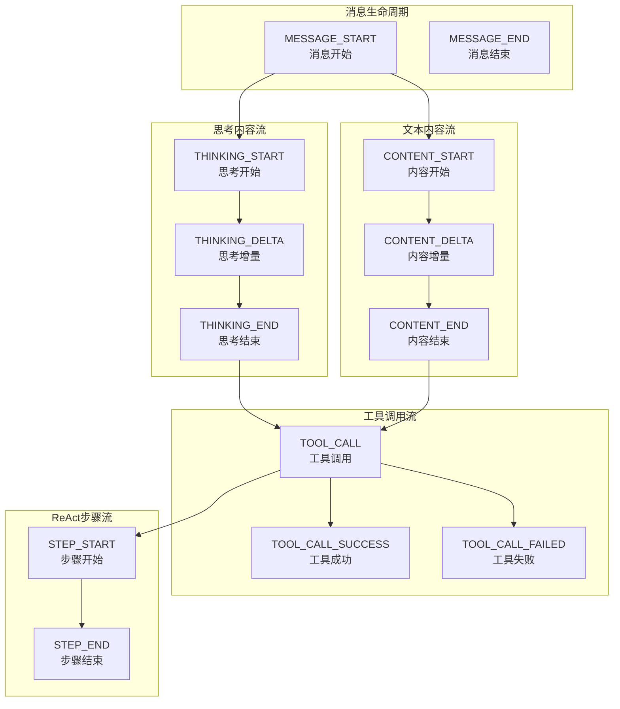
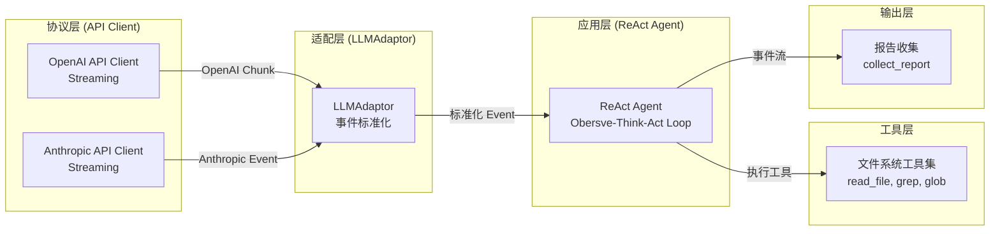
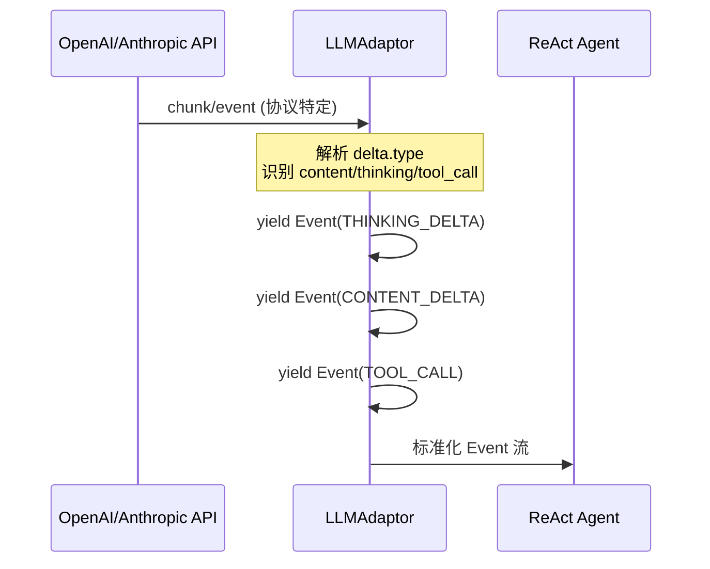
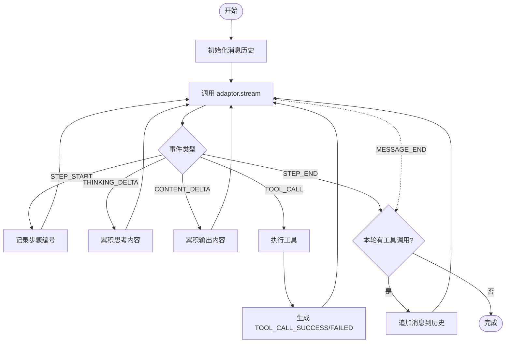
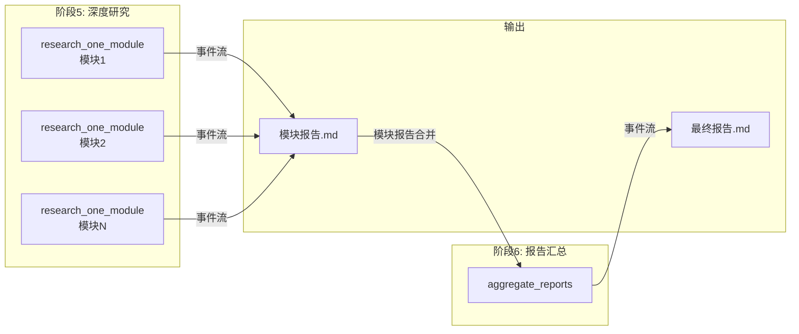
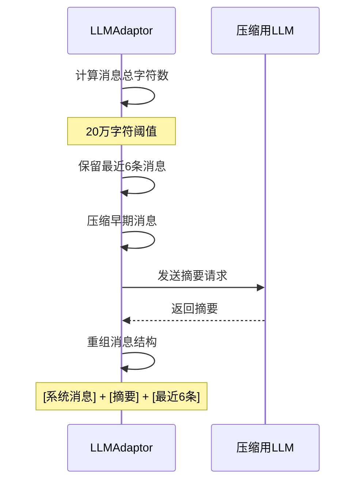

本文档描述 CodeDeepResearch 项目中事件流的分层架构设计，涵盖从底层 API 流式响应到上层 ReAct Agent 循环的完整事件生命周期。

## 事件类型体系

系统定义了一套统一的 `EventType` 枚举，封装了 LLM 流式交互中可能出现的所有事件类型。这套类型体系同时兼容 OpenAI 和 Anthropic 两种协议，是事件流架构的核心抽象层。



| 事件类型 | 触发时机 | 典型载荷 |
|---------|---------|---------|
| `MESSAGE_START` | LLM 开始生成响应时 | - |
| `MESSAGE_END` | LLM 响应完成时 | `stop_reason`, `usage` |
| `THINKING_START/DELTA/END` | 使用思维链模型时 | 思考过程文本 |
| `CONTENT_START/DELTA/END` | 生成普通文本时 | 输出内容片段 |
| `TOOL_CALL` | 检测到工具调用时 | `tool_id`, `tool_name`, `tool_arguments` |
| `TOOL_CALL_SUCCESS/FAILED` | 工具执行完成后 | `tool_result` 或 `tool_error` |
| `STEP_START/END` | ReAct 循环每轮开始/结束时 | `step` 编号 |

Sources: [base/types.py](base/types.py#L10-L27)

## 三层事件流架构

事件流采用分层设计，从底向上依次为：协议层（API Client）、适配层（LLMAdaptor）、应用层（ReAct Agent）。



### 协议层：原始流式事件

协议层负责与 LLM API 交互，生成各协议特定的流式事件对象。系统同时支持 OpenAI 和 Anthropic 两种协议，通过统一配置进行切换。

```python
# OpenAI 流式调用 - 返回 SSE chunk
for chunk in client.chat.completions.create(
    model=model, messages=messages, stream=True, ...
):
    choice = chunk.choices[0]
    delta = choice.delta
    # delta 包含 role, reasoning_content, content, tool_calls 等
```

Sources: [provider/api/openai_api.py](provider/api/openai_api.py#L41-L50)

```python
# Anthropic 流式调用 - 返回 Event 对象
for event in client.messages.create(
    model=model, messages=messages, stream=True, ...
):
    # event.type 可能是: message_start, content_block_start, 
    # content_block_delta, content_block_stop, message_delta, message_stop
```

Sources: [provider/api/anthropic_api.py](provider/api/anthropic_api.py#L47-L53)

### 适配层：事件标准化

`LLMAdaptor` 是事件流架构的核心枢纽，它将协议层的异构事件统一转换为标准 `Event` 对象。这使得上层 ReAct Agent 无需关心底层使用的是哪家 API 提供商。



适配层处理 OpenAI 协议的核心逻辑将原始 `delta` 对象映射为标准化事件：

```python
# 思考内容处理
if getattr(delta, 'reasoning_content', None):
    if not in_thinking:
        in_thinking = True
        yield Event(EventType.THINKING_START)
    yield Event(EventType.THINKING_DELTA, content=delta.reasoning_content)

# 工具调用处理
if delta.tool_calls:
    for tc in delta.tool_calls:
        idx = tc.index + 1
        if idx not in tools:
            tools[idx] = {"id": tc.id, "name": tc.function.name, "arguments": ""}
        # 累积参数片段
        elif tc.function.arguments:
            tools[idx]["arguments"] += tc.function.arguments
```

Sources: [provider/adaptor.py](provider/adaptor.py#L265-L310)

Anthropic 协议的适配处理略有不同，因为它原生支持结构化事件类型：

```python
elif event.type == "content_block_delta":
    if event.delta.type == "thinking_delta":
        yield Event(EventType.THINKING_DELTA, content=event.delta.thinking)
    elif event.delta.type == "text_delta":
        yield Event(EventType.CONTENT_DELTA, content=event.delta.text)
    elif event.delta.type == "input_json_delta":
        tools[idx]["arguments"] += event.delta.partial_json
```

Sources: [provider/adaptor.py](provider/adaptor.py#L320-L327)

### 应用层：ReAct Agent 循环

ReAct Agent 是事件流的消费者，它基于标准化事件实现了经典的 Observe-Think-Act 循环。



ReAct 循环的核心实现：

```python
while (not react_finished) and step <= max_steps:
    yield Event(type=EventType.STEP_START, step=cur_step)
    step = step + 1
    
    for event in _stream(adaptor, messages, tools):
        yield event  # 透传给上层
        if event.type == EventType.TOOL_CALL:
            tool = next((t for t in tools if t.name == event.tool_name))
            result, error = _execute_tool(tool, event.tool_arguments)
            yield Event(type=TOOL_CALL_SUCCESS/FAILED, ...)
    
    if not raw_tool_calls:
        react_finished = True  # 无工具调用则结束
        break
    
    # 累积消息，准备下一轮
    messages.append(AssistantMessage(content, tool_calls, thinking))
    for tc in raw_tool_calls:
        messages.append(ToolMessage(...))
```

Sources: [agent/react_agent.py](agent/react_agent.py#L51-L96)

## 流水线中的事件流

六阶段流水线中，事件流主要在**阶段五（深度研究）**和**阶段六（报告汇总）**发挥作用。这两个阶段都通过 ReAct Agent 生成报告。



### 并行与串行模式

阶段五支持并行和串行两种执行模式，通过 `research_parallel` 配置控制：

```python
if ctx.research_parallel:
    # 并行模式：多线程并发执行
    with ThreadPoolExecutor(max_workers=ctx.research_threads) as executor:
        futures = {
            executor.submit(_observed_research_module, ctx, m, tools, ...): m
            for m in ctx.modules
        }
else:
    # 串行模式：顺序执行
    for m in ctx.modules:
        _observed_research_module(ctx, m, tools, ...)
```

Sources: [pipeline/run.py](pipeline/run.py#L75-L95)

### 报告收集机制

`collect_report` 函数从事件流中提取最终报告文本：

```python
def collect_report(events) -> str:
    """从 ReAct agent 事件流中提取最终报告内容。"""
    contents = [e.content for e in events 
                if e.type == EventType.STEP_END and e.content]
    return contents[-1] if contents else "（未能生成报告）"
```

Sources: [pipeline/utils.py](pipeline/utils.py#L35-L39)

该函数监听所有 `STEP_END` 事件，提取其中包含的最终报告内容。由于 ReAct 循环的最后一轮不产生工具调用，`STEP_END` 事件的 `content` 字段即包含完整报告。

## 上下文压缩机制

事件流架构内置上下文压缩机制，当消息历史超过阈值（20万字符）时自动触发：



压缩实现位于 `adaptor._compress_if_needed` 方法：

```python
if total_chars <= MAX_CONTEXT_CHARS:  # 200,000
    return messages

# 保留系统消息和最近6条对话
to_keep = other_msgs[-COMPRESS_KEEP_RECENT:]  # 6条
to_compress = other_msgs[:-COMPRESS_KEEP_RECENT]
summary = self._summarize_messages(to_compress)

compressed = system_msgs + [
    {"role": "user", "content": f"[以下是之前对话的摘要]\n{summary}"},
    {"role": "assistant", "content": "好的，我已了解..."}
] + to_keep
```

Sources: [provider/adaptor.py](provider/adaptor.py#L97-L133)

## 事件与日志集成

系统通过 `log/logger.py` 中的 `Logger` 类提供调试支持，在 `DEBUG` 模式下输出事件详情：

```python
logger.debug(f"[ReAct] 步骤 {cur_step} 开始")
for event in _stream(adaptor, messages, tools):
    yield event
    if event.type == EventType.THINKING_DELTA:
        logger.debug(event.content, end="")
    elif event.type == EventType.CONTENT_DELTA:
        logger.debug(event.content, end="")
    elif event.type == EventType.TOOL_CALL:
        logger.debug(f"\n[ReAct] 调用工具: {event.tool_name}...")
```

Sources: [agent/react_agent.py](agent/react_agent.py#L68-L77)

## 架构优势

| 特性 | 实现方式 | 优势 |
|-----|---------|------|
| **协议统一** | LLMAdaptor 标准化层 | 支持 OpenAI/Anthropic 透明切换 |
| **流式处理** | Event Yield 机制 | 实时响应，支持长文本生成 |
| **错误隔离** | TOOL_CALL_FAILED 事件 | 单个工具失败不影响整体流程 |
| **上下文管理** | 自适应压缩 | 突破 token 限制处理大项目 |
| **并行扩展** | ThreadPoolExecutor | 多模块并行研究提升效率 |

---

**相关文档**：
- [ReAct Agent实现](13-react-agentshi-xian) - 深入了解 Agent 循环的具体实现
- [LLM适配器层](14-llmgua-pei-qi-ceng) - 协议适配层的完整源码解析
- [上下文压缩机制](19-shang-xia-wen-ya-suo-ji-zhi) - 压缩算法的详细说明