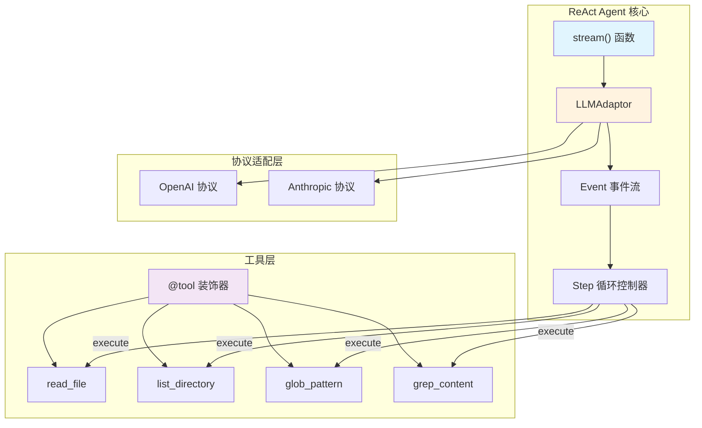
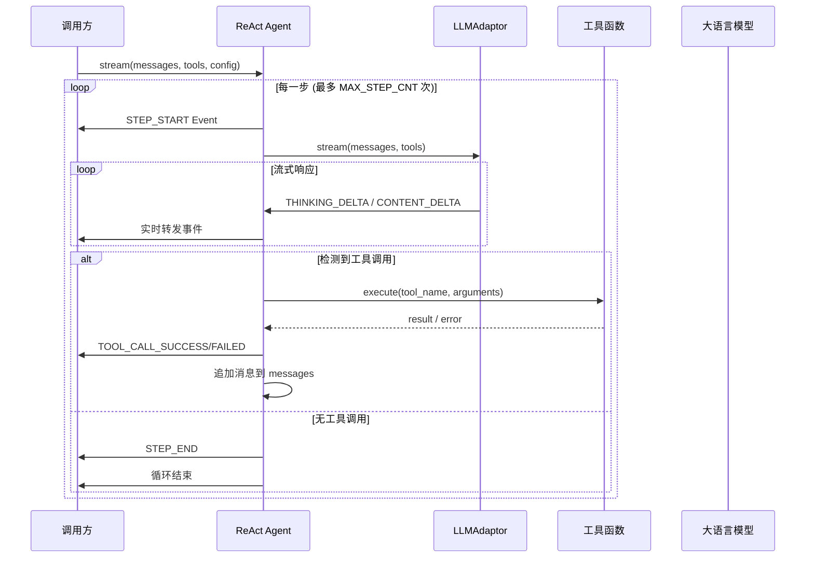

ReAct Agent 是代码深度研究系统的核心执行单元，采用经典的 **Observe → Think → Act** 循环模式，通过流式事件驱动实现与大型语言模型（LLM）的深度交互。本实现支持多轮工具调用、实时思考内容展示和上下文自动压缩。

## 核心架构概述

ReAct Agent 的设计采用事件流架构（Event Streaming Architecture），将 LLM 响应解构为细粒度事件，供上层应用实时消费和渲染。以下架构图展示 Agent 与各组件的交互关系：



## 事件类型系统

事件驱动是 ReAct Agent 的核心设计理念，通过 `EventType` 枚举定义完整的事件生命周期：

| 事件类型 | 用途 | 触发时机 |
|---------|------|---------|
| `MESSAGE_START` | 消息流开始 | LLM 开始输出首个 token |
| `THINKING_START/DELTA/END` | 思考内容 | 模型输出推理过程（支持 extended thinking） |
| `CONTENT_START/DELTA/END` | 最终回答 | 模型输出正式回复内容 |
| `TOOL_CALL` | 工具调用请求 | 模型要求执行工具 |
| `TOOL_CALL_SUCCESS/FAILED` | 工具执行结果 | 工具执行完成或失败 |
| `STEP_START/STEP_END` | 步骤边界 | 每个 Observe-Think-Act 循环的起止 |
| `MESSAGE_END` | 消息流结束 | 模型输出完成，包含 stop_reason 和 usage |

Sources: [base/types.py](base/types.py#L8-L22)

```python
@dataclass
class Event:
    type: EventType
    content: Optional[str] = None
    raw: Optional[dict] = None
    # Tool 相关
    tool_id: Optional[str] = None
    tool_name: Optional[str] = None
    tool_arguments: Optional[str] = None
    tool_result: Optional[str] = None
    tool_error: Optional[str] = None
    # 步骤编号
    step: Optional[int] = None
```

Sources: [base/types.py](base/types.py#L26-L41)

## Observe-Think-Act 循环实现

ReAct Agent 的核心逻辑封装在 `stream()` 函数中，返回一个生成器（Generator），yield 出一系列事件。以下是循环执行流程：



源码实现的核心循环结构：

```python
while (not react_finished) and step <= max_steps:
    yield Event(type=EventType.STEP_START, step=cur_step)
    
    content = ""
    thinking = ""
    raw_tool_calls = []
    tool_results = {}

    for event in _stream(adaptor, messages, tools):
        yield event
        if event.type == EventType.THINKING_DELTA:
            thinking += event.content or ""
        elif event.type == EventType.CONTENT_DELTA:
            content += event.content or ""
        elif event.type == EventType.TOOL_CALL:
            tool = next((t for t in tools if t.name == event.tool_name), None)
            result, error = _execute_tool(tool, event.tool_arguments)
            tool_results[event.tool_id] = {"result": result, "error": error}
            yield Event(type=EventType.TOOL_CALL_SUCCESS..., tool_result=result, tool_error=error)

    if not raw_tool_calls:
        react_finished = True
        break

    messages.append(AssistantMessage(content=content, tool_calls=raw_tool_calls, thinking=thinking))
    for raw_tc in raw_tool_calls:
        messages.append(ToolMessage(tool_id=tid, tool_name=raw_tc["name"], tool_result=tr["result"], tool_error=tr["error"]))
```

Sources: [agent/react_agent.py](agent/react_agent.py#L43-L107)

## 工具执行机制

### 工具定义与注册

工具通过 `@tool` 装饰器从普通函数自动转换为 `Tool` 对象，支持多协议格式输出：

```python
@tool
def read_file(file_path: str) -> str:
    """Read the full contents of a file.

    Args:
        file_path: Relative path from the project root
    """
    project_root = get_project_root()
    full_path = os.path.join(project_root, file_path) if project_root else file_path
    # ... 文件读取逻辑
```

Sources: [tool/fs_tool.py](tool/fs_tool.py#L28-L49)

`@tool` 装饰器自动完成以下转换：
1. 从函数签名提取参数名称和类型
2. 从 docstring 解析参数描述
3. 生成 OpenAI 和 Anthropic 两种格式的 schema
4. 绑定函数引用到 `Tool.func`

Sources: [base/types.py](base/types.py#L184-L216)

### 工具结果收集与消息追加

工具执行后，结果通过 `ToolMessage` 追加到对话历史：

```python
@dataclass
class ToolMessage(Message):
    def __init__(self, tool_id: str, tool_name: str, tool_result: Any = None, tool_error: Any = None):
        self.tool_id = tool_id
        self.tool_name = tool_name
        self.tool_result = tool_result
        self.tool_error = tool_error
        super().__init__("tool", "")

    def to_dict(self) -> dict:
        return {
            "role": "tool",
            "tool_id": self.tool_id,
            "tool_name": self.tool_name,
            "tool_result": self.tool_result,
            "tool_error": self.tool_error,
        }
```

Sources: [base/types.py](base/types.py#L134-L150)

## LLM 协议适配层

`LLMAdaptor` 是统一的流式接口，同时支持 OpenAI 和 Anthropic 协议：

```python
class LLMAdaptor:
    def __init__(self, config: dict):
        self._provider = config.get("provider", "anthropic")
        
        if self._provider == "openai":
            from provider.api.openai_api import call_stream_openai
            self._call_stream = call_stream_openai
        elif self._provider == "anthropic":
            from provider.api.anthropic_api import call_stream_anthropic
            self._call_stream = call_stream_anthropic
```

Sources: [provider/adaptor.py](provider/adaptor.py#L30-L50)

### 思考内容与内容分离

对于支持 extended thinking 的模型（如 OpenAI o1、Anthropic Claude），流式处理需要区分两种输出：

```python
# OpenAI 处理
if getattr(delta, 'reasoning_content', None):
    if not in_thinking:
        in_thinking = True
        yield Event(EventType.THINKING_START)
    yield Event(EventType.THINKING_DELTA, content=delta.reasoning_content)
else:
    if in_thinking:
        in_thinking = False
        yield Event(EventType.THINKING_END)

# Content 输出
if delta.content:
    yield Event(EventType.CONTENT_DELTA, content=delta.content)
```

Sources: [provider/adaptor.py](provider/adaptor.py#L284-L307)

## 上下文压缩机制

当对话上下文超过阈值（默认 200,000 字符），LLMAdaptor 自动触发压缩：

```python
def _compress_if_needed(self, messages) -> list:
    total_chars = sum(len(json.dumps(m, ensure_ascii=False)) for m in messages)
    if total_chars <= MAX_CONTEXT_CHARS:
        return messages

    # 保留最近 6 条消息，压缩早期对话
    system_msgs = [m for m in messages if m.get("role") == "system"]
    other_msgs = [m for m in messages if m.get("role") != "system"]
    
    if len(other_msgs) <= COMPRESS_KEEP_RECENT:
        return messages

    to_compress = other_msgs[:-COMPRESS_KEEP_RECENT]
    summary = self._summarize_messages(to_compress)
    
    # 追加摘要消息对
    compressed = list(system_msgs)
    if summary:
        compressed.append({"role": "user", "content": f"[以下是之前对话的摘要]\n{summary}"})
        compressed.append({"role": "assistant", "content": "好的，我已了解之前的分析内容，继续进行。"})
    compressed.extend(to_keep)
    
    return compressed
```

Sources: [provider/adaptor.py](provider/adaptor.py#L130-L156)

## 线程安全的项目根目录管理

使用 `ContextVar` 实现线程安全的上下文隔离，确保并行研究时的根目录设置不会互相干扰：

```python
from contextvars import ContextVar

_project_root_var: ContextVar[str] = ContextVar('project_root', default='')

def set_project_root(path: str) -> None:
    """设置当前研究会话的项目根目录（线程安全）。"""
    _project_root_var.set(path)

def get_project_root() -> str:
    """获取当前研究会话的项目根目录。"""
    return _project_root_var.get()
```

Sources: [tool/fs_tool.py](tool/fs_tool.py#L6-L25)

## 与流水线集成

ReAct Agent 在六阶段流水线中的**阶段五（深度研究）**发挥作用：

```python
def research_one_module(ctx: PipelineContext, module: Module, tools: list, report_dir: str, file_tree: str) -> None:
    """研究单个模块并生成报告。"""
    set_project_root(ctx.project_path)

    messages = get_compiled_messages("sub-agent",
        project_name=ctx.project_name,
        module_name=module.name,
        file_tree=file_tree,
        module_files_json=json.dumps(module.files, ensure_ascii=False, indent=2),
    )

    events = react_stream(messages=messages, tools=tools, config=ctx.pro_config, max_steps=ctx.max_sub_agent_steps)
    module.research_report = collect_report(events)
```

Sources: [pipeline/researcher.py](pipeline/researcher.py#L20-L39)

## 关键设计模式总结

| 设计模式 | 应用场景 | 实现方式 |
|---------|---------|---------|
| **生成器模式** | 流式事件输出 | `stream()` 返回 generator，按需 yield 事件 |
| **适配器模式** | 多协议支持 | `LLMAdaptor` 统一接口，封装 OpenAI/Anthropic 差异 |
| **装饰器模式** | 工具函数注册 | `@tool` 自动从函数生成 Tool 对象 |
| **上下文变量** | 线程隔离 | `ContextVar` 管理项目根目录 |
| **备忘录模式** | 压缩历史 | 对话摘要替代完整历史 |

Sources: [agent/react_agent.py](agent/react_agent.py#L1-L108), [provider/adaptor.py](provider/adaptor.py#L1-L385), [base/types.py](base/types.py#L1-L227)

## 下一步学习

- **[LLM适配器层](14-llmgua-pei-qi-ceng)**：深入了解 OpenAI 和 Anthropic 协议的具体实现细节
- **[工具装饰器实现](20-gong-ju-zhuang-shi-qi-shi-xian)**：掌握 `@tool` 装饰器的完整实现机制
- **[上下文压缩机制](19-shang-xia-wen-ya-suo-ji-zhi)**：学习对话压缩的完整策略