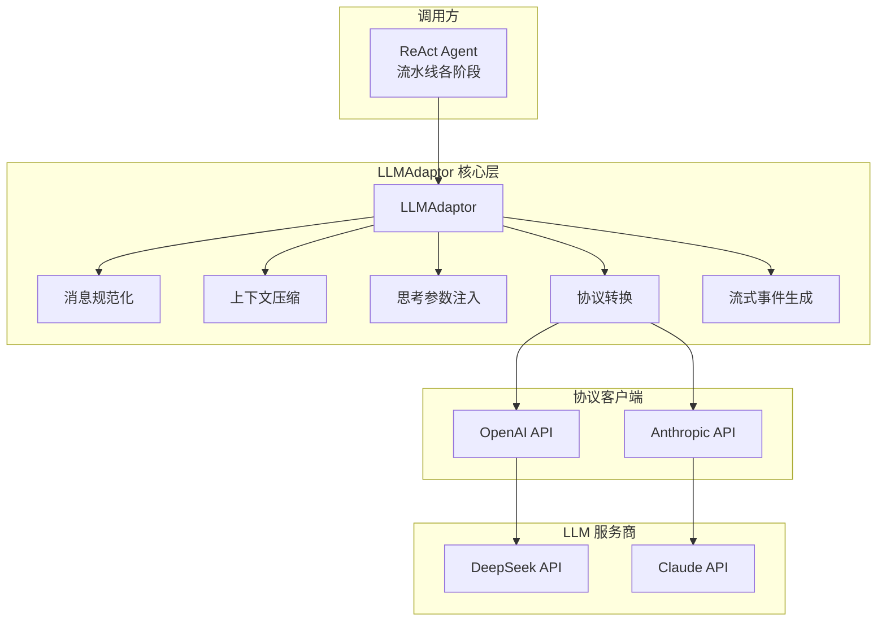
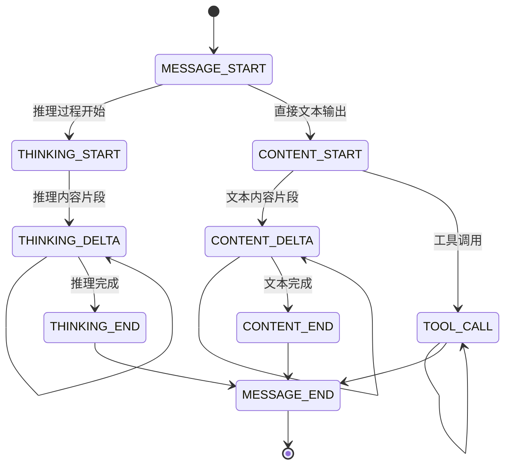

LLM适配器层是整个深度代码研究系统的核心抽象层，负责统一封装对不同LLM协议（OpenAI和Anthropic）的调用。该层通过单一的`LLMAdaptor`类向上层提供流式输出、工具调用、上下文压缩等关键能力，实现了业务逻辑与具体LLM服务商之间的完全解耦。

## 架构概览

LLM适配器层采用**适配器模式**（Adapter Pattern）设计，核心结构如下：



适配器层支持两种配置层级，分别应用于不同的流水线阶段：

| 配置层级 | 用途 | 思考模式 | 适用场景 |
|---------|------|---------|----------|
| `lite` | 快速过滤、初步分析 | 禁用 | 阶段二：文件过滤、阶段三：模块拆分 |
| `pro` | 平衡精度与速度 | 启用 | 阶段四：模块打分 |
| `max` | 深度研究 | 启用 + 高强度推理 | 阶段五：深度研究 |

Sources: [settings.py](settings.py#L7-L38)
Sources: [adaptor.py](provider/adaptor.py#L31-L50)

## 核心类设计

### LLMAdaptor 类

`LLMAdaptor`是适配器层的核心类，其构造函数接收包含provider、base_url、api_key、model等关键字段的配置字典：

```python
class LLMAdaptor:
    def __init__(self, config: dict):
        self._config = config
        self._provider = config.get("provider", "anthropic")
        
        if self._provider == "openai":
            from provider.api.openai_api import call_stream_openai, call_openai
            self._call_stream = call_stream_openai
            self._call = call_openai
        elif self._provider == "anthropic":
            from provider.api.anthropic_api import call_stream_anthropic, call_anthropic
            self._call_stream = call_stream_anthropic
            self._call = call_anthropic
```

**关键设计决策**：协议客户端采用**延迟导入**（Lazy Import）模式，仅在实际调用时才加载对应协议模块，这既避免了循环依赖，又确保了未使用的协议不会产生额外的内存开销。

Sources: [adaptor.py](provider/adaptor.py#L30-L50)

### 流式接口 stream()

流式方法是适配器的核心能力，返回一个生成器（Generator），yield出统一的`Event`对象：

```python
def stream(self, messages, tools=None, response_format=None, **kwargs):
    messages = normalize_messages(messages)
    params = {}
    messages = self._compress_if_needed(messages)
    
    if self._provider == "anthropic":
        messages = self._convert_messages_anthropic(messages, params)
    else:
        messages = self._convert_messages_openai(messages)
    
    # ... 工具格式转换、思考参数注入
    
    if self._provider == "openai":
        yield from self._stream_openai(messages, params, **kwargs)
    else:
        yield from self._stream_anthropic(messages, params, **kwargs)
```

流式方法完整流程包括：消息规范化 → 上下文压缩 → 协议转换 → 工具格式转换 → 思考参数注入 → 协议特定流式处理。

Sources: [adaptor.py](provider/adaptor.py#L52-L78)

### 同步接口 call() 与 call_for_json()

除了流式接口，适配器还提供两种同步调用方式：

| 方法 | 返回类型 | 适用场景 |
|------|---------|---------|
| `call()` | 完整文本字符串 | 简单问答、快速验证 |
| `call_for_json()` | JSON文本字符串 | 结构化输出、解析后使用 |

`call_for_json()`内部调用`call()`后通过`_extract_json()`函数提取响应中的JSON内容，该函数能智能处理被markdown代码块包裹的JSON格式：

```python
def _extract_json(text: str) -> str:
    """从 LLM 响应中提取 JSON（可能被 markdown 代码块包裹）。"""
    text = text.strip()
    if "```" in text:
        start = text.find("```")
        end = text.rfind("```")
        # ... 提取代码块内的内容
    for i, ch in enumerate(text):
        if ch in "[{":
            return text[i:]
    return text
```

Sources: [adaptor.py](provider/adaptor.py#L80-L108)
Sources: [adaptor.py](provider/adaptor.py#L12-L27)

## 协议转换机制

不同LLM协议的消息格式存在显著差异，适配器层通过`_convert_messages_openai()`和`_convert_messages_anthropic()`两个方法实现双向转换。

### OpenAI → Anthropic 转换

Anthropic协议的核心特点是将system消息单独提取，并通过content_blocks组织复杂的嵌套结构：

```python
def _convert_messages_anthropic(self, messages, params):
    system_msg = None
    user_messages = []
    tool_results = []
    
    for msg in messages:
        if msg.get("role") == "system":
            system_msg = msg["content"]
        elif msg.get("role") == "tool":
            tool_results.append({
                "type": "tool_result", 
                "tool_use_id": msg["tool_id"], 
                "content": result_content
            })
        # ...
    
    if system_msg:
        params["system"] = system_msg  # system消息通过params传递
    return user_messages
```

### Anthropic → OpenAI 转换

OpenAI协议使用`tool_calls`数组和`tool_call_id`来关联工具调用：

```python
def _convert_messages_openai(self, messages):
    converted = []
    for msg in messages:
        if msg.get("role") == "tool":
            converted.append({
                "role": "tool",
                "tool_call_id": msg["tool_id"],
                "content": str(msg.get("tool_result") or ""),
            })
        elif msg.get("role") == "assistant" and msg.get("tool_calls"):
            assistant_msg = {"role": "assistant"}
            if msg.get("reasoning_content"):
                assistant_msg["reasoning_content"] = msg["reasoning_content"]
            # ... 构建tool_calls数组
```

Sources: [adaptor.py](provider/adaptor.py#L210-L265)

## 流式事件系统

适配器层定义了统一的`EventType`枚举，封装了LLM响应的各个阶段：



每种事件类型对应不同的数据结构：

| EventType | 触发时机 | 携带数据 |
|-----------|---------|---------|
| `MESSAGE_START` | 响应开始 | 无 |
| `THINKING_START/END/DELTA` | 推理过程 | `content`: 推理文本 |
| `CONTENT_START/END/DELTA` | 文本输出 | `content`: 输出文本 |
| `TOOL_CALL` | 工具调用 | `tool_id`, `tool_name`, `tool_arguments` |
| `MESSAGE_END` | 响应结束 | `stop_reason`, `usage` |

Sources: [base/types.py](base/types.py#L8-L17)
Sources: [base/types.py](base/types.py#L25-L41)

## 上下文压缩机制

为防止上下文窗口溢出，适配器实现了智能压缩机制：

```python
MAX_CONTEXT_CHARS = 200_000
COMPRESS_KEEP_RECENT = 6

def _compress_if_needed(self, messages) -> list:
    total_chars = sum(len(json.dumps(m, ensure_ascii=False)) for m in messages)
    if total_chars <= MAX_CONTEXT_CHARS:
        return messages
    
    # 保留system消息和最近6条对话
    system_msgs = [m for m in messages if m.get("role") == "system"]
    other_msgs = [m for m in messages if m.get("role") != "system"]
    
    to_compress = other_msgs[:-COMPRESS_KEEP_RECENT]
    summary = self._summarize_messages(to_compress)
    
    # 替换为摘要
    compressed = list(system_msgs)
    compressed.append({"role": "user", "content": f"[以下是之前对话的摘要]\n{summary}"})
    return compressed
```

压缩策略保留最近6条消息（一个完整的ReAct循环），将更早的对话通过LLM生成摘要，实现有损压缩。

Sources: [adaptor.py](provider/adaptor.py#L130-L155)

## 思考参数注入

适配器支持为不同provider注入思考模式参数：

```python
def _inject_thinking_params(self, params):
    thinking = self._config.get("thinking")
    reasoning_effort = self._config.get("reasoning_effort")
    
    if self._provider == "openai":
        if reasoning_effort:
            params["reasoning_effort"] = reasoning_effort
        if thinking is not None:
            params.setdefault("extra_body", {})["thinking"] = {"type": "enabled" if thinking else "disabled"}
    elif self._provider == "anthropic":
        extra_body = params.setdefault("extra_body", {})
        if thinking is not None:
            extra_body["thinking"] = {"type": "enabled" if thinking else "disabled"}
        if reasoning_effort:
            extra_body["output_config"] = {"effort": reasoning_effort}
```

这种设计允许通过配置文件灵活控制不同层级的思考深度。

Sources: [adaptor.py](provider/adaptor.py#L110-L128)

## 使用示例

### 基础流式调用

```python
from provider.adaptor import LLMAdaptor
from settings import get_config
from log.printer import print_event

config = get_config("lite")
adaptor = LLMAdaptor(config)

for event in adaptor.stream(messages=messages, tools=tools):
    print_event(event)
```

### 流水线中的使用

```python
# 阶段二：LLM智能过滤
adaptor = LLMAdaptor(ctx.lite_config)
response = adaptor.call_for_json(messages, response_format={"type": "json_object"})
result = json.loads(response)
```

Sources: [test/llm_test.py](test/llm_test.py#L15-L19)
Sources: [pipeline/llm_filter.py](pipeline/llm_filter.py#L17-L19)

## 协议客户端实现

### OpenAI 客户端

```python
def call_stream_openai(messages, base_url=None, api_key=None, model=None, ...):
    client = _create_client(api_key=api_key, base_url=base_url)
    return _with_retry(
        lambda: client.chat.completions.create(
            model=model, messages=messages, max_tokens=max_tokens,
            stream=True, timeout=DEFAULT_TIMEOUT, response_format=response_format, **kwargs
        ),
        "LLM 流式调用",
    )
```

### Anthropic 客户端

```python
def call_stream_anthropic(messages, base_url=None, api_key=None, model=None, ...):
    client = _create_client(api_key=api_key, base_url=base_url)
    return _with_retry(
        lambda: client.messages.create(
            model=model, messages=messages, max_tokens=max_tokens,
            stream=True, timeout=DEFAULT_TIMEOUT, **kwargs
        ),
        "LLM 流式调用",
    )
```

两个客户端都实现了超时重试机制（默认重试1次），使用Langfuse封装的OpenAI客户端支持分布式追踪。

Sources: [provider/api/openai_api.py](provider/api/openai_api.py#L49-L58)
Sources: [provider/api/anthropic_api.py](provider/api/anthropic_api.py#L44-L53)

---

**相关文档**：
- 深入理解适配器层如何服务于ReAct Agent循环，参见 [ReAct Agent实现](13-react-agentshi-xian)
- 了解配置系统如何支持多层级LLM调用，参见 [配置文件详解](4-pei-zhi-wen-jian-xiang-jie)
- 查看适配器层在流水线中的具体应用，参见 [阶段二：LLM智能过滤](7-jie-duan-er-llmzhi-neng-guo-lu)