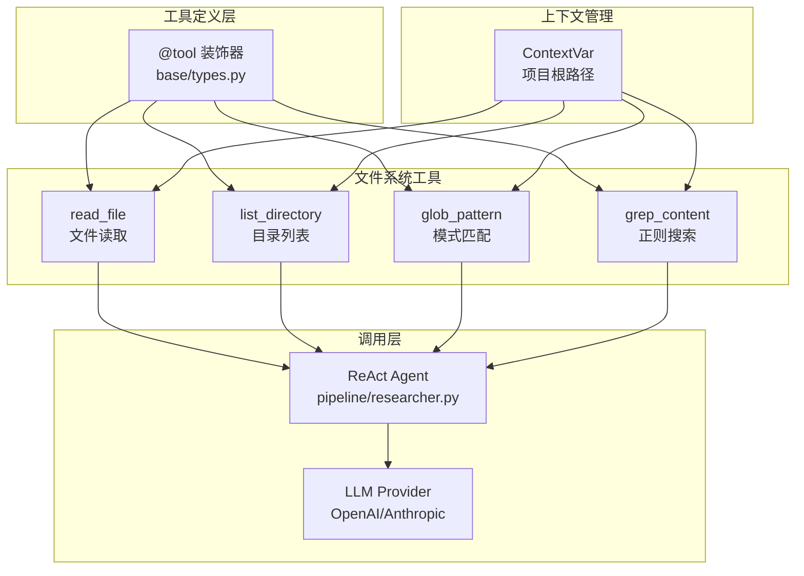
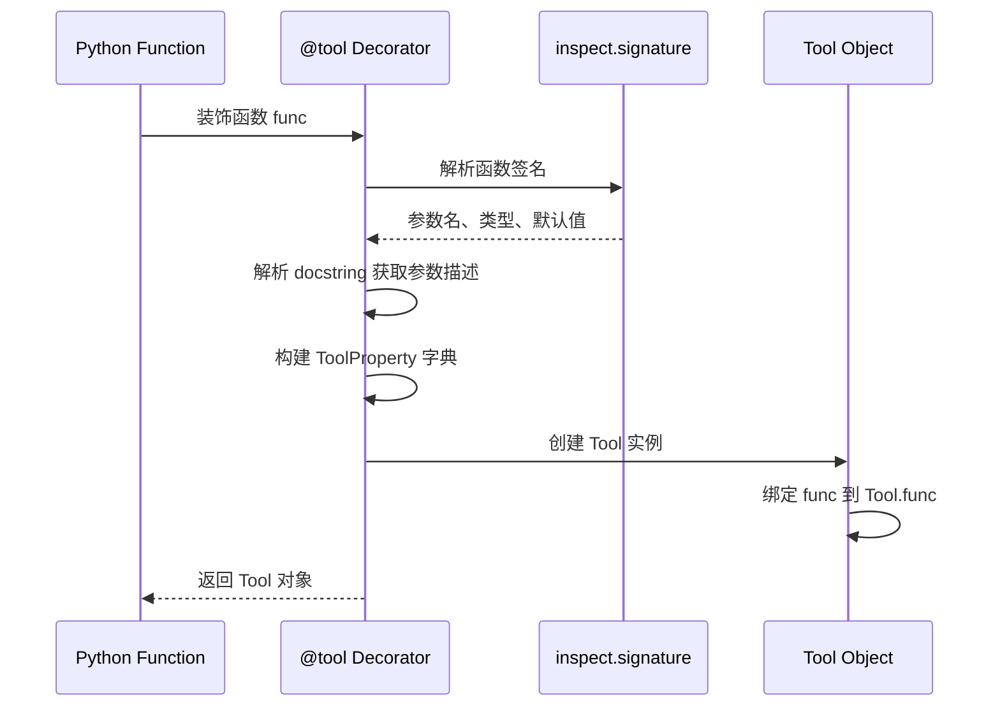

文件系统工具集是代码深度研究系统的核心感知层，为 ReAct Agent 提供与项目代码库交互的能力。这套工具通过标准化的接口封装了常见的文件系统操作，使 LLM 能够自主探索、读取和分析代码内容。

## 架构设计

文件系统工具集采用装饰器模式与上下文隔离的双重设计。`@tool` 装饰器将普通 Python 函数转换为 LLM 可调用的工具对象，同时自动生成符合 OpenAI 和 Anthropic 协议规范的参数 schema。`ContextVar` 则确保在并发研究场景下，每个研究会话维护独立的项目根路径，避免路径污染。



Sources: [tool/fs_tool.py](tool/fs_tool.py#L1-L135), [base/types.py](base/types.py#L184-L216)

## 工具组件详解

### 1. read_file — 文件内容读取

`read_file` 是最基础的文件操作工具，负责将指定路径的文件内容加载到 LLM 上下文中。该工具内置了 20KB 的大小限制机制，防止单个文件撑爆 token 限额。当文件超过限制时，返回截断提示而非完整内容。

实现逻辑分为三个步骤：首先通过 `get_project_root()` 获取当前会话的项目根路径，拼接成完整文件路径；然后以 UTF-8 编码读取文件，最多读取 `MAX_READ_SIZE` 字节；最后检查实际文件大小，若超过限制则追加截断提示。

```python
@tool
def read_file(file_path: str) -> str:
    """Read the full contents of a file.

    Args:
        file_path: Relative path from the project root
    """
    project_root = get_project_root()
    full_path = os.path.join(project_root, file_path) if project_root else file_path
    try:
        with open(full_path, "r", encoding="utf-8", errors="replace") as f:
            content = f.read(MAX_READ_SIZE)
        if os.path.getsize(full_path) > MAX_READ_SIZE:
            content += f"\n\n... [truncated, file exceeds {MAX_READ_SIZE // 1024}KB]"
        return content
    except FileNotFoundError:
        return f"Error: File not found: {file_path}"
    except IsADirectoryError:
        return f"Error: {file_path} is a directory, not a file"
    except Exception as e:
        return f"Error reading file: {e}"
```

错误处理覆盖了常见的三种场景：文件不存在返回明确提示而非异常；尝试读取目录时返回类型错误；其他异常统一包装为可读的错误消息。

Sources: [tool/fs_tool.py](tool/fs_tool.py#L28-L48)

### 2. list_directory — 目录内容列表

`list_directory` 工具以文本形式展示目录结构，为 LLM 提供项目组织的概览。返回结果按字母序排列，每个条目标注类型前缀（`DIR:` 或 `FILE:`），文件条目额外显示字节大小。

该工具使用 `os.listdir()` 获取直接子项而非递归遍历，平衡了信息量和返回长度。判断类型时调用 `os.path.isdir()` 和 `os.path.getsize()` 获取元数据。

```python
@tool
def list_directory(dir_path: str) -> str:
    """List files and subdirectories in a directory.

    Args:
        dir_path: Relative path from the project root, use '.' for root
    """
    project_root = get_project_root()
    full_path = os.path.join(project_root, dir_path) if project_root else dir_path
    try:
        entries = sorted(os.listdir(full_path))
        lines = []
        for name in entries:
            child = os.path.join(full_path, name)
            if os.path.isdir(child):
                lines.append(f"DIR:  {name}/")
            else:
                size = os.path.getsize(child)
                lines.append(f"FILE: {name} ({size} bytes)")
        return "\n".join(lines) if lines else "(empty directory)"
    except FileNotFoundError:
        return f"Error: Directory not found: {dir_path}"
    except NotADirectoryError:
        return f"Error: {dir_path} is not a directory"
    except Exception as e:
        return f"Error listing directory: {e}"
```

Sources: [tool/fs_tool.py](tool/fs_tool.py#L51-L76)

### 3. glob_pattern — 文件模式匹配

`glob_pattern` 基于 glob 语法实现文件发现功能，支持 `**/*.py`、`src/**/*.ts` 等递归模式。该工具在项目扫描阶段用于定位候选文件，在研究阶段用于快速定位相关模块。

实现利用 `pathlib.Path.glob()` 的强大模式匹配能力，遍历匹配结果并过滤隐藏文件（以 `.` 开头的目录下的文件不返回）。

```python
@tool
def glob_pattern(pattern: str) -> str:
    """Find files matching a glob pattern.

    Args:
        pattern: Glob pattern like '**/*.py' or 'src/**/*.ts'
    """
    project_root = get_project_root()
    root = Path(project_root) if project_root else Path.cwd()
    matches = sorted(root.glob(pattern))
    results = []
    for m in matches:
        rel = os.path.relpath(m, project_root) if project_root else m
        if any(part.startswith(".") for part in Path(rel).parts):
            continue
        results.append(rel)
    if not results:
        return "No files matched the pattern."
    return "\n".join(str(r) for r in results)
```

Sources: [tool/fs_tool.py](tool/fs_tool.py#L79-L97)

### 4. grep_content — 正则表达式搜索

`grep_content` 是功能最复杂的工具，提供基于正则表达式的跨文件内容搜索。LLM 可以使用它定位特定 API 调用、注释模式或代码结构。该工具内置 `MAX_GREP_RESULTS = 100` 的结果上限，防止搜索返回过于庞大。

```python
@tool
def grep_content(pattern: str, file_pattern: str = "**/*") -> str:
    """Search for a regex pattern across files.

    Args:
        pattern: Regular expression pattern to search for
        file_pattern: Glob pattern to limit which files to search, default all files
    """
    project_root = get_project_root()
    root = Path(project_root) if project_root else Path.cwd()
    try:
        regex = re.compile(pattern)
    except re.error as e:
        return f"Invalid regex pattern: {e}"

    results = []
    for match_path in sorted(root.glob(file_pattern)):
        if not match_path.is_file():
            continue
        rel = os.path.relpath(match_path, project_root) if project_root else match_path
        if any(part.startswith(".") for part in Path(rel).parts):
            continue
        try:
            with open(match_path, "r", encoding="utf-8", errors="ignore") as f:
                for line_no, line in enumerate(f, 1):
                    if regex.search(line):
                        results.append(f"{rel}:{line_no}: {line.rstrip()}")
                        if len(results) >= MAX_GREP_RESULTS:
                            return "\n".join(results) + f"\n... [truncated at {MAX_GREP_RESULTS} results]"
        except Exception:
            continue

    if not results:
        return "No matches found."
    return "\n".join(results)
```

返回格式为 `文件路径:行号: 匹配内容`，便于 LLM 定位源代码位置。`file_pattern` 参数默认为 `**/*`，即搜索所有文件，但可以限制为特定扩展名如 `**/*.py`。

Sources: [tool/fs_tool.py](tool/fs_tool.py#L100-L134)

## @tool 装饰器实现

装饰器是连接普通函数与 LLM 工具系统的桥梁。其核心逻辑位于 `base/types.py` 的第 184-216 行，包含四个关键步骤：



参数类型映射将 Python 类型映射为 JSON Schema 类型：

| Python 类型 | Schema 类型 |
|------------|-------------|
| `str` | string |
| `int` | integer |
| `float` | number |
| `bool` | boolean |
| `list` | array |
| `dict` | object |

必填参数由函数签名中有无默认值决定：无默认值则为必填，有默认值则为可选。

Sources: [base/types.py](base/types.py#L174-L216)

## 上下文隔离机制

多模块并发研究要求工具调用不互相干扰。项目根路径通过 `ContextVar` 存储，实现线程/协程级别的隔离：

```python
_project_root_var: ContextVar[str] = ContextVar('project_root', default='')

def set_project_root(path: str) -> None:
    """设置当前研究会话的项目根目录（线程安全）。"""
    _project_root_var.set(path)

def get_project_root() -> str:
    """获取当前研究会话的项目根目录。"""
    return _project_root_var.get()
```

`ContextVar` 是 Python 3.7+ 引入的上下文变量机制，与 `threading.local()` 类似但更轻量，特别适合 asyncio 协程场景。每个协程可以独立设置自己的项目根路径，工具调用时自动读取当前上下文的值。

Sources: [tool/fs_tool.py](tool/fs_tool.py#L11-L25)

## 流水线集成

文件系统工具集在[阶段五：深度研究](10-jie-duan-wu-shen-du-yan-jiu)中与 ReAct Agent 深度绑定。`pipeline/researcher.py` 的 `prepare_research` 函数负责初始化：

```python
def prepare_research(ctx: PipelineContext) -> tuple:
    """初始化研究工具和文件树，供 research_one_module 使用。"""
    set_project_root(ctx.project_path)
    tools = [read_file, list_directory, glob_pattern, grep_content]
    file_tree = build_file_tree(ctx.all_files)
    return tools, file_tree
```

工具列表与文件树结构作为上下文信息传递给 ReAct Agent，使其能够自主调用文件系统工具探索代码。研究成果通过 `collect_report()` 从事件流中提取并持久化。

Sources: [pipeline/researcher.py](pipeline/researcher.py#L1-L40)

## 安全边界

工具集内置了多层安全过滤机制：

- **路径隔离**：所有文件操作基于项目根路径，禁止目录遍历攻击
- **隐藏文件过滤**：以 `.` 开头的路径组件自动跳过，防止访问配置目录
- **大小限制**：单文件读取上限 20KB，搜索结果上限 100 条
- **编码容错**：`errors="replace"` 模式处理二进制文件，避免读取失败

这些约束确保即使 LLM 执行意外操作，也不会对系统造成实质性损害。

## 总结

文件系统工具集通过 `@tool` 装饰器将 Python 函数转化为 LLM 可调用的工具，结合 `ContextVar` 实现并发安全的上下文管理。四类工具覆盖了代码研究的典型场景：读取、浏览、发现、搜索。在流水线中，这些工具作为 ReAct Agent 的感知触手，支持自主化的深度代码分析。