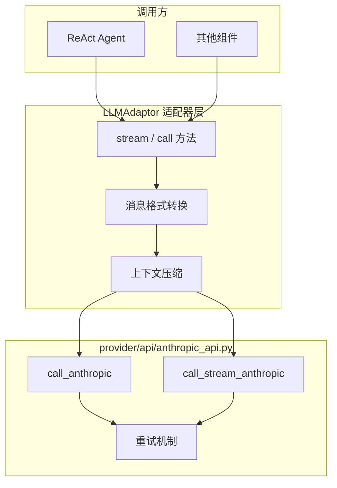

Anthropic协议客户端是本项目统一的LLM适配器层（`LLMAdaptor`）的核心组件之一，负责与兼容Anthropic API规范的大模型服务进行通信。本模块支持同步调用、流式响应、工具调用以及思考过程（thinking）输出，能够适配DeepSeek等提供Anthropic兼容接口的服务商。

## 架构概览

Anthropic协议客户端采用双层架构设计：底层为provider API层（`provider/api/anthropic_api.py`），提供基础的HTTP通信能力；上层为适配器层（`provider/adaptor.py`），将底层能力封装为统一的事件流接口。



## 核心模块详解

### 1. 底层通信模块（provider/api/anthropic_api.py）

底层模块负责与Anthropic兼容的API端点建立HTTP连接，支持同步和流式两种调用模式。

**客户端创建逻辑**

```python
def _create_client(api_key=None, base_url=None):
    import anthropic
    return anthropic.Anthropic(
        api_key=api_key or os.environ.get("DEEPSEEK_API_KEY"),
        base_url=base_url or "https://api.deepseek.com/anthropic",
        timeout=DEFAULT_TIMEOUT,
    )
```

默认从环境变量`DEEPSEEK_API_KEY`读取密钥，基础URL指向DeepSeek的Anthropic兼容端点。超时时间设为60秒，可在调用时覆盖。

**同步调用接口**

```python
def call_anthropic(messages, base_url=None, api_key=None, model=None, max_tokens=None, **kwargs):
    """Anthropic-compatible synchronous call with configurable endpoint."""
    client = _create_client(api_key=api_key, base_url=base_url)
    return _with_retry(
        lambda: client.messages.create(
            model=model, messages=messages, max_tokens=max_tokens, timeout=DEFAULT_TIMEOUT, **kwargs
        ),
        "LLM 调用",
    )
```

**流式调用接口**

```python
def call_stream_anthropic(messages, base_url=None, api_key=None, model=None, max_tokens=None, **kwargs):
    """Anthropic-compatible streaming call with configurable endpoint."""
    client = _create_client(api_key=api_key, base_url=base_url)
    return _with_retry(
        lambda: client.messages.create(
            model=model, messages=messages, max_tokens=max_tokens,
            stream=True, timeout=DEFAULT_TIMEOUT, **kwargs
        ),
        "LLM 流式调用",
    )
```

**重试机制**

```python
def _with_retry(fn, retry_label, *args, **kwargs):
    import anthropic
    for attempt in range(MAX_RETRIES + 1):
        try:
            return fn(*args, **kwargs)
        except (anthropic.APITimeoutError, anthropic.APIConnectionError, TimeoutError) as e:
            if attempt < MAX_RETRIES:
                print(f"  [{retry_label}超时，重试 {attempt+1}/{MAX_RETRIES}]: {e}")
                time.sleep(1)
            else:
                raise
```

当发生超时或连接错误时，系统会进行1次重试（`MAX_RETRIES=1`），重试间隔为1秒。

Sources: [anthropic_api.py](provider/api/anthropic_api.py#L1-L54)

### 2. 适配器层（LLMAdaptor）

适配器层将底层API封装为统一接口，支持流式事件生成、消息格式转换和上下文压缩。

**初始化与提供商切换**

```python
class LLMAdaptor:
    def __init__(self, config: dict):
        self._config = config
        self._provider = config.get("provider", "anthropic")

        if self._provider == "openai":
            from provider.api.openai_api import call_stream_openai, call_openai
            self._call_stream = call_stream_openai
            self._call = call_openai
        elif self._provider == "anthropic":
            from provider.api.anthropic_api import call_stream_anthropic, call_anthropic
            self._call_stream = call_stream_anthropic
            self._call = call_anthropic
```

配置字典包含`provider`、`base_url`、`api_key`、`model`、`max_tokens`等字段，初始化时动态加载对应的API函数。

Sources: [adaptor.py](provider/adaptor.py#L30-L51)

### 3. 消息格式转换

Anthropic协议与OpenAI协议在消息格式上存在差异，适配器层负责格式转换以实现统一的消息处理。

**转换逻辑分析**

Anthropic协议要求将system消息提取到独立的`system`参数中，多轮对话中的工具结果作为user消息插入。转换流程如下：

| 源格式（OpenAI） | 目标格式（Anthropic） |
|-----------------|---------------------|
| `role: system` | 提取到`params["system"]` |
| `role: tool` | 转换为`{"type": "tool_result", ...}`数组 |
| `role: assistant` + `tool_calls` | 转换为content blocks数组 |
| `role: user` | 保持不变 |

**转换方法实现**

```python
def _convert_messages_anthropic(self, messages, params):
    system_msg = None
    user_messages = []
    tool_results = []

    for msg in messages:
        if msg.get("role") == "system":
            system_msg = msg["content"]
        elif msg.get("role") == "tool":
            result_content = str(msg.get("tool_result") or msg.get("tool_error") or "")
            tool_results.append({"type": "tool_result", "tool_use_id": msg["tool_id"], "content": result_content})
        else:
            if tool_results:
                user_messages.append({"role": "user", "content": tool_results})
                tool_results = []
            if msg.get("role") == "assistant" and msg.get("tool_calls"):
                content_blocks = []
                if msg.get("reasoning_content"):
                    content_blocks.append({"type": "thinking", "thinking": msg["reasoning_content"]})
                if msg.get("content"):
                    content_blocks.append({"type": "text", "text": msg["content"]})
                for tc in msg["tool_calls"]:
                    content_blocks.append({"type": "tool_use", "id": tc["id"], "name": tc["name"], "input": json.loads(tc["arguments"]) if tc.get("arguments") else {}})
                user_messages.append({"role": "assistant", "content": content_blocks})
            else:
                user_messages.append(msg)

    if tool_results:
        user_messages.append({"role": "user", "content": tool_results})
    if system_msg:
        params["system"] = system_msg
    return user_messages
```

Sources: [adaptor.py](provider/adaptor.py#L234-L266)

### 4. 流式事件生成

流式响应通过事件（Event）逐块向外推送，每个事件携带特定类型的增量内容。

**Anthropic流式事件处理**

```python
def _stream_anthropic(self, messages, params, **kwargs):
    tools = {}
    block_types = {}
    stop_reason = None
    usage = None

    for event in self._call_stream(...):
        if event.type == "message_start":
            yield Event(EventType.MESSAGE_START)

        elif event.type == "content_block_start":
            idx = event.index
            block_type = event.content_block.type
            if block_type == "thinking":
                block_types[idx] = "thinking"
                yield Event(EventType.THINKING_START)
            elif block_type == "text":
                block_types[idx] = "text"
                yield Event(EventType.CONTENT_START)
            elif block_type == "tool_use":
                tools[idx] = {"id": event.content_block.id, "name": event.content_block.name, "arguments": ""}

        elif event.type == "content_block_delta":
            idx = event.index
            if event.delta.type == "text_delta":
                yield Event(EventType.CONTENT_DELTA, content=event.delta.text)
            elif event.delta.type == "thinking_delta":
                yield Event(EventType.THINKING_DELTA, content=getattr(event.delta, 'thinking', ""))
            elif event.delta.type == "input_json_delta":
                if idx in tools:
                    tools[idx]["arguments"] += event.delta.partial_json

        elif event.type == "content_block_stop":
            idx = event.index
            if idx in tools:
                yield Event(EventType.TOOL_CALL, tool_id=tools[idx]["id"], tool_name=tools[idx]["name"], tool_arguments=tools[idx]["arguments"], raw={"id": tools[idx]["id"], "name": tools[idx]["name"], "arguments": tools[idx]["arguments"]})
            elif idx in block_types:
                yield Event(EventType.THINKING_END if block_types[idx] == "thinking" else EventType.CONTENT_END)

        elif event.type == "message_delta":
            if event.delta.stop_reason:
                stop_reason = event.delta.stop_reason
                usage = event.usage

        elif event.type == "message_stop":
            yield Event(EventType.MESSAGE_END, stop_reason=stop_reason, usage=usage)
            return
```

**事件类型对照表**

| Anthropic事件 | 对应EventType | 说明 |
|--------------|---------------|------|
| `message_start` | MESSAGE_START | 消息流开始 |
| `content_block_start` (type=thinking) | THINKING_START | 思考过程开始 |
| `content_block_start` (type=text) | CONTENT_START | 文本内容开始 |
| `content_block_delta` (text_delta) | CONTENT_DELTA | 文本增量 |
| `content_block_delta` (thinking_delta) | THINKING_DELTA | 思考增量 |
| `content_block_delta` (input_json_delta) | 累加到tool_arguments | 工具参数增量 |
| `content_block_start` (type=tool_use) | TOOL_CALL | 工具调用（参数累加） |
| `message_stop` | MESSAGE_END | 消息流结束 |

Sources: [adaptor.py](provider/adaptor.py#L330-L385)

### 5. 思考模式参数注入

当配置启用思考模式时，需要将thinking相关参数注入到API请求中。

```python
def _inject_thinking_params(self, params):
    """从 config 提取思考模式参数，注入到 API 调用 params 中。"""
    thinking = self._config.get("thinking")
    reasoning_effort = self._config.get("reasoning_effort")

    if thinking is None and not reasoning_effort:
        return

    if self._provider == "openai":
        if reasoning_effort:
            params["reasoning_effort"] = reasoning_effort
        if thinking is not None:
            params.setdefault("extra_body", {})["thinking"] = {"type": "enabled" if thinking else "disabled"}
    elif self._provider == "anthropic":
        extra_body = params.setdefault("extra_body", {})
        if thinking is not None:
            extra_body["thinking"] = {"type": "enabled" if thinking else "disabled"}
        if reasoning_effort:
            extra_body["output_config"] = {"effort": reasoning_effort}
```

通过`extra_body`字段传递Anthropic专有的思考参数，`output_config.effort`控制推理努力程度（high、max等）。

Sources: [adaptor.py](provider/adaptor.py#L110-L129)

### 6. 上下文压缩机制

当对话上下文超过20万字符时，系统会自动进行上下文压缩。

```python
MAX_CONTEXT_CHARS = 200_000
COMPRESS_KEEP_RECENT = 6

def _compress_if_needed(self, messages) -> list:
    total_chars = sum(len(json.dumps(m, ensure_ascii=False)) for m in messages)
    if total_chars <= MAX_CONTEXT_CHARS:
        return messages

    print(f"\n  [上下文压缩] {total_chars} 字符超过阈值 {MAX_CONTEXT_CHARS}，开始压缩...")

    system_msgs = [m for m in messages if m.get("role") == "system"]
    other_msgs = [m for m in messages if m.get("role") != "system"]

    if len(other_msgs) <= COMPRESS_KEEP_RECENT:
        return messages

    to_compress = other_msgs[:-COMPRESS_KEEP_RECENT]
    to_keep = other_msgs[-COMPRESS_KEEP_RECENT:]
    summary = self._summarize_messages(to_compress)
    # ... 构建压缩后的消息
```

压缩策略：保留最近6条非系统消息，将之前的消息交给LLM总结，形成一条摘要消息替代。

Sources: [adaptor.py](provider/adaptor.py#L130-L156)

## 配置与使用

### 配置文件示例

项目根目录的`settings.json`定义了三个层级的配置：

```json
{
  "lite": {
    "provider": "anthropic",
    "base_url": "https://api.deepseek.com",
    "api_key": "${DEEPSEEK_API_KEY}",
    "model": "deepseek-v4-flash",
    "max_tokens": 8192,
    "thinking": false
  },
  "pro": {
    "provider": "anthropic",
    "base_url": "https://api.deepseek.com",
    "api_key": "${DEEPSEEK_API_KEY}",
    "model": "deepseek-v4-pro",
    "max_tokens": 8192,
    "thinking": true,
    "reasoning_effort": "high"
  },
  "max": {
    "provider": "anthropic",
    "base_url": "https://api.deepseek.com",
    "api_key": "${DEEPSEEK_API_KEY}",
    "model": "deepseek-v4-pro",
    "max_tokens": 8192,
    "thinking": true,
    "reasoning_effort": "max"
  }
}
```

**配置层级说明**

| 层级 | thinking | reasoning_effort | 适用场景 |
|------|----------|-----------------|---------|
| lite | false | 无 | 快速响应、低延迟需求 |
| pro | true | high | 平衡性能与深度思考 |
| max | true | max | 复杂推理任务 |

### URL规范化

`settings.py`中的`_normalize_base_url`函数确保Anthropic提供商使用正确的URL路径：

```python
def _normalize_base_url(config: dict) -> None:
    """如果 provider 是 anthropic，自动确保 base_url 以 /anthropic 结尾。"""
    provider = config.get("provider", "")
    base_url = config.get("base_url", "")
    if provider == "anthropic" and base_url and not base_url.rstrip("/").endswith("/anthropic"):
        config["base_url"] = base_url.rstrip("/") + "/anthropic"
```

自动为Anthropic提供商的URL添加`/anthropic`后缀，避免手动配置错误。

Sources: [settings.py](settings.py#L43-L49)

## 事件类型体系

事件类型在`base/types.py`中定义，构建了流式响应的事件驱动模型：

```python
class EventType(Enum):
    MESSAGE_START = "message_start"
    THINKING_START = "thinking_start"
    THINKING_DELTA = "thinking_delta"
    THINKING_END = "thinking_end"
    CONTENT_START = "content_start"
    CONTENT_DELTA = "content_delta"
    CONTENT_END = "content_end"
    TOOL_CALL = "tool_call"
    MESSAGE_END = "message_end"
    # ReAct 相关
    STEP_START = "step_start"
    STEP_END = "step_end"
    TOOL_CALL_SUCCESS = "tool_call_success"
    TOOL_CALL_FAILED = "tool_call_failed"
```

每个事件都包含`type`字段标识事件类型，部分事件携带额外数据：

```python
@dataclass
class Event:
    type: EventType
    content: Optional[str] = None
    raw: Optional[dict] = None
    # Tool 相关
    tool_id: Optional[str] = None
    tool_name: Optional[str] = None
    tool_arguments: Optional[str] = None
    # 消息结束相关信息
    stop_reason: Optional[str] = None
    usage: Optional[dict] = None
```

Sources: [types.py](base/types.py#L1-L41)

## 与OpenAI协议客户端的关系

Anthropic和OpenAI协议客户端通过`LLMAdaptor`实现统一抽象，两者共享相同的接口设计，仅在消息格式转换和事件解析上有所不同：

| 功能 | Anthropic | OpenAI |
|------|-----------|--------|
| 消息格式 | content blocks + system | 标准messages |
| 思考过程 | thinking block | reasoning_content字段 |
| 工具调用 | tool_use/tool_result blocks | tool_calls + tool |
| 流式事件 | SSE事件类型 | delta结构 |

两者共用`provider/adaptor.py`中的流式事件生成逻辑（`_stream_openai`和`_stream_anthropic`），以及上下文压缩、参数注入等通用功能。

## 后续学习路径

- 若需了解统一适配器的完整实现，请阅读 [LLM适配器层](14-llmgua-pei-qi-ceng)
- 若需对比OpenAI协议客户端的实现差异，请阅读 [OpenAI协议客户端](17-openaixie-yi-ke-hu-duan)
- 若需了解事件流如何驱动ReAct Agent，请阅读 [ReAct Agent实现](13-react-agentshi-xian)