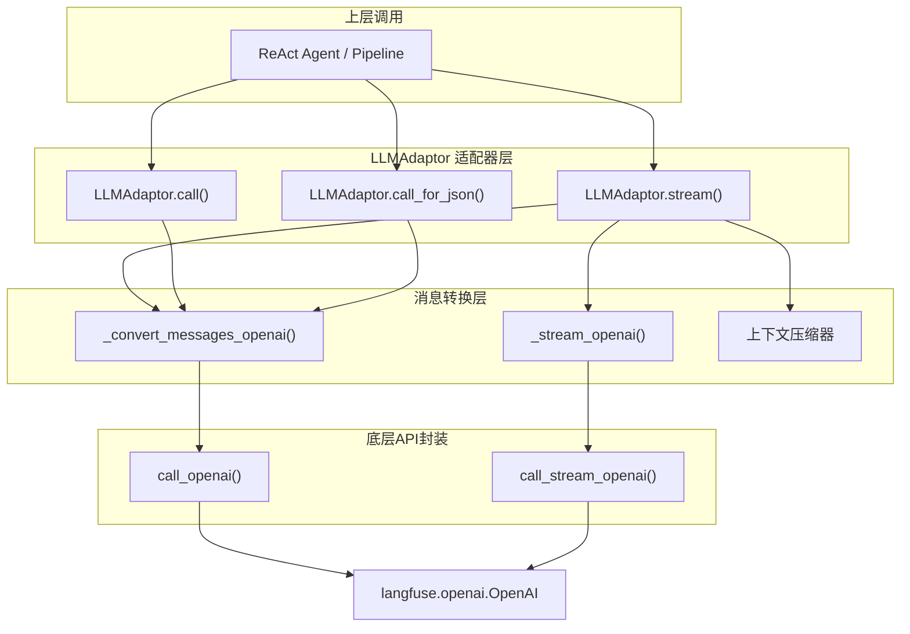
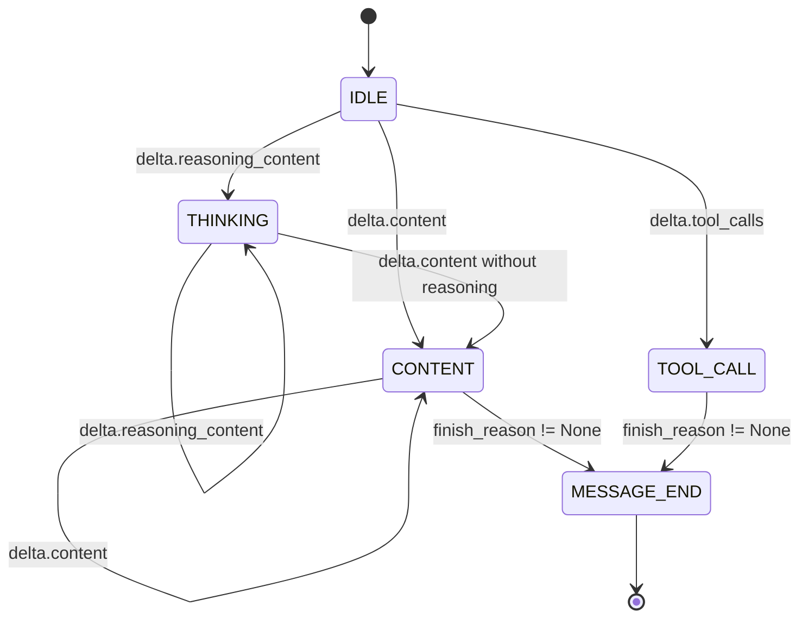

本页面详细说明项目中OpenAI协议客户端的实现架构，包括底层API调用层、统一适配器设计以及事件流处理机制。

## 架构概览

OpenAI协议客户端采用双层架构设计：底层为原始API调用封装层，上层为统一适配器层。这种设计将协议差异隔离在独立模块中，使上层业务逻辑可以无感知地切换不同的LLM提供者。



Sources: [provider/adaptor.py](provider/adaptor.py#L1-L50), [provider/api/openai_api.py](provider/api/openai_api.py#L1-L59)

---

## 底层API封装

底层API封装位于 `provider/api/openai_api.py`，负责与OpenAI兼容API端点的实际通信。

### 核心配置常量

```python
DEFAULT_TIMEOUT = 60      # 默认超时时间60秒
MAX_RETRIES = 1            # 最大重试次数1次
```

底层使用 `langfuse.openai.OpenAI` 客户端，该客户端继承自原生OpenAI SDK并集成了Langfuse追踪能力。默认配置指向DeepSeek API端点，但支持通过参数覆盖。

Sources: [provider/api/openai_api.py](provider/api/openai_api.py#L1-L15)

### 客户端工厂函数

```python
def _create_client(api_key=None, base_url=None):
    from langfuse.openai import OpenAI
    return OpenAI(
        api_key=api_key or os.environ.get("DEEPSEEK_API_KEY"),
        base_url=base_url or "https://api.deepseek.com",
        timeout=DEFAULT_TIMEOUT,
    )
```

该函数实现了延迟导入模式，仅在实际需要时才加载 `langfuse.openai` 模块。API密钥优先使用传入参数，否则从环境变量 `DEEPSEEK_API_KEY` 获取。

Sources: [provider/api/openai_api.py](provider/api/openai_api.py#L14-L21)

### 重试机制

```python
def _with_retry(fn, retry_label, *args, **kwargs):
    from openai import APITimeoutError, APIConnectionError
    for attempt in range(MAX_RETRIES + 1):
        try:
            return fn(*args, **kwargs)
        except (APITimeoutError, APIConnectionError, TimeoutError) as e:
            if attempt < MAX_RETRIES:
                print(f"  [{retry_label}超时，重试 {attempt+1}/{MAX_RETRIES}]: {e}")
                time.sleep(1)
            else:
                raise
```

重试机制专门处理网络相关的临时性故障，包括API超时、连接错误和通用超时异常。每次重试前会输出诊断信息，便于调试。

Sources: [provider/api/openai_api.py](provider/api/openai_api.py#L23-L35)

### 同步与流式调用接口

| 函数 | 用途 | 返回值 |
|------|------|--------|
| `call_openai()` | 同步调用 | `message` 对象（包含 `content`） |
| `call_stream_openai()` | 流式调用 | Generator，可迭代 `chunk` |

两个函数签名一致，支持以下参数：

| 参数 | 类型 | 说明 |
|------|------|------|
| `messages` | list | 消息列表 |
| `base_url` | str | API端点 |
| `api_key` | str | 密钥 |
| `model` | str | 模型名称 |
| `max_tokens` | int | 最大令牌数 |
| `response_format` | dict | 响应格式约束（如JSON模式） |

Sources: [provider/api/openai_api.py](provider/api/openai_api.py#L37-L59)

---

## 统一适配器层

`LLMAdaptor` 类位于 `provider/adaptor.py`，是整个系统的核心抽象层。它将OpenAI和Anthropic两种协议统一在同一个接口下。

### 初始化与Provider选择

```python
class LLMAdaptor:
    def __init__(self, config: dict):
        self._config = config
        self._provider = config.get("provider", "anthropic")

        if self._provider == "openai":
            from provider.api.openai_api import call_stream_openai, call_openai
            self._call_stream = call_stream_openai
            self._call = call_openai
        elif self._provider == "anthropic":
            from provider.api.anthropic_api import call_stream_anthropic, call_anthropic
            self._call_stream = call_stream_anthropic
            self._call = call_anthropic
```

适配器根据配置动态导入对应的API模块，并将调用方法绑定为实例属性。这种运行时绑定方式避免了启动时的循环导入问题。

Sources: [provider/adaptor.py](provider/adaptor.py#L15-L35)

### 公开接口

| 方法 | 描述 | 返回类型 |
|------|------|----------|
| `stream()` | 流式调用，产生Event事件 | Generator[Event] |
| `call()` | 同步调用，返回完整文本 | str |
| `call_for_json()` | 同步调用，自动提取JSON | str |

`sream()` 方法支持丰富的参数：

```python
def stream(self, messages, tools=None, response_format=None, **kwargs):
    # 参数说明：
    # - messages: 标准化的消息列表
    # - tools: Tool对象列表或原始tools字典
    # - response_format: JSON模式定义（仅OpenAI支持）
    # - **kwargs: 透传给底层API的额外参数
```

Sources: [provider/adaptor.py](provider/adaptor.py#L37-L72)

---

## 消息格式转换

OpenAI协议与内部标准化格式之间需要转换，转换逻辑由 `_convert_messages_openai()` 实现。

### 内部格式 → OpenAI格式

内部标准化消息格式包含以下字段：

| 内部字段 | OpenAI字段 | 说明 |
|----------|------------|------|
| `role: tool` | `role: tool` + `tool_call_id` | 工具结果 |
| `role: assistant` + `tool_calls` | `tool_calls` | 工具调用请求 |
| `reasoning_content` | `reasoning_content` | 思考内容 |

```python
def _convert_messages_openai(self, messages):
    converted = []
    for msg in messages:
        if msg.get("role") == "tool":
            converted.append({
                "role": "tool",
                "tool_call_id": msg["tool_id"],
                "content": str(msg.get("tool_result") or msg.get("tool_error") or ""),
            })
        elif msg.get("role") == "assistant" and msg.get("tool_calls"):
            assistant_msg = {"role": "assistant"}
            if msg.get("reasoning_content"):
                assistant_msg["reasoning_content"] = msg["reasoning_content"]
            if msg.get("content"):
                assistant_msg["content"] = msg["content"]
            assistant_msg["tool_calls"] = [
                {"id": tc["id"], "type": "function", 
                 "function": {"name": tc["name"], "arguments": tc.get("arguments", "{}")}}
                for tc in msg["tool_calls"]
            ]
            converted.append(assistant_msg)
        else:
            converted.append(msg)
    return converted
```

该转换保留了非工具相关的消息不变，确保对话历史完整传递。

Sources: [provider/adaptor.py](provider/adaptor.py#L219-L247)

---

## 流式事件处理

`_stream_openai()` 方法负责解析OpenAI流式响应，产生统一的事件流。

### 事件状态机



### 事件类型映射

| OpenAI Delta类型 | 产生的事件 |
|-----------------|-----------|
| `delta.reasoning_content` | `THINKING_START` → `THINKING_DELTA` × n → `THINKING_END` |
| `delta.content` | `CONTENT_START` → `CONTENT_DELTA` × n → `CONTENT_END` |
| `delta.tool_calls` | `TOOL_CALL`（延迟至 `finish_reason` 时触发） |

```python
def _stream_openai(self, messages, params, **kwargs):
    tools = {}
    in_thinking = False
    in_content = False

    for chunk in self._call_stream(...):
        delta = choice.delta

        if delta.role == "assistant":
            yield Event(EventType.MESSAGE_START)

        # Thinking 块处理
        if getattr(delta, 'reasoning_content', None):
            if not in_thinking:
                in_thinking = True
                yield Event(EventType.THINKING_START)
            yield Event(EventType.THINKING_DELTA, content=delta.reasoning_content)
        else:
            if in_thinking:
                in_thinking = False
                yield Event(EventType.THINKING_END)

        # Content 块处理
        if delta.content:
            if not in_content:
                in_content = True
                yield Event(EventType.CONTENT_START)
            yield Event(EventType.CONTENT_DELTA, content=delta.content)
        else:
            if in_content:
                in_content = False
                yield Event(EventType.CONTENT_END)

        # 工具调用延迟收集
        if delta.tool_calls:
            for tc in delta.tool_calls:
                idx = tc.index + 1
                if idx not in tools:
                    tools[idx] = {"id": tc.id, "name": tc.function.name or "", "arguments": tc.function.arguments or ""}
                elif tc.function.arguments:
                    tools[idx]["arguments"] += tc.function.arguments

        # 消息结束处理
        if choice.finish_reason is not None:
            # ... 发送结束事件
            yield Event(EventType.MESSAGE_END, stop_reason=choice.finish_reason, usage=chunk.usage)
            return
```

工具调用信息在流式响应过程中被增量收集，仅在收到 `finish_reason` 时才产生最终事件，确保参数完整性。

Sources: [provider/adaptor.py](provider/adaptor.py#L275-L339)

---

## 思考模式注入

适配器支持为兼容的OpenAI模型注入思考过程（Reasoning）参数。

```python
def _inject_thinking_params(self, params):
    thinking = self._config.get("thinking")
    reasoning_effort = self._config.get("reasoning_effort")

    if thinking is None and not reasoning_effort:
        return

    if self._provider == "openai":
        if reasoning_effort:
            params["reasoning_effort"] = reasoning_effort
        if thinking is not None:
            params.setdefault("extra_body", {})["thinking"] = {"type": "enabled" if thinking else "disabled"}
```

配置参数在 `settings.py` 中定义：

| 配置层级 | `thinking` | `reasoning_effort` |
|---------|-----------|-------------------|
| `lite` | `false` | - |
| `pro` | `true` | `"high"` |
| `max` | `true` | `"max"` |

Sources: [provider/adaptor.py](provider/adaptor.py#L131-L150), [settings.py](settings.py#L7-L25)

---

## 上下文压缩机制

当消息上下文超过阈值（200,000字符）时，适配器自动触发压缩：

```python
MAX_CONTEXT_CHARS = 200_000
COMPRESS_KEEP_RECENT = 6
```

压缩流程如下：

1. **分离系统消息**：保留所有系统消息不动
2. **保留最近消息**：保留最后6条非系统消息
3. **压缩早期消息**：使用LLM生成摘要
4. **注入摘要**：在摘要后添加确认消息

```python
def _compress_if_needed(self, messages) -> list:
    total_chars = sum(len(json.dumps(m, ensure_ascii=False)) for m in messages)
    if total_chars <= MAX_CONTEXT_CHARS:
        return messages

    # ... 压缩逻辑
    compressed = list(system_msgs)
    if summary:
        compressed.append({"role": "user", "content": f"[以下是之前对话的摘要]\n{summary}"})
        compressed.append({"role": "assistant", "content": "好的，我已了解之前的分析内容，继续进行。"})
    compressed.extend(to_keep)
    return compressed
```

Sources: [provider/adaptor.py](provider/adaptor.py#L152-L195)

---

## Event类型定义

事件类型在 `base/types.py` 中统一枚举：

```python
class EventType(Enum):
    MESSAGE_START = "message_start"
    THINKING_START = "thinking_start"
    THINKING_DELTA = "thinking_delta"
    THINKING_END = "thinking_end"
    CONTENT_START = "content_start"
    CONTENT_DELTA = "content_delta"
    CONTENT_END = "content_end"
    TOOL_CALL = "tool_call"
    MESSAGE_END = "message_end"
    STEP_START = "step_start"
    STEP_END = "step_end"
    TOOL_CALL_SUCCESS = "tool_call_success"
    TOOL_CALL_FAILED = "tool_call_failed"
```

`Event` 数据类封装了事件的所有属性：

```python
@dataclass
class Event:
    type: EventType
    content: Optional[str] = None           # 文本内容
    raw: Optional[dict] = None               # 原始数据
    tool_id: Optional[str] = None            # 工具调用ID
    tool_name: Optional[str] = None          # 工具名称
    tool_arguments: Optional[str] = None      # 工具参数JSON
    stop_reason: Optional[str] = None        # 停止原因
    usage: Optional[dict] = None              # token使用统计
```

Sources: [base/types.py](base/types.py#L6-L45)

---

## 配置驱动设计

整个协议客户端完全由配置驱动，配置层级定义在 `settings.py`：

```python
_DEFAULTS = {
    "lite": {
        "provider": "openai",
        "base_url": "https://api.deepseek.com",
        "api_key": "${DEEPSEEK_API_KEY}",
        "model": "deepseek-v4-flash",
        "max_tokens": 8192,
        "thinking": False,
    },
    "pro": {
        "provider": "openai",
        "base_url": "https://api.deepseek.com",
        "api_key": "${DEEPSEEK_API_KEY}",
        "model": "deepseek-v4-flash",
        "max_tokens": 8192,
        "thinking": True,
        "reasoning_effort": "high",
    },
    # ...
}
```

通过 `get_config(tier)` 函数获取指定层级的完整配置：

```python
from settings import get_config

config = get_config("pro")
adaptor = LLMAdaptor(config)
```

Sources: [settings.py](settings.py#L1-L50)

---

## 下一步阅读

- [Anthropic协议客户端](16-anthropicxie-yi-ke-hu-duan) — 了解Anthropic协议的实现细节与OpenAI的差异对比
- [LLM适配器层](14-llmgua-pei-qi-ceng) — 深入理解适配器层的统一抽象设计
- [配置文件详解](4-pei-zhi-wen-jian-xiang-jie) — 学习如何配置不同的LLM提供者和层级