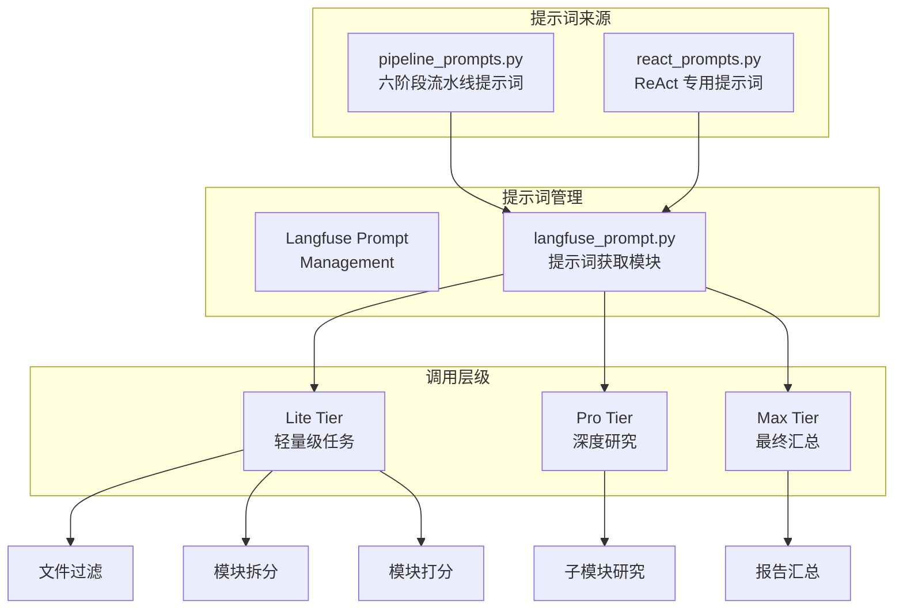
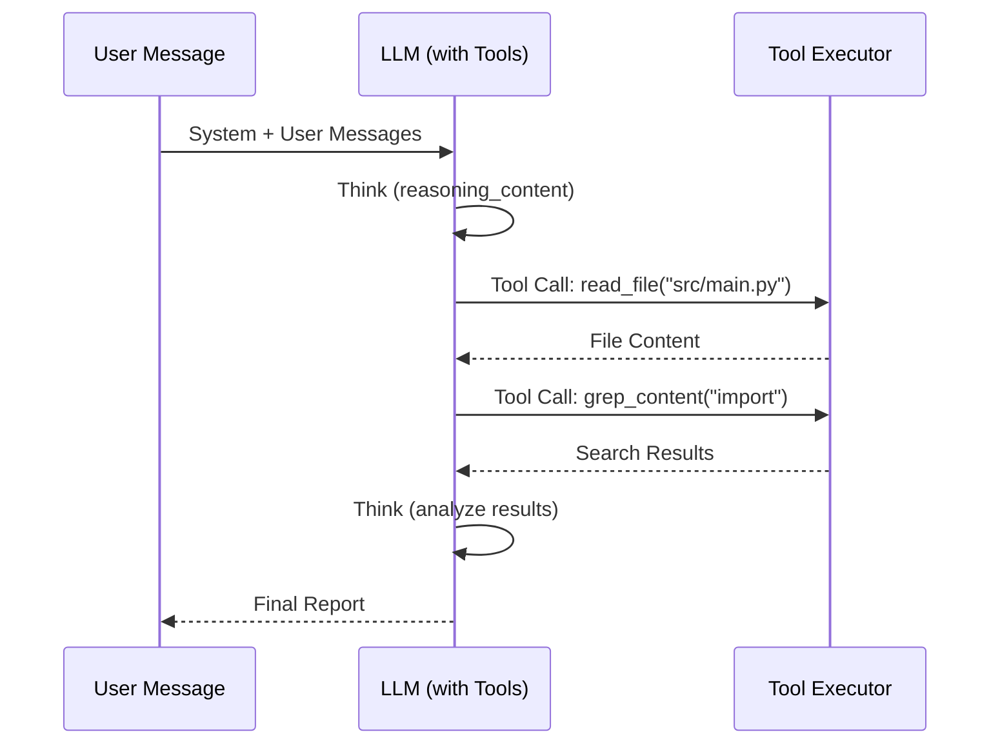

本文档详细阐述 CodeDeepResearch 项目的提示词工程体系，涵盖六阶段流水线的提示词设计、ReAct 智能体的工具调用提示词、以及与 Langfuse 的集成管理机制。

## 提示词架构总览

本项目采用**分层提示词架构**，将提示词分为三个层级以适应不同复杂度任务的需求：

| 层级 | 配置键 | 典型用途 | 思考模式 | Token 上限 |
|------|--------|----------|----------|------------|
| **Lite** | `lite_config` | 文件过滤、模块拆分、打分排序 | 关闭 | 8192 |
| **Pro** | `pro_config` | 子模块深度研究（ReAct Agent） | 高强度思考 | 8192 |
| **Max** | `max_config` | 最终报告汇总（ReAct Agent） | 最大强度思考 | 8192 |



所有提示词通过 `get_compiled_messages()` 函数从 Langfuse 获取并编译模板变量，确保生产环境的提示词版本受控管理。

Sources: [prompt/langfuse_prompt.py](prompt/langfuse_prompt.py#L1-L23), [settings.py](settings.py#L8-L30)

## 六阶段流水线提示词设计

### 阶段一：文件过滤（file-filter）

**设计目标**：基于项目类型判断文件重要性，过滤测试、构建、文档等非核心文件。

**提示词结构**采用 system + user 的双组件设计：

```python
FILE_FILTER_SYSTEM = """<role>代码架构分析助手</role>
<task>分析项目文件列表，标记不重要的文件。</task>
<response_format>返回 JSON 对象，包含 unimportant_paths 数组。</response_format>

## 重要文件（保留）
- 核心业务逻辑、算法实现
- API 入口（路由、控制器、CLI）
- 数据模型、类型定义
- **配置文件**：pyproject.toml、settings.json 等
- **工具/工具类**：tool/ 目录下的工具模块

## 不重要文件（排除）
- 测试文件：test_、_test、Test、Tests 等
- 生成代码：swagger、protobuf、ORM migration
- 构建/部署：Dockerfile、Makefile、CI 配置"""
```

**关键设计决策**：

1. **XML 标签结构**：使用 `<role>`、`<task>`、`<response_format>` 等语义化标签，便于 LLM 理解任务边界。

2. **明确的黑白名单**：通过排除规则（非重要文件）而非列举重要文件，降低提示词长度并提高泛化能力。

3. **JSON 输出约束**：强制要求返回 `unimportant_paths` 数组，确保后续处理可解析。

Sources: [prompt/pipeline_prompts.py](prompt/pipeline_prompts.py#L1-L42)

### 阶段二：模块拆分（decomposer）

**设计目标**：将项目文件按逻辑内聚性划分为 3-10 个模块。

**核心分析步骤**嵌入提示词中：

1. **理解项目**：从目录结构推断技术栈、项目类型
2. **识别模块边界**：目录结构自然形成模块边界
3. **合并小模块**：文件数≤2 的小模块需合并
4. **命名规范**：模块名用 kebab-case，描述用中文

```python
DECOMPOSER_SYSTEM = """<role>软件架构分析师</role>
<task>分析项目文件列表，拆分为逻辑内聚的模块。</task>

## 分析步骤
1. 理解项目：从目录结构推断技术栈、项目类型
2. 识别模块边界：目录结构自然形成模块
3. 合并小模块：文件数≤2 的小模块可合并到相关大模块
4. 命名规范：模块名用 kebab-case（如 core-agent）"""
```

**输出格式要求**每个模块必须包含：
- `name`：kebab-case 格式的模块标识符
- `description`：中文描述模块职责
- `files`：属于该模块的文件路径数组

Sources: [prompt/pipeline_prompts.py](prompt/pipeline_prompts.py#L47-L88)

### 阶段三：模块打分（scorer）

**设计目标**：对各模块进行 0-100 分的重要性评分，指导后续研究优先级。

**评分维度体系**采用四维加权模型：

| 维度 | 高分标准（80-100） | 低分标准（10-40） |
|------|-------------------|------------------|
| **核心度** | 主业务流程、核心算法 | 纯工具/辅助功能 |
| **依赖中心度** | 被大量依赖的基础模块 | 独立运行的模块 |
| **入口重要性** | 含 main/API/CLI | 仅内部调用 |
| **领域独特性** | 含项目特有领域逻辑 | 通用基础设施 |

```python
SCORER_SYSTEM = """<role>软件架构评估专家</role>
<task>对项目模块进行重要性评分（0-100分）。</task>

## 评分维度
- 核心度：主业务流程、核心算法 → 高分
- 依赖中心度：被大量依赖的基础模块 → 高分
- 入口重要性：含 main/API/CLI → 高分
- 领域独特性：含项目特有领域逻辑 → 高分"""
```

Sources: [prompt/pipeline_prompts.py](prompt/pipeline_prompts.py#L93-L128)

### 阶段四 & 五：深度研究（sub-agent）与汇总（aggregator）

**设计目标**：子模块研究使用 Pro Tier + ReAct Agent，报告汇总使用 Max Tier + ReAct Agent。

**Sub-Agent 提示词**内置完整分析框架：

```python
SUB_AGENT_SYSTEM = """<role>资深软件工程师 & 代码架构分析师</role>
<task>对指定模块进行深度分析。</task>

## 工具
- read_file: 读取文件内容
- list_directory: 列出目录结构
- glob_pattern: 按模式搜索文件
- grep_content: 搜索文件内容
**批量调用，每次最多 10 个。**

## 报告结构
### 模块：（见用户提示词中的模块名）

#### 一、模块定位
本模块的职责、解决的问题、在项目中的地位。

#### 二、核心架构图（Mermaid）
用 Mermaid flowchart/sequenceDiagram 画出...

#### 三、关键实现（必须有代码）
选取 1-2 个核心函数，展示关键代码...

#### 四、数据流
用 Mermaid sequenceDiagram 描述...

#### 五、依赖关系
- 本模块引用了哪些外部模块/函数
- 其他模块如何调用本模块

#### 六、对外接口
公共 API 清单：函数签名 → 用途 → 示例

#### 七、总结
设计亮点、值得注意的问题、可能的改进方向。"""
```

**质量约束**通过负面清单强化：
- ❌ 不能泛泛而谈
- ❌ 不能有任何铺垫句
- ❌ Mermaid 图必须与代码对应
- ❌ 依赖关系要精确到函数级别

Sources: [prompt/pipeline_prompts.py](prompt/pipeline_prompts.py#L133-L197), [prompt/pipeline_prompts.py](prompt/pipeline_prompts.py#L201-L275)

## ReAct Agent 提示词机制

### 思考-行动循环设计

ReAct Agent 采用 **Observe → Think → Act** 循环模式，提示词通过 `stream()` 函数动态构建消息序列：



**事件驱动架构**通过 `EventType` 枚举定义完整的流式交互状态：

```python
class EventType(Enum):
    MESSAGE_START = "message_start"
    THINKING_START = "thinking_start"
    THINKING_DELTA = "thinking_delta"
    CONTENT_DELTA = "content_delta"
    TOOL_CALL = "tool_call"
    STEP_START = "step_start"
    STEP_END = "step_end"
    TOOL_CALL_SUCCESS = "tool_call_success"
    TOOL_CALL_FAILED = "tool_call_failed"
```

Sources: [agent/react_agent.py](agent/react_agent.py#L1-L108), [base/types.py](base/types.py#L14-L30)

### 工具定义与注入

工具通过 `@tool` 装饰器从普通函数自动生成 Tool 对象：

```python
@tool
def read_file(file_path: str) -> str:
    """Read the full contents of a file.
    
    Args:
        file_path: Relative path from the project root
    """
    # ... implementation
```

装饰器自动解析函数签名和文档字符串，生成 OpenAI/Anthropic 兼容的 schema：

```python
def to_openai(self) -> dict:
    return {
        "type": "function",
        "function": {
            "name": self.name,
            "description": self.description,
            "parameters": self._build_schema(),
        },
    }
```

**文件系统工具集**（`tool/fs_tool.py`）提供四个核心能力：

| 工具名 | 功能 | 关键约束 |
|--------|------|----------|
| `read_file` | 读取文件完整内容 | 最大 20KB，超出截断并标注 |
| `list_directory` | 列出目录结构 | 区分 FILE/DIR 标记 |
| `glob_pattern` | 按 glob 模式搜索 | 自动过滤 `.` 开头的隐藏文件 |
| `grep_content` | 正则表达式搜索 | 最多返回 100 条结果 |

Sources: [tool/fs_tool.py](tool/fs_tool.py#L1-L135), [base/types.py](base/types.py#L150-L200)

### 对话压缩提示词

当上下文超过 200,000 字符阈值时，系统触发压缩机制：

```python
COMPRESS_SYSTEM = """<role>对话压缩助手</role>
<memory_context>将多轮对话历史压缩为简洁的摘要，保留关键信息。</memory_context>

## 压缩规则
1. 保留工具调用的**关键结果**（文件内容摘要、搜索结果）
2. 保留 LLM 的**重要分析和结论**
3. 丢弃冗余的中间推理过程
4. 保留完整的文件路径和函数/类名引用"""
```

压缩后保留最近 6 条消息作为"锚点"，中间历史压缩为摘要。

Sources: [prompt/react_prompts.py](prompt/react_prompts.py#L1-L20), [provider/adaptor.py](provider/adaptor.py#L88-L110)

## 提示词模板变量系统

### 变量注入机制

提示词通过 `get_compiled_messages()` 函数接收运行时变量：

```python
@observe(as_type="generation")
def get_compiled_messages(name: str, **variables) -> list[dict]:
    """从 Langfuse 获取 chat prompt 并编译模板变量。"""
    prompt = _client.get_prompt(name, type="chat")
    _client.update_current_generation(prompt=prompt)
    return prompt.compile(**variables)
```

**各阶段必需的模板变量**：

| Prompt 名称 | 必需变量 | 来源 |
|-------------|----------|------|
| `file-filter` | `project_name`, `files_json` | `ctx.project_name`, `ctx.all_files` |
| `decomposer` | `project_name`, `files_json` | `ctx.project_name`, `important_files` |
| `scorer` | `project_name`, `modules_json` | `ctx.project_name`, `ctx.modules` |
| `sub-agent` | `project_name`, `module_name`, `file_tree`, `module_files_json` | 多源组合 |
| `aggregator` | `project_name`, `file_tree`, `important_files`, `module_reports` | 多源组合 |
| `compress` | `conversation` | 动态构建 |

Sources: [prompt/langfuse_prompt.py](prompt/langfuse_prompt.py#L1-L23), [pipeline/llm_filter.py](pipeline/llm_filter.py#L1-L31)

### Langfuse 同步机制

提示词通过 `langfuse_prompt_init.py` 脚本同步到 Langfuse 平台：

```python
# Python format {var} → Langfuse 模板 {{var}}
def _to_langfuse_vars(text: str) -> str:
    return re.sub(r'(?<!\{)\{(\w+)\}(?!\})', r'{{\1}}', text)

chat_prompts = [
    ("file-filter", FILE_FILTER_SYSTEM, FILE_FILTER_USER),
    ("decomposer", DECOMPOSER_SYSTEM, DECOMPOSER_USER),
    ("scorer", SCORER_SYSTEM, SCORER_USER),
    ("sub-agent", SUB_AGENT_SYSTEM, SUB_AGENT_USER),
    ("aggregator", AGGREGATOR_SYSTEM, AGGREGATOR_USER),
    ("compress", COMPRESS_SYSTEM, COMPRESS_USER),
]

for name, system, user in chat_prompts:
    langfuse.create_prompt(
        name=name,
        type="chat",
        prompt=[
            {"role": "system", "content": _to_langfuse_vars(system)},
            {"role": "user", "content": _to_langfuse_vars(user)},
        ],
        labels=["production"],
    )
```

Sources: [prompt/langfuse_prompt_init.py](prompt/langfuse_prompt_init.py#L1-L50)

## 多协议适配层

### LLMAdaptor 统一接口

`LLMAdaptor` 类封装 OpenAI 和 Anthropic 两种协议的差异：

```python
class LLMAdaptor:
    def __init__(self, config: dict):
        self._provider = config.get("provider", "anthropic")
        
        if self._provider == "openai":
            from provider.api.openai_api import call_stream_openai
            self._call_stream = call_stream_openai
        elif self._provider == "anthropic":
            from provider.api.anthropic_api import call_stream_anthropic
            self._call_stream = call_stream_anthropic
```

**协议转换逻辑**处理消息格式差异：

| 消息类型 | OpenAI 格式 | Anthropic 格式 |
|----------|-------------|-----------------|
| System | `{"role": "system", "content": "..."}` | `params["system"] = "..."` |
| Tool Result | `{"role": "tool", "tool_call_id": "...", "content": "..."}` | `{"type": "tool_result", "tool_use_id": "...", "content": "..."}` |
| Assistant + Tools | `{"role": "assistant", "tool_calls": [...]}` | `{"type": "tool_use", "id": "...", "name": "...", "input": {...}}` |

Sources: [provider/adaptor.py](provider/adaptor.py#L1-L100), [provider/adaptor.py](provider/adaptor.py#L200-L290)

### 思考模式注入

```python
def _inject_thinking_params(self, params):
    if self._provider == "openai":
        if reasoning_effort:
            params["reasoning_effort"] = reasoning_effort
        if thinking is not None:
            params.setdefault("extra_body", {})["thinking"] = {"type": "enabled" if thinking else "disabled"}
    elif self._provider == "anthropic":
        extra_body = params.setdefault("extra_body", {})
        if thinking is not None:
            extra_body["thinking"] = {"type": "enabled" if thinking else "disabled"}
        if reasoning_effort:
            extra_body["output_config"] = {"effort": reasoning_effort}
```

Sources: [provider/adaptor.py](provider/adaptor.py#L70-L86)

## 提示词质量保障机制

### 角色-任务强绑定

每个提示词都通过 `<role>` 标签明确设定身份：

```xml
<role>代码架构分析助手</role>
<role>软件架构分析师</role>
<role>软件架构评估专家</role>
<role>资深软件工程师 & 代码架构分析师</role>
<role>技术架构分析师</role>
<role>对话压缩助手</role>
```

### 输出格式约束

所有 LLM 调用均使用 `response_format={"type": "json_object"}` 强制 JSON 输出，并通过 `_extract_json()` 函数处理可能被 markdown 代码块包裹的响应：

```python
def _extract_json(text: str) -> str:
    """从 LLM 响应中提取 JSON（可能被 markdown 代码块包裹）。"""
    text = text.strip()
    if "```" in text:
        # 处理 ```json ... ``` 格式
        ...
    for i, ch in enumerate(text):
        if ch in "[{":
            return text[i:]
    return text
```

### 错误容忍设计

```python
try:
    result = json.loads(response)
    unimportant_paths = set(result.get("unimportant_paths", []))
except (json.JSONDecodeError, KeyError, TypeError):
    unimportant_paths = set()  # 降级策略：保留所有文件
```

Sources: [pipeline/llm_filter.py](pipeline/llm_filter.py#L18-L26), [provider/adaptor.py](provider/adaptor.py#L10-L25)

## 扩展指南

### 添加新阶段提示词

1. 在 `pipeline_prompts.py` 中定义 SYSTEM 和 USER 提示词：
   ```python
   NEW_STAGE_SYSTEM = """<role>你的角色</role>
   <task>任务描述</task>
   <response_format>期望的 JSON 格式</response_format>
   ...
   """
   
   NEW_STAGE_USER = """<project_name>{project_name}</project_name>
   <data>{data_var}</data>"""
   ```

2. 在 `langfuse_prompt_init.py` 的 `chat_prompts` 列表中添加：
   ```python
   ("new-stage", NEW_STAGE_SYSTEM, NEW_STAGE_USER),
   ```

3. 运行同步脚本：
   ```bash
   python -m prompt.langfuse_prompt_init
   ```

4. 在流水线中调用：
   ```python
   from prompt.langfuse_prompt import get_compiled_messages
   messages = get_compiled_messages("new-stage", project_name=name, data_var=data)
   ```

### 添加新工具

1. 在 `tool/fs_tool.py` 中定义函数：
   ```python
   @tool
   def new_tool(param1: str, param2: int) -> str:
       """Tool description.
       
       Args:
           param1: Description of param1
           param2: Description of param2
       """
       # implementation
   ```

2. 在 `pipeline/researcher.py` 或 `pipeline/aggregator.py` 的 tools 列表中注册：
   ```python
   tools = [read_file, list_directory, glob_pattern, grep_content, new_tool]
   ```

### 提示词版本管理

通过 Langfuse 的 `labels` 参数管理版本：

```python
langfuse.create_prompt(
    name="file-filter",
    type="chat",
    prompt=[...],
    labels=["production"],  # 或 ["staging"], ["development"]
)
```

使用不同标签访问特定版本：
```python
prompt = _client.get_prompt(name, type="chat", label="staging")
```

---

## 下一步

- 了解 [上下文压缩机制](19-shang-xia-wen-ya-suo-ji-zhi) 如何处理长对话
- 深入 [ReAct Agent实现](13-react-agentshi-xian) 的流式事件处理
- 参考 [工具装饰器实现](20-gong-ju-zhuang-shi-qi-shi-xian) 扩展自定义工具