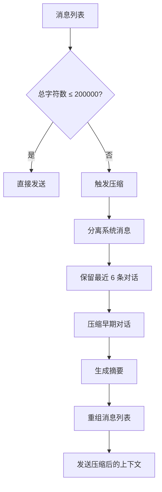

在代码深度分析场景中，处理大型代码库时会产生大量对话历史和工具调用结果。这些内容会快速消耗 LLM 的上下文窗口，导致分析中断或成本激增。CodeDeepResearch 通过**自适应上下文压缩机制**，在保持关键信息完整性的前提下，将历史对话压缩至可控规模，确保长程分析任务能够顺利完成。

## 核心架构

上下文压缩机制集成在 [LLM适配器层](14-llmgua-pei-qi-ceng) 的 `LLMAdaptor` 类中，作为消息发送前的最后一道处理关口。该机制采用**摘要压缩**策略，将冗长的对话历史转化为简洁的要点摘要，同时保留对后续分析至关重要的关键引用和文件路径。



## 压缩阈值与策略

### 关键常量定义

压缩机制的行为由两个关键常量控制，定义在 [provider/adaptor.py](provider/adaptor.py#L8-L9) 文件顶部：

| 常量 | 值 | 含义 |
|------|-----|------|
| `MAX_CONTEXT_CHARS` | 200,000 | 触发压缩的字符数阈值 |
| `COMPRESS_KEEP_RECENT` | 6 | 压缩时保留的最近消息条数 |

```python
MAX_CONTEXT_CHARS = 200_000
COMPRESS_KEEP_RECENT = 6
```

Sources: [provider/adaptor.py](provider/adaptor.py#L8-L9)

### 压缩判定逻辑

压缩触发发生在 `stream()` 方法调用时，每次 API 请求都会检查上下文规模。在 `_compress_if_needed()` 方法中，系统首先计算所有消息的 JSON 序列化总字符数，仅当超过阈值时才执行压缩操作。这种惰性压缩策略确保了在大多数场景下不会产生不必要的摘要开销。

```python
def _compress_if_needed(self, messages) -> list:
    total_chars = sum(len(json.dumps(m, ensure_ascii=False)) for m in messages)
    if total_chars <= MAX_CONTEXT_CHARS:
        return messages

    print(f"\n  [上下文压缩] {total_chars} 字符超过阈值 {MAX_CONTEXT_CHARS}，开始压缩...")
    # ... 压缩逻辑
```

Sources: [provider/adaptor.py](provider/adaptor.py#L129-L140)

## 压缩执行流程

### 第一步：消息分类

系统将消息分为两类：**系统消息**和**其他消息**。系统消息（如角色定义、任务说明）在压缩过程中被完整保留，因为它们包含 LLM 正确理解任务所需的基础上下文。其他消息则进入压缩候选池。

```python
system_msgs = [m for m in messages if m.get("role") == "system"]
other_msgs = [m for m in messages if m.get("role") != "system"]
```

Sources: [provider/adaptor.py](provider/adaptor.py#L136-L137)

### 第二步：滑动窗口保留

在非系统消息中，系统采用**滑动窗口策略**：保留最近的 6 条消息，将更早的历史纳入压缩范围。选择 6 条消息的原因是保持足够的近期上下文，使 LLM 能够理解对话的当前状态和未完成的任务。

```python
if len(other_msgs) <= COMPRESS_KEEP_RECENT:
    return messages  # 消息数量不足，跳过压缩

to_compress = other_msgs[:-COMPRESS_KEEP_RECENT]  # 待压缩的历史
to_keep = other_msgs[-COMPRESS_KEEP_RECENT:]      # 保留的近期消息
```

Sources: [provider/adaptor.py](provider/adaptor.py#L142-L145)

### 第三步：摘要生成

被压缩的历史消息通过 `_summarize_messages()` 方法传递给专用的压缩提示词。该方法首先将消息列表格式化为适合摘要的文本形式，然后调用 LLM 生成简洁的摘要内容。

```python
def _summarize_messages(self, messages: list) -> str:
    from prompt.langfuse_prompt import get_compiled_messages
    conversation_text = self._format_messages_for_summary(messages)
    if not conversation_text.strip():
        return ""

    try:
        compiled = get_compiled_messages("compress", conversation=conversation_text[:30000])
        return self.call(compiled)
    except Exception as e:
        print(f"  [上下文压缩] 压缩失败: {e}")
        return ""
```

Sources: [provider/adaptor.py](provider/adaptor.py#L157-L168)

### 第四步：消息重组

压缩完成后，系统将压缩摘要作为新的用户消息插入上下文，原有的早期消息被完全替换。最终的消息结构为：`[系统消息...] + [摘要用户消息] + [确认助手消息] + [保留的近期消息]`。

```python
compressed = list(system_msgs)
if summary:
    compressed.append({"role": "user", "content": f"[以下是之前对话的摘要]\n{summary}"})
    compressed.append({"role": "assistant", "content": "好的，我已了解之前的分析内容，继续进行。"})
compressed.extend(to_keep)
```

Sources: [provider/adaptor.py](provider/adaptor.py#L147-L152)

## 压缩提示词设计

### 提示词模板

压缩功能使用存储在 Langfuse Prompt Management 中的专用提示词，模板定义在 [prompt/react_prompts.py](prompt/react_prompts.py#L1-L20)：

```python
COMPRESS_SYSTEM = """<role>对话压缩助手</role>
<memory_context>将多轮对话历史压缩为简洁的摘要，保留关键信息。</memory_context>

## 压缩规则

1. 保留工具调用的**关键结果**（文件内容摘要、搜索结果）
2. 保留 LLM 的**重要分析和结论**
3. 丢弃冗余的中间推理过程
4. 保留完整的文件路径和函数/类名引用

## 输出格式

多条简短要点，每条一行。"""

COMPRESS_USER = """<conversation>{conversation}</conversation>"""
```

Sources: [prompt/react_prompts.py](prompt/react_prompts.py#L1-L20)

### 压缩规则设计要点

提示词设计遵循四个核心原则：**保留工具结果**确保分析过程中发现的关键信息不丢失；**保留分析结论**使 LLM 能够继承之前的推理成果；**丢弃中间推理**大幅减少冗余内容；**保留路径引用**保证后续分析仍可准确访问相关代码位置。

## 消息格式化

### 助手消息格式化

`_format_assistant_for_summary()` 方法将助手消息中的文本内容和工具调用分别提取。对于文本内容，截取前 500 字符保留核心信息；对于工具调用，提取函数名和关键参数（同样截断至 200 字符）。

```python
def _format_assistant_for_summary(self, content) -> str:
    if isinstance(content, list):
        parts = []
        for block in content:
            if isinstance(block, dict):
                if block.get("type") == "text":
                    parts.append(f"[助手]: {block['text'][:500]}")
                elif block.get("type") == "tool_use":
                    parts.append(f"[助手调用工具]: {block.get('name', '?')}({json.dumps(block.get('input', {}), ensure_ascii=False)[:200]})")
        return "\n".join(parts) if parts else ""
```

Sources: [provider/adaptor.py](provider/adaptor.py#L170-L182)

### 用户消息格式化

用户消息格式化时，方法会识别并保留工具结果内容块，同时对文本内容进行截断处理。

```python
def _format_user_for_summary(self, content) -> str:
    if isinstance(content, list):
        parts = []
        for block in content:
            if isinstance(block, dict) and block.get("type") == "tool_result":
                parts.append(f"[工具结果]: {str(block.get('content', ''))[:500]}")
        return "\n".join(parts) if parts else ""
    elif content:
        return f"[用户]: {str(content)[:500]}"
    return ""
```

Sources: [provider/adaptor.py](provider/adaptor.py#L185-L194)

## 流水线中的压缩时机

上下文压缩在六阶段分析流水线中自动触发，主要发生在两个高上下文消耗的场景。

### 深度研究阶段

在[阶段五：深度研究](10-jie-duan-wu-shen-du-yan-jiu)中，ReAct Agent 执行多步推理循环，每个步骤都会产生工具调用和结果交换。当分析大型模块时，历史消息会快速积累。此时 `research_one_module()` 通过 `adaptor.stream()` 调用自动触发压缩机制。

```python
def research_one_module(ctx: PipelineContext, module: Module, tools: list, report_dir: str, file_tree: str) -> None:
    messages = get_compiled_messages("sub-agent", ...)
    events = react_stream(messages=messages, tools=tools, ...)
    # stream() 内部会调用 _compress_if_needed()
```

Sources: [pipeline/researcher.py](pipeline/researcher.py#L20-L30)

### 最终报告汇总阶段

在[阶段六：报告汇总](11-jie-duan-liu-bao-gao-hui-zong)中，汇总 Agent 需要整合所有模块报告并生成最终文档。当模块数量较多时，累积的模块报告内容会使上下文规模急剧膨胀，压缩机制在此阶段尤为关键。

```python
def aggregate_reports(ctx: PipelineContext, selected: list) -> None:
    messages = get_compiled_messages("aggregator", ...)
    events = react_stream(messages=messages, tools=tools, ...)
    ctx.final_report = collect_report(events)
```

Sources: [pipeline/aggregator.py](pipeline/aggregator.py#L10-L20)

## 压缩效果示例

假设 ReAct Agent 执行了 20 步分析操作，每步平均产生约 15,000 字符的上下文交换。未压缩时总字符数约为 300,000，超过阈值。压缩后的上下文结构如下：

| 消息类型 | 字符数 | 说明 |
|----------|--------|------|
| 系统消息 | 8,000 | 角色定义和分析要求 |
| 摘要消息 | 3,000 | 压缩后的历史要点 |
| 确认消息 | 50 | "好的，我已了解..." |
| 近期消息 × 6 | 45,000 | 最后 6 步的完整对话 |
| **总计** | **56,050** | 压缩率约 81% |

压缩后，LLM 仍能理解之前分析的关键发现和文件引用，同时上下文规模已降至安全范围内。

## 注意事项

### 截断限制

压缩提示词对输入内容设置了 30,000 字符的上限。当待压缩的对话历史超过此限制时，超出部分将被静默丢弃。这在实际场景中影响较小，因为压缩发生时往往是前几步的累积内容，尚未达到该上限。

### 压缩失败处理

如果摘要生成过程中发生异常（如网络错误、API 超时），压缩机制会打印错误日志并返回空字符串。这会导致早期对话历史完全丢失，但不会阻断后续分析流程。系统设计优先保证可用性，而非完美的上下文保持。

### 不压缩条件

以下情况不会触发压缩：消息总数不足（少于 6 条非系统消息）、总字符数未超过阈值、或压缩摘要生成失败。这种保守策略避免了因过早压缩导致的信息丢失。

## 后续学习路径

深入理解上下文压缩机制后，建议继续学习以下内容以掌握完整的系统设计：

- [LLM适配器层](14-llmgua-pei-qi-ceng) — 了解适配器如何统一处理 OpenAI 和 Anthropic 协议
- [ReAct Agent实现](13-react-agentshi-xian) — 掌握思考-行动循环如何与压缩机制协同工作
- [提示词体系设计](18-ti-shi-ci-ti-xi-she-ji) — 学习如何设计高效的提示词模板