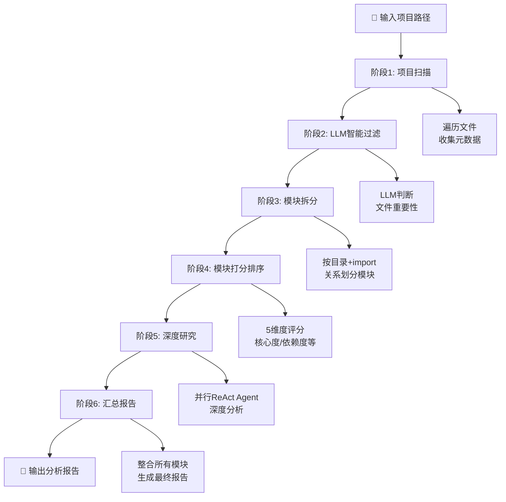

本指南旨在帮助开发者快速上手 CodeDeepResearch 自动化代码分析引擎。通过本指南，您将在 5 分钟内完成环境配置，并成功运行第一次代码分析。

---

## 什么是 CodeDeepResearch？

CodeDeepResearch 是一款 LLM 驱动的自动化代码深度分析引擎。只需输入任意代码仓库路径，即可输出一份结构化的中文项目分析报告，包含架构总览、模块详解、跨模块洞察和总结建议。

**核心特性**：
- 全自动化分析：无需人工干预
- 智能文件筛选：去除测试/文档/配置等无分析价值文件
- 并行模块研究：充分利用 token 并发
- 生成-评估迭代：确保报告质量

Sources: [CLAUDE.md](CLAUDE.md#L1-L10), [README.md](README.md#L1-L20)

---

## 前置要求

在开始之前，请确保您的开发环境满足以下要求：

| 要求 | 说明 |
|------|------|
| Python 版本 | 3.12 或更高版本 |
| 包管理器 | uv（推荐）或 pip |
| API 密钥 | DeepSeek API Key（用于 LLM 调用） |

**验证 Python 版本**：
```bash
python --version
# 确保输出类似: Python 3.12.x
```

Sources: [pyproject.toml](pyproject.toml#L1-L12)

---

## 安装步骤

### 第一步：克隆或下载项目

```bash
# 如果使用 Git
git clone <repository-url>

# 进入项目目录
cd CodeDeepResearch
```

### 第二步：安装依赖

使用 `uv` 安装项目依赖（推荐方式）：

```bash
uv sync
```

或者使用 pip：

```bash
pip install -e .
```

依赖包括：
- `anthropic>=0.89.0` — Anthropic 协议客户端
- `openai>=2.30.0` — OpenAI 协议客户端
- `langfuse>=4.5.0` — 可观测性追踪（可选）

Sources: [pyproject.toml](pyproject.toml#L1-L12)

---

## 配置 API 密钥

### 方式一：环境变量（推荐）

在终端中设置 DeepSeek API 密钥：

```bash
# Linux/macOS
export DEEPSEEK_API_KEY="your-api-key-here"

# Windows (PowerShell)
$env:DEEPSEEK_API_KEY="your-api-key-here"
```

### 方式二：创建 .env 文件

在项目根目录创建 `.env` 文件：

```bash
cp .env.example .env
```

编辑 `.env` 文件，填入您的 API 密钥：

```env
DEEPSEEK_API_KEY="your-api-key-here"
```

### 验证 API 密钥配置

```bash
# 检查环境变量是否设置成功
echo $DEEPSEEK_API_KEY
```

Sources: [.env.example](.env.example#L1-L5)

---

## 配置文件详解

CodeDeepResearch 使用 `settings.json` 管理三级模型配置。编辑项目根目录的 `settings.json`：

```json
{
  "lite": {
    "provider": "anthropic",
    "base_url": "https://api.deepseek.com",
    "api_key": "${DEEPSEEK_API_KEY}",
    "model": "deepseek-v4-flash",
    "max_tokens": 8192,
    "thinking": false
  },
  "pro": {
    "provider": "anthropic",
    "base_url": "https://api.deepseek.com",
    "api_key": "${DEEPSEEK_API_KEY}",
    "model": "deepseek-v4-pro",
    "max_tokens": 8192,
    "thinking": true,
    "reasoning_effort": "high"
  },
  "max": {
    "provider": "anthropic",
    "base_url": "https://api.deepseek.com",
    "api_key": "${DEEPSEEK_API_KEY}",
    "model": "deepseek-v4-pro",
    "max_tokens": 8192,
    "thinking": true,
    "reasoning_effort": "max"
  },
  "max_sub_agent_steps": 30,
  "research_parallel": true,
  "research_threads": 10,
  "debug": false
}
```

**三级模型说明**：

| 层级 | 用途 | 特点 |
|------|------|------|
| `lite` | 分类/过滤/打分 | 速度快，成本低 |
| `pro` | 子模块深度分析 | 推理能力强 |
| `max` | 最终汇总 | 最强推理能力 |

**其他配置项**：

| 配置项 | 说明 | 默认值 |
|--------|------|--------|
| `max_sub_agent_steps` | 每个 agent 的最大步数 | 30 |
| `research_parallel` | 是否并行研究模块 | true |
| `research_threads` | 并行研究线程数 | 10 |
| `debug` | 启用调试日志 | false |

Sources: [settings.json](settings.json#L1-L33), [settings.py](settings.py#L1-L105)

---

## 运行第一次分析

### 基本命令

分析本地项目（以当前项目自身为例）：

```bash
uv run python main.py /path/to/your/project
```

**示例**：分析本项目

```bash
uv run python main.py .
```

### 常用命令选项

```bash
# 指定配置文件
uv run python main.py /path/to/project --settings /path/to/settings.json

# 输出到指定文件
uv run python main.py /path/to/project -o output.md
```

Sources: [main.py](main.py#L1-L51)

---

## 分析流程可视化

CodeDeepResearch 采用六阶段流水线架构：



**流水线各阶段说明**：

| 阶段 | 名称 | 功能 |
|------|------|------|
| 1 | 项目扫描 | 遍历文件，收集大小/扩展名/路径 |
| 2 | LLM过滤 | 基于项目类型判断文件重要性 |
| 3 | 模块拆分 | 按目录结构 + import 关系划分模块 |
| 4 | 模块打分 | 核心度/依赖度/入口/领域独特性评分 |
| 5 | 深度研究 | 并行 ReAct agent 深度研究每个模块 |
| 6 | 汇总报告 | 整合所有模块报告生成最终报告 |

Sources: [CLAUDE.md](CLAUDE.md#L15-L20), [pipeline/run.py](pipeline/run.py#L1-L128)

---

## 输出结果解读

### 终端输出示例

运行成功后，终端会显示分析进度：

```
============================================================
阶段 1/6: 扫描项目 [my-project]
============================================================
  扫描到 1247 个文件

============================================================
阶段 2/6: LLM 智能过滤
============================================================
  保留 89 个重要文件

============================================================
阶段 3/6: 模块拆分
============================================================
  识别到 7 个模块:
    - core-agent: ReAct 智能体循环引擎 (4 个文件)
    - llm-provider: LLM API 多协议适配层 (3 个文件)

============================================================
阶段 4/6: 模块重要性打分
============================================================
  模块评分（从高到低）:
    - core-agent: 95分
    - llm-provider: 88分

============================================================
阶段 5/6: 子模块深度研究
============================================================
  并行模式: 10 线程, 7 个模块
  ✓ 模块完成: core-agent
  ✓ 模块完成: llm-provider
  ...

============================================================
阶段 6/6: 汇总最终报告
============================================================

============================================================
分析完成！共 7 个模块报告 + 1 份最终报告
报告目录: .report/my-project/202401011200
============================================================
```

### 报告文件结构

分析完成后，结果保存在 `.report/{项目名}/{时间戳}/` 目录：

```
.report/
└── my-project/
    └── 202401011200/
        ├── 模块分析报告-core-agent.md
        ├── 模块分析报告-llm-provider.md
        └── 最终报告-my-project.md
```

Sources: [pipeline/run.py](pipeline/run.py#L90-L95)

---

## 常见问题排查

| 问题 | 可能原因 | 解决方案 |
|------|----------|----------|
| `ModuleNotFoundError` | 依赖未安装 | 运行 `uv sync` |
| `API key not found` | 环境变量未设置 | 检查 `DEEPSEEK_API_KEY` |
| `Permission denied` | 无项目目录访问权限 | 检查目录权限 |
| 分析卡住不动 | 网络问题或超时 | 检查网络连接，查看是否启用 debug 模式 |
| 报告为空 | 项目文件太少或全部被过滤 | 检查项目是否包含足够代码文件 |

**启用调试模式**：

```bash
# 临时启用调试输出
DEBUG=1 uv run python main.py /path/to/project
```

Sources: [CLAUDE.md](CLAUDE.md#L10-L12), [README.md](README.md#L80-L85)

---

## 快速命令速查

```bash
# 安装依赖
uv sync

# 基本分析
uv run python main.py /path/to/project

# 指定配置和输出
uv run python main.py /path/to/project --settings settings.json -o result.md

# 启用调试
DEBUG=1 uv run python main.py /path/to/project
```

---

## 下一步

完成快速启动后，建议继续阅读以下文档：

| 文档 | 内容 |
|------|------|
| [环境配置与依赖安装](3-huan-jing-pei-zhi-yu-yi-lai-an-zhuang) | 详细了解 uv 和依赖管理 |
| [配置文件详解](4-pei-zhi-wen-jian-xiang-jie) | 深入理解 settings.json 各配置项 |
| [六阶段分析流水线](5-liu-jie-duan-fen-xi-liu-shui-xian) | 了解流水线各阶段工作原理 |