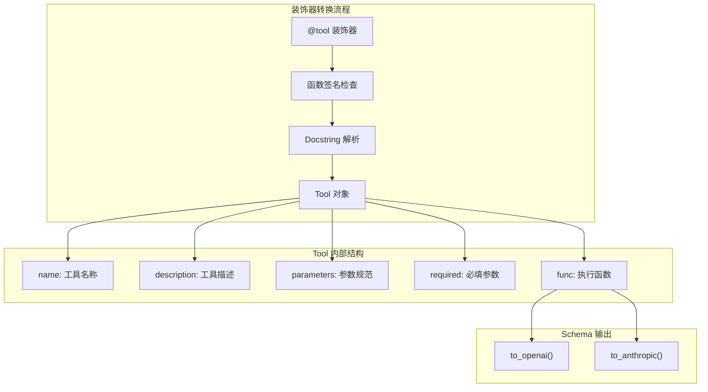
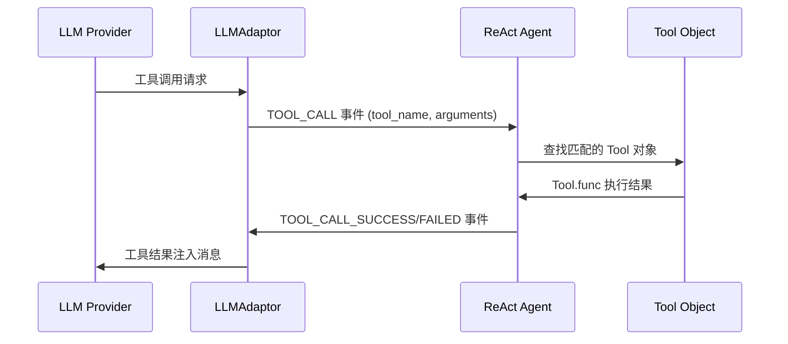

工具装饰器是本系统的核心抽象层，它将普通 Python 函数转换为符合 LLM 函数调用协议的工具对象。这套装饰器机制实现了函数签名到 OpenAI/Anthropic 工具 schema 的自动映射，并为 ReAct Agent 提供了统一的工具执行入口。

## 装饰器架构

装饰器系统由三个核心组件构成：`@tool` 装饰器、`Tool` 数据类、以及参数描述解析器。这三者在 `base/types.py` 中实现，共同完成了从函数定义到工具规范的结构化转换。



装饰器接受三个可选参数：直接应用时作为被装饰函数使用，或者接收 `name` 和 `description` 参数来自定义元数据。当无参数调用时支持 `@tool` 语法，有参数调用时支持 `@tool(name="xxx", description="yyy")` 语法。

```python
# 无参数形式 - 使用函数名和文档第一行作为描述
@tool
def read_file(file_path: str) -> str:
    """Read the full contents of a file.
    
    Args:
        file_path: Relative path from the project root
    """
    ...

# 带参数形式 - 自定义名称和描述
@tool(name="get_temperature", description="获取指定城市的温度")
def get_temperature(city: str, unit: str = "celsius") -> str:
    ...
```

Sources: [base/types.py#L184-L216](base/types.py#L184-L216)

## 参数类型映射

装饰器通过 Python 类型注解自动推断参数类型，并映射为 LLM API 接受的 schema 类型。当前支持的类型映射规则如下：

| Python 类型 | Schema 类型 | 用途 |
|------------|-------------|------|
| `str` | `string` | 文本参数 |
| `int` | `integer` | 整数参数 |
| `float` | `number` | 数值参数 |
| `bool` | `boolean` | 布尔参数 |
| `list` | `array` | 列表参数 |
| `dict` | `object` | 对象参数 |
| 无注解 | `string` | 默认处理 |

类型映射在内部字典 `_TYPE_MAP` 中定义，通过检查函数签名的 `annotation` 属性获取类型信息。如果参数没有类型注解，默认使用 `string` 类型。

```python
_TYPE_MAP = {
    str: "string",
    int: "integer",
    float: "number",
    bool: "boolean",
    list: "array",
    dict: "object",
}
```

Sources: [base/types.py#L174-L181](base/types.py#L174-L181)

## Docstring 参数解析

参数描述的提取采用正则表达式解析 Google 风格的 docstring。装饰器从函数的 `__doc__` 中查找 `Args:` 段落，逐行提取参数名和描述信息。

```python
def _parse_param_descriptions(docstring: str) -> Dict[str, str]:
    """解析 docstring 中的参数描述"""
    args_match = re.search(r'Args:\s*\n(.*?)(?=\n\n|\Z)', docstring, re.DOTALL)
    if not args_match:
        return {}
    descriptions = {}
    for line in args_match.group(1).split('\n'):
        match = re.match(r'(\w+):\s*(.+)', line.strip())
        if match:
            descriptions[match.group(1)] = match.group(2).strip()
    return descriptions
```

解析逻辑假设 docstring 遵循以下格式：
```
描述文本

Args:
    param_name: 参数描述
    another_param: 另一个参数描述

Returns:
    返回值描述
```

当 docstring 中没有 `Args:` 部分时，参数将使用参数名本身作为描述。

Sources: [base/types.py#L157-L171](base/types.py#L157-L171)

## Tool 数据类与 Schema 生成

`Tool` 数据类封装了工具的所有元信息，并提供了多协议兼容的 schema 生成方法。`to_openai()` 生成符合 OpenAI 函数调用规范的 schema，`to_anthropic()` 生成符合 Anthropic 工具调用规范的 schema。

```python
@dataclass
class Tool:
    name: str
    description: str
    parameters: Dict[str, ToolProperty] = field(default_factory=dict)
    required: List[str] = field(default_factory=list)
    func: Optional[Callable] = None

    def _build_schema(self) -> Dict[str, Any]:
        """构建参数 schema（OpenAI 和 Anthropic 共用）"""
        properties = {}
        for key, prop in self.parameters.items():
            prop_dict = {"type": prop.type, "description": prop.description}
            if prop.enum:
                prop_dict["enum"] = prop.enum
            properties[key] = prop_dict
        return {"type": "object", "properties": properties, "required": self.required}

    def to_openai(self) -> dict:
        return {
            "type": "function",
            "function": {
                "name": self.name,
                "description": self.description,
                "parameters": self._build_schema(),
            },
        }

    def to_anthropic(self) -> dict:
        return {
            "name": self.name,
            "description": self.description,
            "input_schema": self._build_schema(),
        }
```

这种设计确保了工具定义在两个主流 LLM 提供商之间的兼容性，适配器层可以根据配置选择使用哪种 schema 格式。

Sources: [base/types.py#L51-L83](base/types.py#L51-L83)

## 文件系统工具集

文件系统工具集实现了 ReAct Agent 在代码库研究时所需的基础能力，包括文件读取、目录列表、模式匹配和内容搜索。四个工具均使用 `@tool` 装饰器定义，并依赖 `ContextVar` 实现线程安全的项目根路径管理。

| 工具 | 功能 | 参数 |
|------|------|------|
| `read_file` | 读取文件内容 | `file_path`: 相对路径 |
| `list_directory` | 列出目录内容 | `dir_path`: 目录相对路径 |
| `glob_pattern` | 模式匹配文件 | `pattern`: glob 模式如 `**/*.py` |
| `grep_content` | 正则搜索内容 | `pattern`: 正则表达式，`file_pattern`: 文件过滤 |

工具集通过 `set_project_root()` 和 `get_project_root()` 管理项目上下文，支持并发研究场景下的线程安全隔离。读取和搜索结果有大小限制以控制上下文膨胀：`MAX_READ_SIZE = 20KB`、`MAX_GREP_RESULTS = 100`。

```python
_project_root_var: ContextVar[str] = ContextVar('project_root', default='')

def set_project_root(path: str) -> None:
    """设置当前研究会话的项目根目录（线程安全）"""
    _project_root_var.set(path)
```

Sources: [tool/fs_tool.py#L1-L135](tool/fs_tool.py#L1-L135)

## 工具在 ReAct Agent 中的执行流程

ReAct Agent 通过适配器层接收 LLM 的工具调用请求，并将 `Tool` 对象转换为可执行函数。执行流程如下：



工具执行时的参数解析采用 JSON 字符串反序列化：

```python
def _execute_tool(tool, tool_arguments: str):
    try:
        args = json.loads(tool_arguments)  # 安全解析 JSON
        result = tool(**args)  # 调用 Tool.func
        return result, None
    except Exception as e:
        return None, str(e)
```

Agent 内部维护消息历史，将工具调用和结果作为 `AssistantMessage` 和 `ToolMessage` 添加到对话上下文中，形成完整的 ReAct 循环。

Sources: [agent/react_agent.py#L31-L40](agent/react_agent.py#L31-L40)

## 工具注册与管道集成

在流水线研究中，工具通过 `prepare_research()` 函数注册到上下文中：

```python
def prepare_research(ctx: PipelineContext) -> tuple:
    """初始化研究工具和文件树，供 research_one_module 使用"""
    set_project_root(ctx.project_path)
    tools = [read_file, list_directory, glob_pattern, grep_content]
    file_tree = build_file_tree(ctx.all_files)
    return tools, file_tree
```

注意这里传递的是 `read_file`、`list_directory` 等 Tool 对象本身，而非普通函数。当 `research_one_module` 调用 `react_stream()` 时，这些 Tool 对象被传入并用于构建消息和执行工具调用。

## 扩展自定义工具

开发者可以通过 `@tool` 装饰器轻松扩展新的工具集：

```python
from base.types import tool

@tool(name="custom_tool", description="自定义工具描述")
def custom_tool(param1: str, param2: int = 10) -> str:
    """自定义工具的功能说明
    
    Args:
        param1: 第一个参数描述
        param2: 第二个参数描述
    """
    # 实现逻辑
    return f"{param1}, {param2}"
```

新增工具只需确保类型注解完整、docstring 格式规范，即可自动获得 schema 生成能力和 ReAct Agent 集成支持。

---

**相关文档**：
- [ReAct Agent实现](13-react-agentshi-xian) — 了解 Agent 如何调用工具
- [LLM适配器层](14-llmgua-pei-qi-ceng) — 了解多协议 schema 生成
- [提示词体系设计](18-ti-shi-ci-ti-xi-she-ji) — 了解工具在提示词中的应用