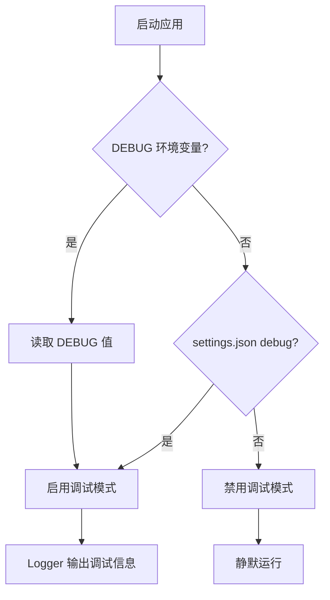
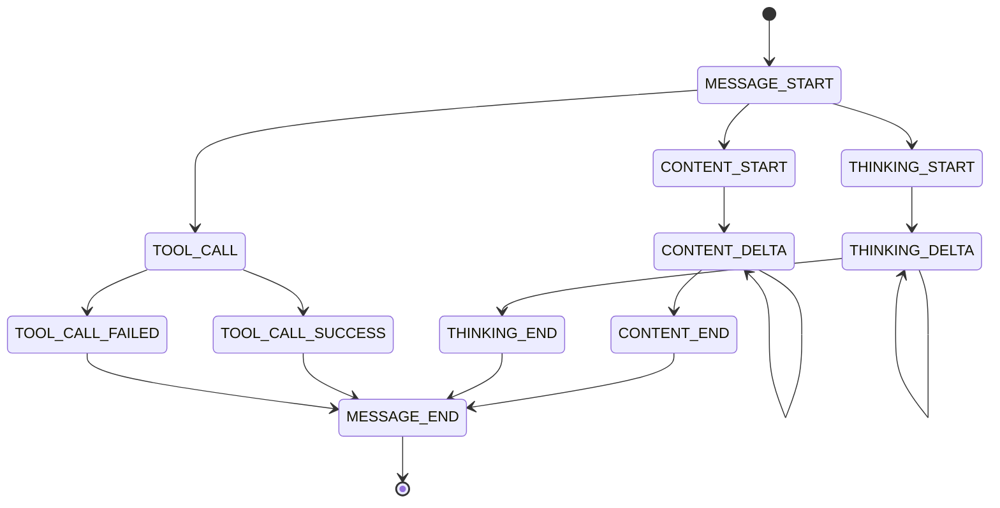

本页面详细说明 CodeDeepResearch 项目中的调试模式和日志系统，帮助开发者理解如何启用调试输出、配置日志行为，以及如何解读各类日志信息。

---

## 调试模式概述

项目采用**条件式日志策略**：只有在明确启用调试模式时，才输出详细的调试信息。这种设计既保证了生产环境的整洁输出，又为开发调试提供了充分的可见性。



调试模式的控制采用**双重来源优先级**：

| 来源 | 优先级 | 说明 |
|------|--------|------|
| `DEBUG` 环境变量 | 高 | 设为 `1`/`true`/`yes` 时强制启用 |
| `settings.json` | 低 | `debug` 字段配置 |

Sources: [logger.py](log/logger.py#L8-L23)

---

## 启用调试模式

### 方式一：环境变量

在终端中执行程序前设置环境变量：

```bash
# Linux/macOS
DEBUG=1 python main.py

# 或
export DEBUG=1
python main.py
```

### 方式二：配置文件

在 `settings.json` 中设置：

```json
{
  "debug": true
}
```

环境变量的优先级高于配置文件，这意味着即使用户在 `settings.json` 中禁用了调试，开发者仍可通过环境变量强制启用。

Sources: [settings.json](settings.json#L30-L31)

---

## 日志系统架构

日志系统由两个核心组件构成：

### Logger 类

`Logger` 是主要的日志输出类，提供 `debug()` 方法。该方法具有智能格式化能力，能够根据传入参数的类型自动选择合适的展示格式。

**关键特性**：

| 参数类型 | 展示方式 |
|----------|----------|
| `messages` | 以索引列表形式展示角色和内容预览 |
| `tools` | 展示工具名称、描述和参数定义 |
| `str` | 截断至100字符并添加省略号 |
| `dict/list` | JSON格式化后截断至200字符 |
| 其他 | 直接打印原始值 |

Sources: [logger.py](log/logger.py#L32-L73)

### Printer 模块

`Printer` 专注于事件流的打印，将底层事件转换为人类可读的日志输出。它与事件流架构紧密集成，负责渲染各类消息事件。

Sources: [printer.py](log/printer.py#L1-L32)

---

## 事件类型与日志映射

项目定义了完整的事件类型枚举，每种类型对应不同的日志输出：



**事件类型对照表**：

| 事件类型 | 日志标签 | 输出内容 |
|----------|----------|----------|
| `MESSAGE_START` | `[MESSAGE_START]` | 消息流开始 |
| `CONTENT_START` | `[Content Start]` | 正文内容开始 |
| `CONTENT_DELTA` | 实时输出 | 正文内容增量 |
| `CONTENT_END` | `[Content End]` | 正文内容结束 |
| `THINKING_START` | `[Thinking Start]` | 推理过程开始 |
| `THINKING_DELTA` | 实时输出 | 推理内容增量 |
| `THINKING_END` | `[Thinking End]` | 推理过程结束 |
| `TOOL_CALL` | `[Tool Call]` | 工具名称和参数 |
| `TOOL_CALL_SUCCESS` | `[Tool Result]` | 工具执行结果 |
| `TOOL_CALL_FAILED` | `[Tool Error]` | 工具错误信息 |
| `MESSAGE_END` | `[MESSAGE_END]` | 停止原因和用量统计 |
| `STEP_START` | `[STEP_START]` | 步骤编号 |
| `STEP_END` | `[STEP_END]` | 步骤编号 |

Sources: [types.py](base/types.py#L8-L23)
Sources: [printer.py](log/printer.py#L5-L32)

---

## 日志输出示例

启用调试模式后，日志系统会输出类似以下格式的信息：

### 消息流开始

```
[MESSAGE_START]
```

### 工具调用

```
[Tool Call]
  tool_name: read_file
  tool_arguments: {"file_path": "example.py", "start_line": 1, "end_line": 50}
```

### 工具执行结果

```
[Tool Result]
  tool_result: "def example():\n    pass"
```

### 消息结束

```
[MESSAGE_END]
  stop_reason: end_turn
  usage: {"input_tokens": 150, "output_tokens": 89}
```

Sources: [printer.py](log/printer.py#L20-L27)

---

## HTTP 库的日志抑制

项目自动抑制来自第三方 HTTP 库的调试日志，确保输出聚焦于业务逻辑：

```python
for _lib in ("httpx", "httpcore", "openai", "anthropic", "urllib3"):
    _lg = logging.getLogger(_lib)
    _lg.setLevel(logging.WARNING)
    _lg.propagate = False
```

这意味着即启用了全局调试模式，HTTP 请求的原始报文也不会被输出，避免了日志泛滥。

Sources: [logger.py](log/logger.py#L25-L29)

---

## 调试输出示例代码

### 基本用法

```python
from log import logger

# 简单消息
logger.debug("处理模块中...")

# 带附加数据
logger.debug("开始分析", module="scanner", file_count=42)

# 打印消息列表
messages = [
    {"role": "user", "content": "分析这个代码库"},
    {"role": "assistant", "content": "我将开始扫描..."}
]
logger.debug("消息历史", messages=messages)
```

### 工具信息输出

```python
# 打印工具列表
tools = [
    Tool(
        name="read_file",
        description="读取文件内容",
        parameters={...}
    )
]
logger.debug("可用工具", tools=tools)
```

Sources: [logger.py](log/logger.py#L35-L70)

---

## 生产环境建议

| 场景 | 配置建议 |
|------|----------|
| 开发调试 | 设置 `DEBUG=1` 或 `settings.json` 中 `"debug": true` |
| 生产运行 | 确保 `settings.json` 中 `"debug": false` 或不设置 |
| 问题排查 | 使用环境变量临时启用，不修改配置文件 |
| CI/CD 流水线 | 通过环境变量控制，不依赖配置文件 |

---

## 快速检查清单

调试时按以下顺序检查：

1. **确认调试模式已启用**：运行 `echo $DEBUG` 或检查 `settings.json`
2. **检查 Python 环境变量**：确保在正确的虚拟环境中运行
3. **查看日志输出**：启用后应看到 `[MESSAGE_START]` 等事件标签
4. **分析具体事件**：根据事件类型定位问题所在阶段

---

## 下一步

完成调试配置后，建议进一步了解：

- [ReAct Agent实现](13-react-agentshi-xian) — 了解智能体如何利用日志系统进行调试
- [事件流架构](12-shi-jian-liu-jia-gou) — 深入理解事件驱动的日志机制
- [配置文件详解](4-pei-zhi-wen-jian-xiang-jie) — 全面掌握 settings.json 的各项配置