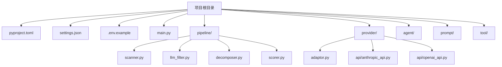

本文档详细介绍 CodeDeepResearch 项目的环境配置与依赖安装全过程。CodeDeepResearch 是一个基于 LLM 的自动化代码深度分析引擎，要求 Python 3.12+ 环境，并支持 OpenAI 和 Anthropic 两种协议格式与 LLM 进行交互。通过阅读本文档，初学者将能够完整搭建开发环境并成功运行第一个代码分析任务。

## 前置条件检查

在开始安装之前，需要确认系统满足以下要求。项目使用 Python 3.12 作为运行时环境，并采用 uv 作为包管理工具，这比传统的 pip 更加高效。

### 系统要求

| 要求项 | 最低版本 | 验证方式 |
|--------|----------|----------|
| Python | 3.12+ | `python3 --version` |
| 包管理器 | uv | `uv --version` |
| 磁盘空间 | 500MB | - |
| 网络 | 可访问 DeepSeek API | - |

### 安装 uv（如未安装）

如果系统尚未安装 uv，可以通过以下方式安装：

```bash
# macOS/Linux
curl -LsSf https://astral.sh/uv/install.sh | sh

# 或使用 pip
pip install uv
```

Sources: [CLAUDE.md](CLAUDE.md#L122-L123)
Sources: [.python-version](.python-version#L1-L2)

## 项目结构概览

在配置环境之前，先了解项目的目录结构有助于理解各个配置文件的作用位置。下面的 Mermaid 图展示了项目的核心目录组织方式：



Sources: [pyproject.toml](pyproject.toml#L1-L12)

## 依赖安装

### 使用 uv 安装

项目依赖通过 `pyproject.toml` 文件定义，使用 uv 进行同步安装是最推荐的方式。uv 能够自动解析依赖关系并创建虚拟环境。

```bash
# 进入项目目录
cd /path/to/CodeDeepResearch

# 安装所有依赖
uv sync
```

安装完成后，uv 会在项目根目录创建 `.venv` 虚拟环境。所有后续的 Python 命令都需要通过 `uv run` 执行，以确保在正确的虚拟环境中运行。

Sources: [pyproject.toml](pyproject.toml#L1-L12)
Sources: [README.md](README.md#L35-L36)

### 核心依赖说明

项目仅依赖三个核心包，这种精简的依赖设计降低了环境配置的复杂度。

| 依赖包 | 版本要求 | 用途说明 |
|--------|----------|----------|
| anthropic | ≥0.89.0 | Anthropic 协议客户端，用于 Claude 等模型调用 |
| openai | ≥2.30.0 | OpenAI 协议客户端，用于 DeepSeek 等模型调用 |
| langfuse | ≥4.5.0 | 提示词管理和追踪平台（可选） |

Sources: [pyproject.toml](pyproject.toml#L7-L10)

## 环境变量配置

### 必需的环境变量

项目运行时需要配置 API 密钥等敏感信息，这些通过环境变量注入。建议创建 `.env` 文件来管理环境变量。

```bash
# 复制示例环境变量文件
cp .env.example .env

# 编辑 .env 文件，填入你的 API Key
```

`.env.example` 文件中包含以下配置项：

```bash
# Langfuse 配置（可选，用于提示词管理）
LANGFUSE_SECRET_KEY="sk-lf-248fa5dd-8735-4206-ae71-670abb265b67"
LANGFUSE_PUBLIC_KEY="pk-lf-631ef405-1f48-4eca-be15-ab72948c740c"
LANGFUSE_BASE_URL="http://localhost:3000"

# DeepSeek API 配置（必需）
DEEPSEEK_API_KEY="your-api-key"
```

环境变量的加载在多个模块中通过 `dotenv.load_dotenv()` 实现，确保在项目启动时自动读取 `.env` 文件中的配置。

Sources: [.env.example](.env.example#L1-L5)
Sources: [provider/api/openai_api.py](provider/api/openai_api.py#L6)
Sources: [main.py](main.py#L5)

### 可选的环境变量

| 变量名 | 默认值 | 说明 |
|--------|--------|------|
| DEBUG | 0 | 设置为 1 可启用调试日志输出 |

Sources: [CLAUDE.md](CLAUDE.md#L24-L26)

## 配置文件详解

### settings.json 结构

`s settings.json` 是项目的核心配置文件，采用 JSON 格式存储三层模型配置和运行时参数。配置文件支持默认值自动合并，即使文件内容不完整也能正常运行。

```json
{
  "lite": { ... },
  "pro": { ... },
  "max": { ... },
  "max_sub_agent_steps": 30,
  "research_parallel": true,
  "research_threads": 10,
  "debug": false
}
```

Sources: [settings.json](settings.json#L1-L33)

### 三层模型配置

项目采用三级模型分层设计，不同层级的任务分配给不同能力的模型，实现速度与质量的平衡。这种设计理念体现在配置中，每个层级都有独立的 provider、base_url、model 等参数。

| 层级 | 用途 | 特点 |
|------|------|------|
| lite | 文件分类、过滤、打分 | 速度快，处理轻量级任务 |
| pro | 子模块深度分析、评估 | 推理能力强，平衡性能 |
| max | 最终报告汇总 | 最强推理能力，适合复杂整合 |

每个层级的配置结构相同，包含以下参数：

```json
{
  "provider": "anthropic",
  "base_url": "https://api.deepseek.com",
  "api_key": "${DEEPSEEK_API_KEY}",
  "model": "deepseek-v4-flash",
  "max_tokens": 8192,
  "thinking": false,
  "reasoning_effort": "high"
}
```

| 参数 | 说明 | 示例值 |
|------|------|--------|
| provider | 协议类型 | `openai` 或 `anthropic` |
| base_url | API 端点地址 | `https://api.deepseek.com/anthropic` |
| api_key | API 密钥（支持环境变量） | `${DEEPSEEK_API_KEY}` |
| model | 模型名称 | `deepseek-v4-flash` |
| max_tokens | 最大输出 token 数 | `8192` |
| thinking | 是否启用思考模式 | `true`/`false` |
| reasoning_effort | 推理投入程度 | `high`/`max` |

Sources: [settings.py](settings.py#L5-L30)
Sources: [README.md](README.md#L45-L62)

### 运行时参数

除三层模型配置外，settings.json 还包含以下运行时控制参数：

| 参数 | 默认值 | 说明 |
|------|--------|------|
| max_sub_agent_steps | 30 | 每个 Agent 的最大执行步数 |
| research_parallel | true | 是否并行研究多个模块 |
| research_threads | 10 | 并行研究的最大线程数 |
| debug | false | 是否启用调试模式 |

Sources: [settings.py](settings.py#L30-L35)
Sources: [settings.json](settings.json#L26-L32)

### 配置加载机制

配置系统采用默认值合并策略，项目内部定义了完整的默认配置 `DEFAULTS`，用户配置文件中的值会与默认值合并，未指定的字段使用默认值。

```python
_DEFAULTS = {
    "lite": { "provider": "openai", "model": "deepseek-v4-flash", ... },
    "pro": { ... },
    "max": { ... },
    "max_sub_agent_steps": 30,
    "research_parallel": True,
    ...
}
```

配置加载时会依次检查多个位置：当前工作目录的 `settings.json`、脚本同目录的 `settings.json`，都找不到时则使用内置默认值。环境变量替换通过 `_expand_env_vars()` 函数递归处理，支持 `${VAR_NAME}` 语法。

Sources: [settings.py](settings.py#L55-L95)

## 快速验证

安装和配置完成后，可以通过以下步骤验证环境是否正确搭建。

### 步骤一：检查 Python 环境

```bash
uv run python --version
# 应输出: Python 3.12.x
```

### 步骤二：验证依赖安装

```bash
uv run python -c "import anthropic, openai, langfuse; print('依赖检查通过')"
```

### 步骤三：测试 API 连接

创建一个简单的测试脚本验证 API 配置正确：

```bash
uv run python -c "
from settings import load_settings
config = load_settings()
print('lite 配置:', config['lite']['model'])
print('pro 配置:', config['pro']['model'])
print('max 配置:', config['max']['model'])
"
```

### 步骤四：运行示例分析

使用项目根目录本身作为分析目标进行测试：

```bash
uv run python main.py . -o test_report.md
```

Sources: [main.py](main.py#L1-L51)
Sources: [CLAUDE.md](CLAUDE.md#L18-L23)

## 常见问题排查

### 问题一：ModuleNotFoundError

如果在运行时报 `ModuleNotFoundError`，需要重新执行依赖安装：

```bash
uv sync
```

### 问题二：API Key 未配置

如果提示 `API key not found`，检查环境变量是否正确设置：

```bash
# 检查环境变量
echo $DEEPSEEK_API_KEY

# 如果为空，配置并生效
export DEEPSEEK_API_KEY="your-actual-api-key"
```

### 问题三：Protocol 端点格式错误

Anthropic 协议的 base_url 必须以 `/anthropic` 结尾。配置系统会自动修正此问题，但手动配置时需注意：

```json
// 正确
"base_url": "https://api.deepseek.com/anthropic"

// 错误
"base_url": "https://api.deepseek.com"
```

Sources: [settings.py](settings.py#L47-L52)

## 下一步

完成环境配置后，建议按以下顺序阅读文档：

- 继续阅读 [快速启动指南](2-kuai-su-qi-dong-zhi-nan)，了解如何运行第一个分析任务
- 阅读 [配置文件详解](4-pei-zhi-wen-jian-xiang-jie)，深入理解配置选项的高级用法
- 查看 [项目概述](1-xiang-mu-gai-shu)，了解系统的整体架构