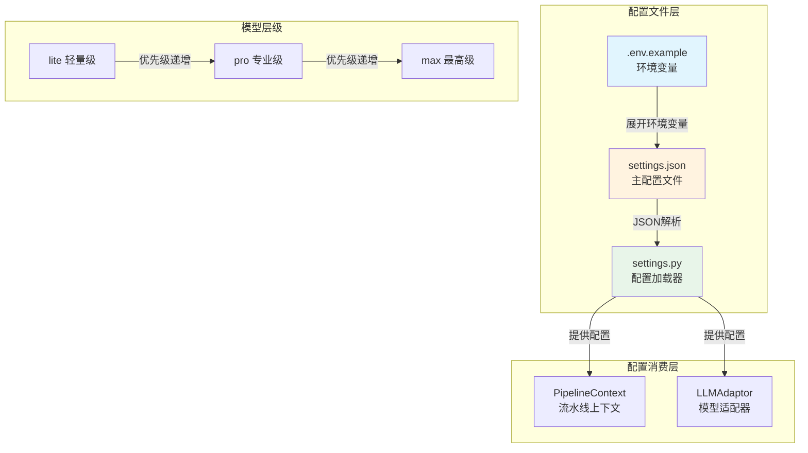

本页面详细说明 CodeDeepResearch 项目中的配置文件体系，涵盖配置层级、参数含义、环境变量管理以及配置加载机制，帮助开发者理解如何按需定制系统行为。

## 配置文件全景图

项目采用分层配置架构，通过 `settings.json` 定义运行时参数，由 `settings.py` 统一加载和管理。这种设计将配置逻辑与业务代码分离，既支持 JSON 格式的声明式配置，又具备 Python 的动态能力。



## settings.json 主配置详解

`settings.json` 是项目的主配置文件，采用 JSON 格式定义所有运行时参数。

```json
{
  "lite": { ... },
  "pro": { ... },
  "max": { ... },
  "max_sub_agent_steps": 30,
  "research_parallel": true,
  "research_threads": 10,
  "debug": false
}
```

### 模型层级配置

项目定义了三个模型层级，分别对应不同的分析任务复杂度。层级之间通过 `thinking` 参数区分推理深度：

| 层级 | 用途 | thinking | 适用场景 |
|------|------|----------|----------|
| lite | 快速扫描与初步分析 | false | 文件过滤、简单分类 |
| pro | 标准深度分析 | true | 模块拆分、报告生成 |
| max | 复杂问题深度研究 | true + effort=max | 架构设计、代码考古 |

```json
"lite": {
    "provider": "anthropic",
    "base_url": "https://api.deepseek.com",
    "api_key": "${DEEPSEEK_API_KEY}",
    "model": "deepseek-v4-flash",
    "max_tokens": 8192,
    "thinking": false
}
```

每个模型配置包含以下核心参数：

**provider** — 指定协议客户端类型。系统支持 `openai` 和 `anthropic` 两种协议，通过此参数决定使用哪个适配器。

**base_url** — API 端点地址。配置中使用的 `https://api.deepseek.com` 是 DeepSeek API 的官方地址。

**api_key** — API 密钥。此处使用 `${DEEPSEEK_API_KEY}` 语法引用环境变量，避免密钥硬编码在配置文件中。

**model** — 模型标识符。不同层级可指向同一模型（如 `deepseek-v4-pro`），通过 `thinking` 和 `reasoning_effort` 参数区分能力。

**max_tokens** — 单次请求最大 token 数。设置 8192 是为了在获得充分响应的同时控制成本。

**thinking** — 是否启用思维链模式。设为 `true` 时模型会输出推理过程，适合复杂分析任务。

**reasoning_effort** — 推理强度配置，仅在 thinking=true 时生效。可选值包括 `high`（高）和 `max`（最高），影响模型投入的推理算力。

Sources: [settings.json](settings.json#L1-L33)

### 并行研究配置

```json
"max_sub_agent_steps": 30,
"research_parallel": true,
"research_threads": 10,
```

这三个参数控制深度研究阶段的执行策略：

`max_sub_agent_steps` 限制子 agent 的最大步数，防止无限循环。设为 30 意味着在深度研究一个模块时，agent 最多执行 30 次工具调用。

`research_parallel` 决定是否启用并行模式。启用时多个模块同时研究，关闭时按顺序逐个处理。

`research_threads` 仅在并行模式生效，指定同时进行的最大线程数。

Sources: [settings.json](settings.json#L30-L33), [pipeline/run.py](pipeline/run.py#L67-L87)

### 调试模式配置

`debug` 参数控制调试信息输出。在正式分析时应设为 `false`，仅在排查问题时启用。

Sources: [settings.json](settings.json#L33)

## 环境变量管理

### .env.example 示例文件

```bash
LANGFUSE_SECRET_KEY="sk-lf-248fa5dd-8735-4206-ae71-670abb265b67"
LANGFUSE_PUBLIC_KEY="pk-lf-631ef405-1f48-4eca-be15-ab72948c740c"
LANGFUSE_BASE_URL="http://localhost:3000"

DEEPSEEK_API_KEY="your-api-key"
```

环境变量文件用于配置第三方服务凭证。复制为 `.env` 后填入真实密钥即可生效。`${VAR}` 语法会自动展开这些环境变量。

Sources: [.env.example](.env.example#L1-L5)

### 环境变量展开机制

`settings.py` 中的 `_expand_env_vars` 函数递归处理配置中的 `${VAR}` 语法：

```python
def _expand_env_vars(obj):
    """Recursively expand ${VAR} environment variables in strings."""
    if isinstance(obj, str):
        return os.path.expandvars(obj)
    elif isinstance(obj, dict):
        return {k: _expand_env_vars(v) for k, v in obj.items()}
    elif isinstance(obj, list):
        return [_expand_env_vars(item) for item in obj]
    return obj
```

这意味着配置文件中任何字符串位置都可以使用环境变量引用，包括 base_url、api_key 等参数。

Sources: [settings.py](settings.py#L38-L46)

## 配置加载机制

### 自动路径搜索

`load_settings` 函数按优先级尝试以下路径：

1. 当前工作目录下的 `settings.json`
2. settings.py 同级目录下的 `settings.json`
3. 内置默认配置（_DEFAULTS 字典）

```python
candidates = [
    os.path.join(os.getcwd(), "settings.json"),
    os.path.join(os.path.dirname(os.path.abspath(__file__)), "settings.json"),
]
```

这种设计允许用户在任意目录下放置配置文件，系统会自动发现。

Sources: [settings.py](settings.py#L56-L66)

### 配置合并策略

加载配置时采用分层合并策略：

```python
merged = {**_DEFAULTS, **user_settings}
for tier in ["lite", "pro", "max"]:
    if tier in merged and tier in _DEFAULTS:
        merged[tier] = {**_DEFAULTS[tier], **merged.get(tier, {})}
```

全局参数覆盖默认配置，每个模型层级的内部参数也在各自范围内覆盖默认值。这允许用户只覆盖关心的部分，其余保持默认。

Sources: [settings.py](settings.py#L68-L70)

### Anthropic 协议 URL 规范化

当 provider 设为 `anthropic` 时，系统自动确保 base_url 以 `/anthropic` 结尾：

```python
def _normalize_base_url(config: dict) -> None:
    """如果 provider 是 anthropic，自动确保 base_url 以 /anthropic 结尾。"""
    provider = config.get("provider", "")
    base_url = config.get("base_url", "")
    if provider == "anthropic" and base_url and not base_url.rstrip("/").endswith("/anthropic"):
        config["base_url"] = base_url.rstrip("/") + "/anthropic"
```

这是因为 Anthropic SDK 需要在 API 端点后追加 `/anthropic` 路径，自动处理避免了手动配置的麻烦。

Sources: [settings.py](settings.py#L31-L38)

## 配置消费流程

### 流水线中的配置传递

在 `run_pipeline` 中，配置被取出并封装到 PipelineContext：

```python
lite_config = get_config("lite")
pro_config = get_config("pro")
max_config = get_config("max")

ctx = PipelineContext(
    project_path=project_path,
    project_name=project_name,
    lite_config=lite_config,
    pro_config=pro_config,
    max_config=max_config,
    max_sub_agent_steps=max_sub_agent_steps,
    research_parallel=research_parallel,
    research_threads=research_threads,
    settings=settings,
)
```

不同阶段使用不同的模型层级：阶段二（LLM过滤）使用 lite，阶段三（模块拆分）使用 pro，阶段五（深度研究）使用 max。

Sources: [pipeline/run.py](pipeline/run.py#L34-L50)

### 模型适配器的配置注入

LLMAdaptor 接收配置后，根据 provider 字段决定加载哪个 API 客户端：

```python
if self._provider == "openai":
    from provider.api.openai_api import call_stream_openai, call_openai
    self._call_stream = call_stream_openai
    self._call = call_openai
elif self._provider == "anthropic":
    from provider.api.anthropic_api import call_stream_anthropic, call_anthropic
    self._call_stream = call_stream_anthropic
    self._call = call_anthropic
```

这种架构使得更换模型提供商变得简单，只需修改 settings.json 中的 provider 字段。

Sources: [provider/adaptor.py](provider/adaptor.py#L49-L60)

## 常见配置场景

### 切换模型提供商

将 provider 从 `anthropic` 改为 `openai`，同时调整 base_url：

```json
"lite": {
    "provider": "openai",
    "base_url": "https://api.deepseek.com/v1",
    "model": "deepseek-v4-flash"
}
```

适配器会自动选择对应的 API 客户端，无需修改业务代码。

Sources: [settings.py](settings.py#L49-L60)

### 调优并行研究参数

如果项目文件较多，增加并行线程数：

```json
"research_parallel": true,
"research_threads": 20
```

如果遇到 API 限流错误，减少线程数或关闭并行模式：

```json
"research_parallel": false
```

### 启用调试模式

排查问题时启用 debug：

```json
"debug": true
```

这会在控制台输出详细的执行信息，包括 API 调用、文件扫描进度等。

Sources: [settings.json](settings.json#L33)

## 进阶配置

### 自定义默认参数

修改 `settings.py` 中的 `_DEFAULTS` 字典可以改变内置默认配置。这在需要批量部署相同配置的场景下很有用。

Sources: [settings.py](settings.py#L7-L25)

### 配置缓存管理

`load_settings` 函数会缓存已加载的配置：

```python
if _settings is not None:
    return _settings
```

测试场景下可通过 `reset_settings()` 函数清除缓存：

```python
def reset_settings() -> None:
    """Reset settings cache (useful for testing)."""
    global _settings
    _settings = None
```

Sources: [settings.py](settings.py#L73-L75), [settings.py](settings.py#L102-L105)

## 下一步

- 继续阅读 [六阶段分析流水线](5-liu-jie-duan-fen-xi-liu-shui-xian) 了解配置在流水线各阶段的实际应用
- 查看 [环境配置与依赖安装](3-huan-jing-pei-zhi-yu-yi-lai-an-zhuang) 完成本地开发环境搭建
- 参考 [项目概述](1-xiang-mu-gai-shu) 了解系统整体架构