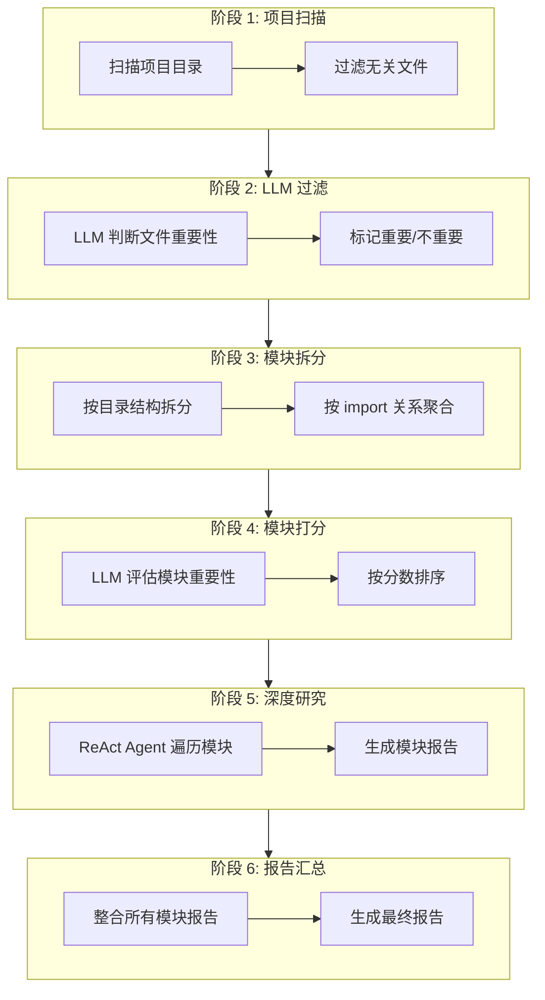
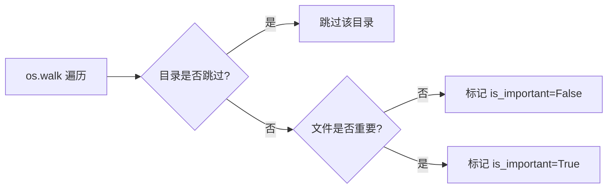
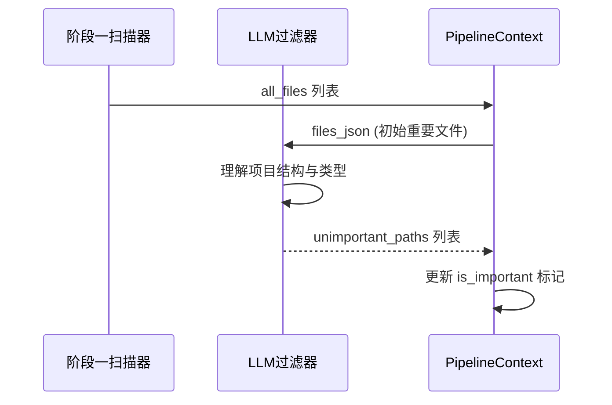
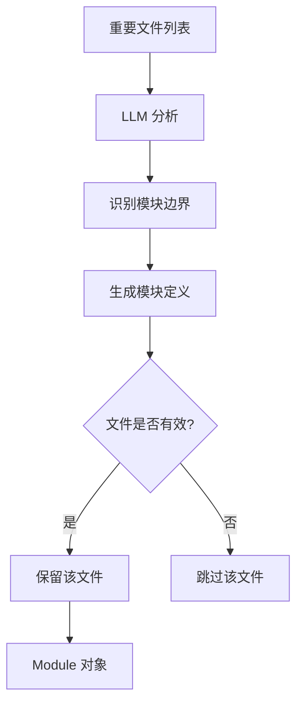
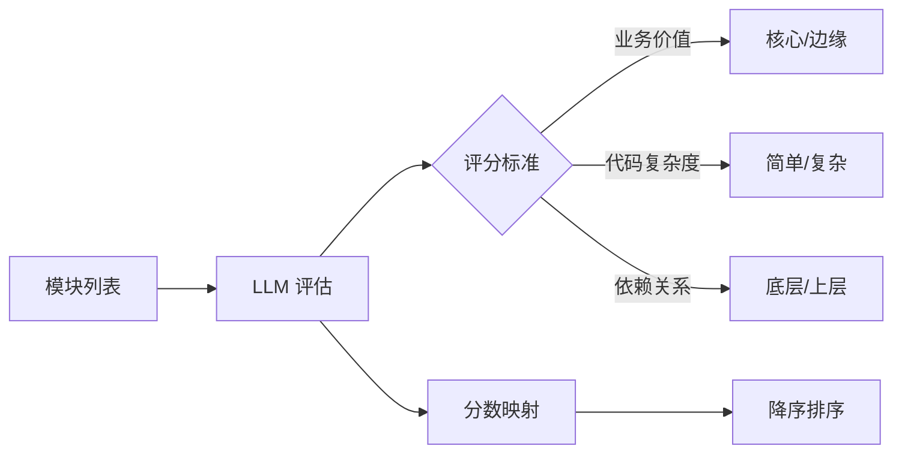
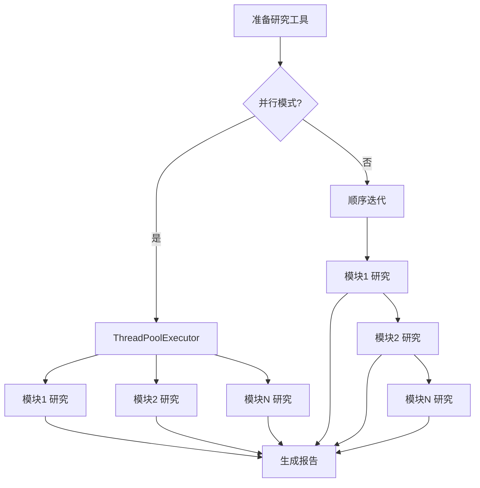
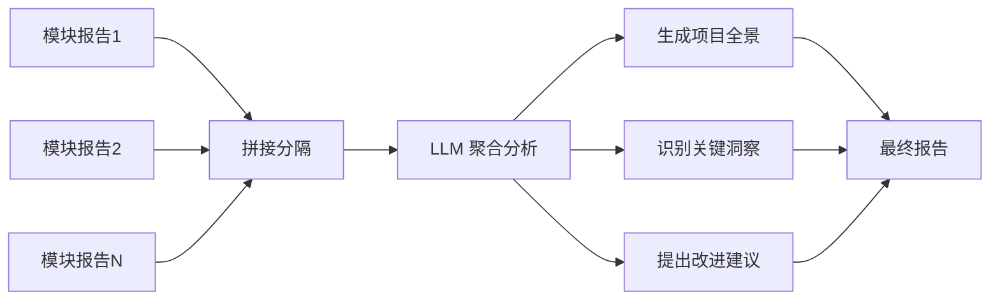

六阶段分析流水线是 CodeDeepResearch 项目的核心执行引擎，通过渐进式分析策略将任意规模的代码仓库转化为结构化研究报告。该流水线采用**分层模型调用**策略：轻量级任务使用 `lite` 配置快速执行，深度研究任务使用 `pro` 配置，而最终聚合使用最高算力的 `max` 配置。

Sources: [pipeline/run.py](pipeline/run.py#L25-L55)

## 流水线整体架构



## 核心数据结构

流水线各阶段通过 `PipelineContext` 数据上下文传递信息，该上下文包含三个关键数据槽位：

| 数据槽位 | 类型 | 阶段 | 说明 |
|---------|------|------|------|
| `all_files` | `list[FileInfo]` | 1→2→3→6 | 所有扫描到的文件及其元数据 |
| `modules` | `list[Module]` | 3→4→5→6 | 拆分后的模块及其评分、研究报告 |
| `final_report` | `str` | 6 | 最终聚合生成的完整报告 |

Sources: [pipeline/types.py](pipeline/types.py#L21-L41)

## 模型配置层级

项目采用三级模型配置体系，通过 `settings.json` 中的 `lite`、`pro`、`max` 三个层级控制不同阶段的计算资源投入：

| 层级 | 用途 | 思考模式 | 典型场景 |
|------|------|----------|----------|
| `lite` | 快速决策任务 | 关闭 | 文件过滤、模块拆分、打分排序 |
| `pro` | 深度分析任务 | 高强度 | 阶段5子模块研究 |
| `max` | 聚合生成任务 | 最高强度 | 阶段6最终报告汇总 |

Sources: [settings.py](settings.py#L7-L38)
Sources: [pipeline/run.py](pipeline/run.py#L36-L43)

## 六阶段详细流程

### 阶段一：项目扫描

**扫描器** (`scanner.py`) 负责遍历项目目录，构建完整的文件清单。该阶段基于预定义规则进行**初轮过滤**，排除明显的非代码文件。



**排除规则**包括：
- **目录级过滤**：`UNIMPORTANT_DIRS` 包含 `.git`, `.venv`, `test`, `log`, `__pycache__`, `.report`
- **文件名过滤**：`UNIMPORTANT_NAMES` 包含 `.DS_Store`, `.gitignore`, `CLAUDE.md`, `__init__.py`
- **扩展名过滤**：`UNIMPORTANT_EXTENSIONS` 包含 `.log`, `.lock`

Sources: [pipeline/scanner.py](pipeline/scanner.py#L8-L19)

扫描结果存储为 `FileInfo` 对象列表，每个文件包含路径、大小、文件类型（code/doc/config）和重要性标记。

Sources: [pipeline/scanner.py](pipeline/scanner.py#L56-L78)

### 阶段二：LLM 智能过滤

**LLM 过滤器** (`llm_filter.py`) 调用大语言模型进行**语义级重要性判断**，弥补规则过滤的局限性。该阶段仅对初始标记为重要的文件进行二次筛选。



过滤器通过 `file-filter` 提示词模板调用 `LLMAdaptor`，要求模型返回 JSON 格式的无关文件路径列表。

Sources: [pipeline/llm_filter.py](pipeline/llm_filter.py#L9-L31)

### 阶段三：模块拆分

**模块分解器** (`decomposer.py`) 基于文件结构和代码依赖关系将项目划分为逻辑模块。该阶段是流水线的关键抽象层，将扁平的 FileInfo 列表转化为结构化的 Module 列表。



LLM 根据目录结构、文件名模式和可能的 import 关系进行智能分组，每个 Module 包含名称、描述和文件列表。

Sources: [pipeline/decomposer.py](pipeline/decomposer.py#L9-L34)

### 阶段四：模块打分排序

**打分器** (`scorer.py`) 对阶段三识别的模块进行重要性评估，采用百分制评分体系。评分结果用于后续排序，确保高价值模块优先被研究。



评分维度包括模块的业务重要性、代码复杂度、与其他模块的耦合度等因素。

Sources: [pipeline/scorer.py](pipeline/scorer.py#L9-L26)

### 阶段五：深度研究

**研究者** (`researcher.py`) 是流水线中最耗时的阶段，使用 ReAct Agent 对每个模块进行深度代码考古研究。该阶段支持**并行/串行**两种执行模式。



**ReAct Agent 循环**由 `Observe → Think → Act` 三步组成：
1. **Observe**：Agent 读取代码文件内容
2. **Think**：分析代码模式、技术选型、实现逻辑
3. **Act**：调用文件系统工具进行进一步探索

Sources: [pipeline/researcher.py](pipeline/researcher.py#L20-L40)
Sources: [agent/react_agent.py](agent/react_agent.py#L42-L108)

研究者使用 `pro` 配置调用模型，最大步数由 `max_sub_agent_steps` 参数控制（默认30步），支持并行线程数由 `research_threads` 参数控制（默认10线程）。

Sources: [settings.py](settings.py#L34-L36)

### 阶段六：报告汇总

**聚合器** (`aggregator.py`) 整合阶段五生成的所有模块研究报告，通过 ReAct Agent 生成最终的项目整体分析报告。



该阶段使用 `max` 配置（最高算力），确保最终报告具有最佳质量。工具集与研究阶段相同（read_file, list_directory, glob_pattern, grep_content）。

Sources: [pipeline/aggregator.py](pipeline/aggregator.py#L11-L28)

## 流水线执行入口

`run_pipeline()` 函数是流水线的单一入口点，负责：
1. 初始化 `PipelineContext` 和会话 ID
2. 创建报告输出目录
3. 顺序执行六个阶段
4. 通过 Langfuse 进行可观测性追踪

```python
# 核心编排逻辑
ctx = PipelineContext(project_path=project_path, ...)
report_dir = os.path.join(".report", project_name, timestamp)

scan_project(ctx)           # 阶段1
llm_filter_files(ctx)       # 阶段2
decompose_into_modules(ctx) # 阶段3
score_and_rank_modules(ctx) # 阶段4
research_one_module(...)    # 阶段5 (并行/串行)
aggregate_reports(...)      # 阶段6
```

Sources: [pipeline/run.py](pipeline/run.py#L25-L122)

## 报告输出结构

分析完成后，报告目录结构如下：

```
.report/{project_name}/{timestamp}/
├── 模块分析报告-{module1}.md
├── 模块分析报告-{module2}.md
├── ...
├── 模块分析报告-{moduleN}.md
└── 最终报告-{project_name}.md
```

Sources: [pipeline/run.py](pipeline/run.py#L57-L59)
Sources: [pipeline/researcher.py](pipeline/researcher.py#L37-L39)

## 并行研究配置

当 `settings.json` 中 `research_parallel=true` 时，阶段五使用 `ThreadPoolExecutor` 实现多模块并行研究：

```python
with ThreadPoolExecutor(max_workers=ctx.research_threads) as executor:
    futures = {
        executor.submit(_observed_research_module, ctx, m, tools, report_dir, file_tree, session_id): m
        for m in ctx.modules
    }
    for future in as_completed(futures):
        # 收集结果并打印进度
```

Sources: [pipeline/run.py](pipeline/run.py#L91-L104)

## 后续学习路径

理解流水线整体架构后，建议深入各阶段实现细节：

- [阶段一：项目扫描](6-jie-duan-xiang-mu-sao-miao) — 深入了解文件扫描与过滤机制
- [阶段五：深度研究](10-jie-duan-wu-shen-du-yan-jiu) — ReAct Agent 实现原理
- [ReAct Agent实现](13-react-agentshi-xian) — Observe-Think-Act 循环机制