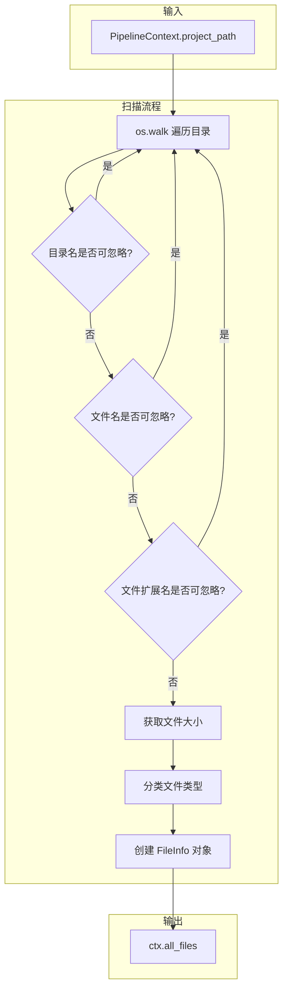

项目扫描是六阶段分析流水线的入口环节，负责对目标代码仓库进行系统性遍历，提取文件元数据并建立初步的重要性标注。这为后续的智能过滤和模块拆分提供了原始数据基础。

## 核心组件架构

项目扫描功能由 `scanner.py` 单一模块承载，核心函数 `scan_project()` 接收 `PipelineContext` 上下文对象，执行文件遍历后将结果写入上下文的 `all_files` 字段。



Sources: [scanner.py](pipeline/scanner.py#L56-L77)

## 双层过滤机制

项目扫描采用**规则预过滤 + LLM 智能过滤**的双层架构。第一层在扫描阶段通过确定性规则完成，初步排除明显不重要的文件；第二层在阶段二（LLM智能过滤）通过大语言模型判断文件重要性。

### 规则预过滤配置

```python
# 不进入的目录（直接跳过整个目录树）
UNIMPORTANT_DIRS = {".git", ".venv", "test", "log", "__pycache__", ".report"}

# 直接排除的文件名
UNIMPORTANT_NAMES = {".DS_Store", ".gitignore", "CLAUDE.md", "__init__.py"}

# 直接排除的扩展名
UNIMPORTANT_EXTENSIONS = {".log", ".lock"}
```

Sources: [scanner.py](pipeline/scanner.py#L8-L19)

这种设计确保了大量临时文件、缓存目录不会进入后续处理流程，显著降低了后续LLM调用的Token消耗。目录过滤在 `os.walk` 迭代中通过修改 `dirnames` 列表实现原地过滤：

```python
dirnames[:] = [d for d in sorted(dirnames) 
               if d not in UNIMPORTANT_DIRS and not d.startswith(".")]
```

Sources: [scanner.py](pipeline/scanner.py#L61)

## 文件元数据结构

扫描结果以 `FileInfo` 数据类存储，每个被遍历的文件都会生成一个元数据对象：

| 字段 | 类型 | 说明 |
|------|------|------|
| `path` | `str` | 相对于项目根目录的路径 |
| `size` | `int` | 文件字节数 |
| `file_type` | `str` | 分类：code / doc / config |
| `is_important` | `bool` | 重要性标记，初始为 `True` |

Sources: [types.py](pipeline/types.py#L4-L9)

### 文件类型自动分类

`scanner.py` 内部根据文件扩展名和名称自动推断文件类型：

```python
def _get_file_type(path: str) -> str:
    if ext in DOC_EXTENSIONS: return "doc"
    if ext in CONFIG_EXTENSIONS: return "config"
    return "code"
```

Sources: [scanner.py](pipeline/scanner.py#L36-L43)

类型判定优先级为：文档 > 配置 > 代码。这意味着 `.md` 文件会被标记为文档类型，而 `.json`、`.yaml`、`.toml` 等配置文件则进入配置类型队列。

## 重要性判定机制

`is_important` 字段是贯穿整个流水线的关键标记。扫描阶段结束后，所有文件初始标记为重要（`True`），随后在阶段二通过LLM进行二次判断：

```python
# 阶段二：LLM 智能过滤
for f in ctx.all_files:
    if f.path in unimportant_paths:
        f.is_important = False
```

Sources: [llm_filter.py](pipeline/llm_filter.py#L27-L30)

这种设计使得扫描阶段保持纯粹的规则驱动，避免引入复杂的语义判断逻辑，同时保留了在后续阶段进行智能调整的灵活性。

## 流水线集成方式

在 `run.py` 的主流程编排中，扫描阶段作为第一个执行环节：

```python
# ====== 阶段 1: 扫描 ======
print(f"\n{'='*60}\n阶段 1/6: 扫描项目 [{project_name}]\n{'='*60}")
_observed("scan_project", scan_project, ctx, session_id=session_id)
print(f"  扫描到 {len(ctx.all_files)} 个文件")
```

Sources: [run.py](pipeline/run.py#L62-L65)

使用 `_observed()` 包装函数，该函数是 Langfuse 观测功能的通用封装，支持追踪执行耗时和调用参数：

```python
def _observed(name, fn, *args, session_id, **kwargs):
    with propagate_attributes(session_id=session_id):
        return observe(name=name)(fn)(*args, **kwargs)
```

Sources: [run.py](pipeline/run.py#L19-L22)

## 输出产物与下游消费

扫描阶段的输出直接存储在 `PipelineContext.all_files` 中，供后续阶段消费：

| 下游阶段 | 消费方式 |
|----------|----------|
| 阶段二（LLM过滤） | 将 `is_important=True` 的文件序列化为JSON送入LLM |
| 阶段三（模块拆分） | 分析文件路径结构和类型分布 |
| 阶段五（深度研究） | 通过 `prepare_research()` 构建文件树 |

Sources: [run.py](pipeline/run.py#L69-L75), [utils.py](pipeline/utils.py#L7-L19)

特别值得注意的是，`utils.py` 中的 `build_file_tree()` 函数消费扫描结果生成可视化文件树：

```python
def build_file_tree(files) -> str:
    """构建文本形式的文件树。"""
    tree = {}
    for f in files:
        parts = Path(f.path).parts
        node = tree
        for part in parts[:-1]:
            node = node.setdefault(part + "/", {})
        node[parts[-1]] = None
    # ... 渲染逻辑
```

Sources: [utils.py](pipeline/utils.py#L7-L19)

## 配置依赖

扫描行为本身不直接依赖模型配置，但受全局设置中的路径配置影响。`PipelineContext` 在初始化时接收项目路径：

```python
ctx = PipelineContext(
    project_path=project_path,  # 来自 run_pipeline 参数
    project_name=project_name,   # 自动从路径提取
    # ...
)
```

Sources: [run.py](pipeline/run.py#L45-L55)

项目名称提取逻辑：
```python
project_path = os.path.abspath(project_path)
project_name = os.path.basename(project_path)
```

Sources: [run.py](pipeline/run.py#L33-L34)

## 扫描报告输出

扫描完成后会输出文件统计信息，该信息被打印到控制台：
- 扫描到的文件总数
- 保留的重要文件数（在阶段二LLM过滤后）
- 识别的模块数量（在阶段三模块拆分后）
- 模块评分结果（在阶段四打分排序后）

这种渐进式输出设计让用户能够实时了解流水线执行进度。

## 下一步阅读

完成项目扫描后，流水线进入 [阶段二：LLM智能过滤](7-jie-duan-er-llmzhi-neng-guo-lu)，该阶段将利用大语言模型对扫描结果进行智能重要性判断，进一步筛选出值得深度分析的核心文件。