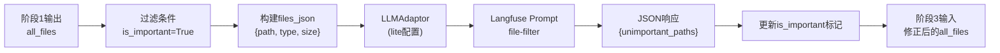
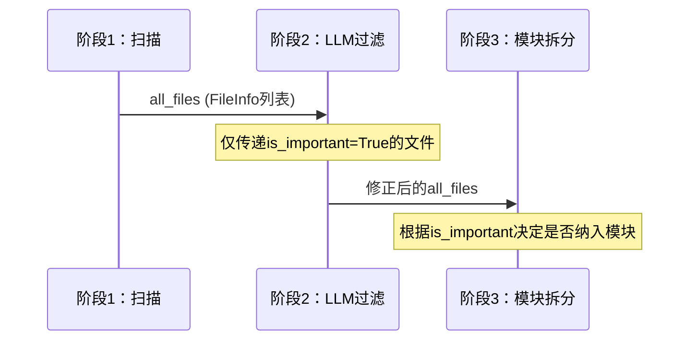

本阶段承接[阶段一：项目扫描](6-jie-duan-xiang-mu-sao-miao)的输出，在初步筛选的基础上进一步利用LLM的语义理解能力，对文件进行更精准的重要性判断。这是整个流水线中**首次LLM调用**，承担着承上启下的关键角色——既要过滤掉低价值文件以降低后续阶段的Token消耗，又要确保核心代码不被误删。

## 核心架构

LLM过滤模块采用**轻量级配置 + JSON结构化输出**的设计理念。相比后续深度研究阶段的复杂ReAct循环，过滤阶段追求的是快速、准确、可预测的决策能力。



在 `run.py` 中可以看到该阶段的执行位置：

```python
# ====== 阶段 2: LLM 过滤 ======
print(f"\n{'='*60}\n阶段 2/6: LLM 智能过滤\n{'='*60}")
_observed("llm_filter_files", llm_filter_files, ctx, session_id=session_id)
important_count = sum(1 for f in ctx.all_files if f.is_important)
print(f"  保留 {important_count} 个重要文件")
```

Sources: [run.py](pipeline/run.py#L67-L71)

## 执行流程

`llm_filter_files` 函数的实现逻辑清晰，包含四个关键步骤：

### 1. 输入准备：构建文件列表JSON

```python
files_json = json.dumps([
    {"path": f.path, "type": f.file_type, "size": f.size}
    for f in ctx.all_files
    if f.is_important  # 初始标记为重要的才送入 LLM 进一步过滤
], ensure_ascii=False, indent=2)
```

这里使用 `is_important=True` 作为初始过滤条件，将阶段一扫描结果中的噪声文件（如 `.DS_Store`、`__init__.py`）在进入LLM调用前就排除掉，大幅减少Token消耗。

Sources: [llm_filter.py](pipeline/llm_filter.py#L10-L15)

### 2. LLM调用：获取结构化响应

```python
adaptor = LLMAdaptor(ctx.lite_config)
messages = get_compiled_messages("file-filter", project_name=ctx.project_name, files_json=files_json)
response = adaptor.call_for_json(messages, response_format={"type": "json_object"})
```

**Lite配置策略**：相比后续阶段使用的 `pro`/`max` 配置，过滤阶段采用 `lite` 配置，在成本和速度之间取得平衡：

| 配置层级 | 模型 | 思考模式 | 适用场景 |
|---------|------|---------|---------|
| `lite` | deepseek-v4-flash | 关闭 | 文件过滤、评分排序 |
| `pro` | deepseek-v4-flash | 开启+高强度推理 | 模块拆分、结构分析 |
| `max` | deepseek-v4-flash | 开启+最大推理 | 深度研究、复杂分析 |

Sources: [llm_filter.py](pipeline/llm_filter.py#L17-L19)
Sources: [settings.py](settings.py#L7-L24)

### 3. 响应解析：容错处理

```python
try:
    result = json.loads(response)
    unimportant_paths = set(result.get("unimportant_paths", []))
except (json.JSONDecodeError, KeyError, TypeError):
    unimportant_paths = set()
```

采用**乐观解析**策略：若JSON解析失败，默认不排除任何文件（保守策略），避免因LLM响应格式异常导致误删重要文件。

Sources: [llm_filter.py](pipeline/llm_filter.py#L21-L25)

### 4. 标记修正：更新文件重要性

```python
for f in ctx.all_files:
    if f.path in unimportant_paths:
        f.is_important = False
```

通过路径匹配更新 `FileInfo` 对象的 `is_important` 标记，该标记会在后续的[阶段三：模块拆分](8-jie-duan-san-mo-kuai-chai-fen)中被使用。

Sources: [llm_filter.py](pipeline/llm_filter.py#L27-L30)

## 过滤规则体系

LLM的判断依据来自 `pipeline_prompts.py` 中定义的 `FILE_FILTER_SYSTEM` 提示词，包含明确的重要/不重要文件分类：

### 保留文件（重要）

| 类别 | 示例 | 判断依据 |
|------|------|---------|
| 核心业务逻辑 | `agent/react_agent.py`、`pipeline/*.py` | 实现核心功能 |
| API入口 | 路由、控制器、CLI | 程序执行起点 |
| 数据模型 | `base/types.py` | 类型定义、接口契约 |
| 基础设施 | 中间件、认证、错误处理 | 系统级支撑 |
| 配置文件 | `pyproject.toml`、`settings.json` | 项目元数据 |
| 工具类 | `tool/` 目录 | 通用工具复用 |
| 重要文档 | `README.md` | 用户/开发者指南 |

### 排除文件（不重要）

| 类别 | 示例 | 排除原因 |
|------|------|---------|
| 测试文件 | `test_`、`_test`、`Test`、`Tests`、conftest | 开发产物，非生产代码 |
| 次要文档 | CHANGELOG、LICENSE、CONTRIBUTING | 非功能说明性内容 |
| 生成代码 | swagger、protobuf、ORM migration | 机器生成，可再生 |
| 构建/部署 | Dockerfile、Makefile、CI配置 | 运维相关，非核心逻辑 |
| IDE配置 | `.eslintrc`、`.prettierrc` | 编辑器个性化设置 |
| 示例/演示 | example、demo、sample目录 | 教学用途，非项目本体 |

Sources: [pipeline_prompts.py](prompt/pipeline_prompts.py#L5-L36)

## 与其他阶段的协作



`PipelineContext` 作为阶段间数据传递的载体，过滤结果直接体现在 `ctx.all_files` 中：

```python
@dataclass
class FileInfo:
    path: str
    size: int
    file_type: str = ""  # code, doc, config, log
    is_important: bool = True  # 过滤阶段会修改此标记
```

Sources: [types.py](pipeline/types.py#L4-L9)

## 配置灵活性

过滤模块通过 `ctx.lite_config` 获取LLM配置，这意味着用户可以通过修改 `settings.json` 中的 `lite` 配置来调整：

```json
{
  "lite": {
    "provider": "openai",
    "base_url": "https://api.deepseek.com",
    "model": "deepseek-v4-flash",
    "max_tokens": 8192,
    "thinking": false
  }
}
```

若需切换到 Anthropic 协议，适配器会自动处理协议转换：

```python
# adaptor.py 中的 provider 检测
if self._provider == "anthropic":
    from provider.api.anthropic_api import call_stream_anthropic, call_anthropic
    self._call_stream = call_stream_anthropic
    self._call = call_anthropic
```

Sources: [adaptor.py](provider/adaptor.py#L45-L48)

## 下一步

完成LLM过滤后，流水线将进入[阶段三：模块拆分](8-jie-duan-san-mo-kuai-chai-fen)，利用过滤后的重要文件列表进行语义层面的模块识别和边界划分。在此之前，如需了解项目如何加载配置，可参考[配置文件详解](4-pei-zhi-wen-jian-xiang-jie)；如需深入理解适配器层的设计，可查阅[LLM适配器层](14-llmgua-pei-qi-ceng)。