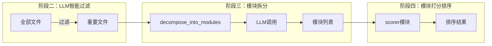
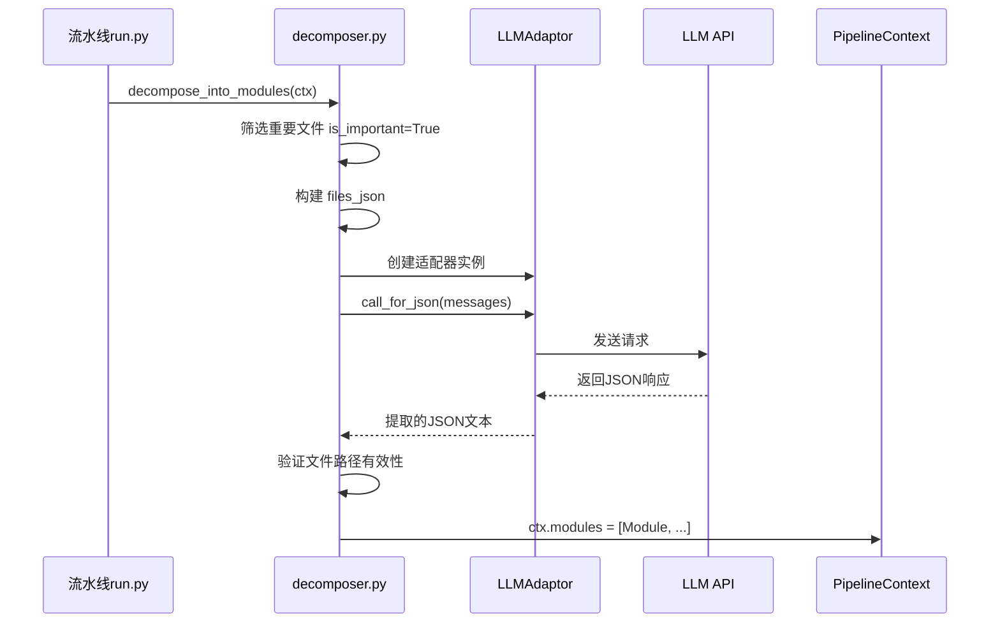
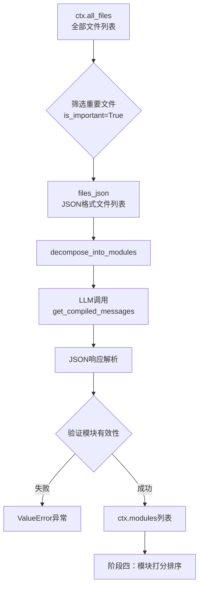

模块拆分是六阶段分析流水线的**第三个关键环节**，其核心职责是将阶段二过滤后的重要文件集合，按照**逻辑内聚性原则**组织为若干个结构化模块。每个模块不仅包含文件列表，还附带清晰的职责描述，为后续的[阶段四：模块打分排序](9-jie-duan-si-mo-kuai-da-fen-pai-xu)提供分析对象。



## 核心实现

模块拆分的入口函数为 `decompose_into_modules`，定义于 [pipeline/decomposer.py#L9-35](pipeline/decomposer.py#L9-L35)。该函数接收 `PipelineContext` 上下文对象，直接修改其 `modules` 属性。



### 输入数据构建

函数首先从 `ctx.all_files` 中筛选出 `is_important=True` 的文件，并将其转换为 JSON 格式用于 LLM 调用：

```python
important_files = [f for f in ctx.all_files if f.is_important]
files_json = json.dumps([
    {"path": f.path, "type": f.file_type, "size": f.size}
    for f in important_files
], ensure_ascii=False, indent=2)
```

每个文件信息包含三个字段：`path`（文件路径）、`type`（文件类型：code/doc/config）、`size`（字节大小）。这些信息帮助 LLM 理解项目的整体规模和结构特征。
Sources: [pipeline/decomposer.py#L10-L14](pipeline/decomposer.py#L10-L14)

### LLM 调用与提示词设计

使用 `LLMAdaptor` 发起结构化调用，通过 `get_compiled_messages` 获取编译后的提示词：

```python
adaptor = LLMAdaptor(ctx.lite_config)
messages = get_compiled_messages("decomposer", project_name=ctx.project_name, files_json=files_json)
response = adaptor.call_for_json(messages, response_format={"type": "json_object"})
```

提示词模板分为两部分：系统提示词 `DECOMPOSER_SYSTEM` 定义分析角色和输出格式要求；用户提示词 `DECOMPOSER_USER` 注入项目名称和文件列表。
Sources: [pipeline/decomposer.py#L16-L18](pipeline/decomposer.py#L16-L18)

**DECOMPOSER_SYSTEM 核心要求**：

| 维度 | 约束 |
|------|------|
| 模块数量 | 3-10 个（小项目 3-5，大项目 5-10） |
| 文件数量 | 每模块至少 2 个文件，不足则合并 |
| 归属约束 | 每个文件只能属于一个模块 |
| 命名规范 | 模块名用 kebab-case（如 `core-agent`），描述用中文 |
Sources: [prompt/pipeline_prompts.py#L75-L79](prompt/pipeline_prompts.py#L75-L79)

**分析步骤指导**：

1. **理解项目**：从目录结构推断技术栈、项目类型、核心功能
2. **识别模块边界**：目录结构自然形成模块；同模块文件通常互相 import
3. **合并小模块**：文件数≤2 的小模块可合并到相关大模块
4. **命名规范**：模块名用 kebab-case，描述用中文

### 结果解析与数据验证

LLM 返回的 JSON 需经过严格验证才能存入上下文：

```python
result = json.loads(response)
modules_data = result.get("modules", [])

existing_paths = {f.path for f in important_files}
ctx.modules = []
for m in modules_data:
    name = m.get("name", "")
    description = m.get("description", "")
    files = m.get("files", [])
    valid_files = [f for f in files if f in existing_paths]  # 路径有效性验证
    if name and valid_files:
        ctx.modules.append(Module(name=name, description=description, files=valid_files))
```

关键验证逻辑：

- **路径过滤**：仅保留在 `existing_paths` 中存在的文件路径，防止 LLM 幻觉文件名
- **非空检查**：`name` 和 `valid_files` 均不能为空
- **结果保证**：若所有模块验证失败，抛出 `ValueError` 异常
Sources: [pipeline/decomposer.py#L23-L34](pipeline/decomposer.py#L23-L34)

## 模块数据结构

模块拆分结果以 `Module` 数据类的形式存储于 `PipelineContext.modules`：

| 字段 | 类型 | 说明 |
|------|------|------|
| `name` | str | 模块名称，kebab-case 格式 |
| `description` | str | 模块职责描述，中文文本 |
| `files` | list[str] | 归属文件路径列表 |
| `score` | float | 评分，初始值 0.0（阶段四填充） |
| `research_report` | str | 深度研究报告（阶段五填充） |

数据类定义于 [pipeline/types.py#L12-L19](pipeline/types.py#L12-L19)：

```python
@dataclass
class Module:
    name: str
    description: str
    files: list[str]
    score: float = 0.0
    research_report: str = ""
```

## 流水线上下文整合

在 [pipeline/run.py#L73-78](pipeline/run.py#L73-L78) 中，模块拆分阶段与前后阶段无缝衔接：

```python
# ====== 阶段 3: 模块拆分 ======
print(f"\n{'='*60}\n阶段 3/6: 模块拆分\n{'='*60}")
_observed("decompose_into_modules", decompose_into_modules, ctx, session_id=session_id)
print(f"  识别到 {len(ctx.modules)} 个模块:")
for m in ctx.modules:
    print(f"    - {m.name}: {m.description} ({len(m.files)} 个文件)")
```

执行流程：



## 异常处理机制

函数设计了两层异常保护：

| 场景 | 处理方式 |
|------|----------|
| LLM 返回格式无效 | `json.loads()` 抛出 `JSONDecodeError` |
| 所有模块验证失败 | 显式抛出 `ValueError("模块拆分失败：LLM 返回无效结果")` |

这种设计确保流水线不会携带脏数据进入后续阶段，fail-fast 原则使问题定位更加清晰。
Sources: [pipeline/decomposer.py#L33-L34](pipeline/decomposer.py#L33-L34)

## 质量保障策略

为提高模块拆分的准确性，系统采用了**多重约束机制**：

| 策略 | 实现方式 | 效果 |
|------|----------|------|
| 数量约束 | 提示词规定 3-10 个模块 | 避免过度细分或粗粒度划分 |
| 最小文件数 | 提示词规定每模块至少 2 个文件 | 促进小模块合并 |
| 路径验证 | Python 代码过滤非法路径 | 防止 LLM 幻觉 |
| 独占约束 | 每个文件仅属一个模块 | 消除归属歧义 |

## 后续阶段衔接

模块拆分完成后，上下文中的 `ctx.modules` 立即成为阶段四的输入。模块列表按其在 JSON 中的出现顺序排列，尚未经过重要性排序。排序逻辑将在 [阶段四：模块打分排序](9-jie-duan-si-mo-kuai-da-fen-pai-xu) 中详细阐述。

---

## 下一步

完成模块拆分后，分析流水线将进入：

- **[阶段四：模块打分排序](9-jie-duan-si-mo-kuai-da-fen-pai-xu)** — 对识别出的模块进行重要性评分与优先级排序

或回顾前一阶段：

- **[阶段二：LLM智能过滤](7-jie-duan-er-llmzhi-neng-guo-lu)** — 了解重要文件筛选机制