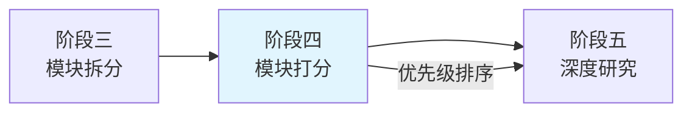

阶段四是六阶段分析流水线中的关键环节，负责对阶段三拆分出的模块进行重要性评分，并按分数倒序排列。作为流水线中的承上启下阶段，它为阶段五的深度研究提供了优先级依据——系统将优先对高分模块进行更深入的分析，同时确保所有模块都得到研究。

## 核心定位

从数据流角度看，阶段四接收 `PipelineContext.modules` 中的模块列表，返回时同一列表已按 `score` 字段降序排列。这个副作用直接影响了阶段五的研究顺序，使得核心模块能够获得更充分的分析资源和优先级。