# CodeDeepResearch 项目深度分析报告

## 一、项目概述
CodeDeepResearch 是一个 LLM 驱动的自动化代码深度分析引擎，采用 Python 3.12+ 技术栈，基于 DeepSeek API 实现。核心功能是通过 6 阶段流水线自动化分析任意代码仓库，生成结构化的中文项目分析报告。项目采用事件驱动架构和 ReAct（Reasoning-Acting）智能体模式，支持 OpenAI 和 Anthropic 两种协议，具有智能文件过滤、并行模块研究、三级模型分层等特色功能。

## 二、架构总览

### 核心架构图
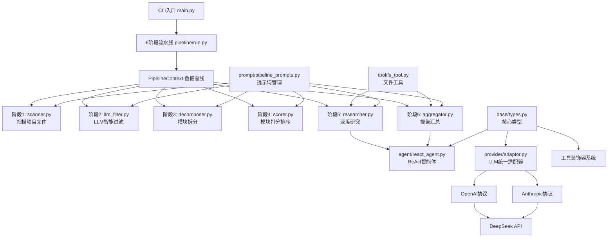

### 各模块关系和数据流向
1. **请求入口**：`main.py` CLI → `pipeline/run.py` → 创建 `PipelineContext`
2. **扫描阶段**：`scanner.py` 遍历文件系统 → 生成 `FileInfo` 列表存入上下文
3. **过滤阶段**：`llm_filter.py` 调用轻量模型 → 标记文件重要性
4. **拆分阶段**：`decomposer.py` 调用专业模型 → 识别逻辑模块
5. **打分阶段**：`scorer.py` 评估模块重要性 → 排序
6. **研究阶段**：`researcher.py` 并行调用 ReAct 智能体 → 生成模块报告
7. **汇总阶段**：`aggregator.py` 调用 ReAct 智能体 → 生成最终报告

### 核心模块 vs 辅助模块
- **核心执行模块**：`pipeline-orchestration`（流水线编排）、`core-agent`（ReAct引擎）、`llm-provider`（LLM适配）
- **基础设施模块**：`core-types`（类型定义）、`tool-integration`（文件工具）、`config-management`（配置管理）
- **支撑模块**：`prompt-management`（提示词管理）、`documentation`（项目文档）

### 请求完整链路
```
用户CLI → main.py → run_pipeline() → PipelineContext初始化
→ 6阶段流水线顺序执行 → LLM多次调用 → 文件工具交互
→ 生成模块报告 → 汇总最终报告 → 写入文件系统 → 返回用户
```

## 三、模块详细分析

### 1. pipeline-orchestration（流水线编排）
**模块定位**：项目的核心编排引擎，负责自动化代码深度分析的完整流水线。通过 6 个阶段协调 LLM 智能体、文件系统和报告生成。

**核心架构图**：
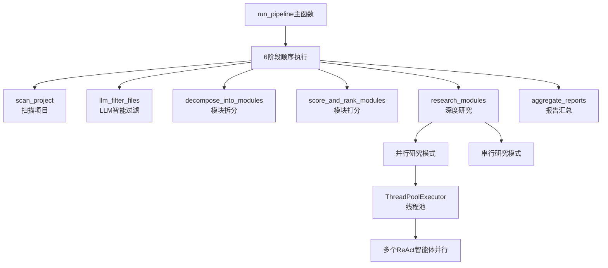

**关键实现**：
```python
# pipeline/run.py - 核心流水线函数
def run_pipeline(project_path: str, settings_path: str | None = None) -> str:
    """运行完整分析流水线。"""
    settings = load_settings(settings_path)
    project_path = os.path.abspath(project_path)
    project_name = os.path.basename(project_path)

    # 三级模型配置
    lite_model = get_lite_model()  # 过滤/分类用
    pro_model = get_pro_model()    # 模块研究用
    max_model = get_max_model()    # 最终汇总用

    ctx = PipelineContext(
        project_path=project_path,
        project_name=project_name,
        provider=settings["provider"],
        lite_model=lite_model,
        pro_model=pro_model,
        max_model=max_model,
        max_sub_agent_steps=settings["max_sub_agent_steps"],
        research_parallel=settings["research_parallel"],
        research_threads=settings["research_threads"],
        settings=settings,
    )

    # 6阶段顺序执行
    scan_project(ctx)
    llm_filter_files(ctx)
    decompose_into_modules(ctx)
    score_and_rank_modules(ctx)
    research_modules(ctx, report_dir, ctx.modules)
    aggregate_reports(ctx, ctx.modules)
```

**设计技巧**：
1. **上下文传递模式**：使用 `PipelineContext` 数据类贯穿所有阶段，避免函数参数爆炸
2. **渐进式过滤**：扫描 → LLM过滤 → 模块拆分 → 打分，逐步缩小分析范围
3. **模型分级使用**：lite/pro/max 三级模型按任务复杂度分配，优化成本与效果平衡
4. **并行/串行切换**：根据配置动态选择研究模式，适应不同资源环境

**潜在问题**：
- 内存占用较大：`ctx.all_files` 存储所有文件对象
- 错误处理不足：某个阶段失败会导致整个流水线中断
- 硬编码路径：`report_dir` 使用 `os.getcwd()`，服务化部署可能有问题

**数据流**：
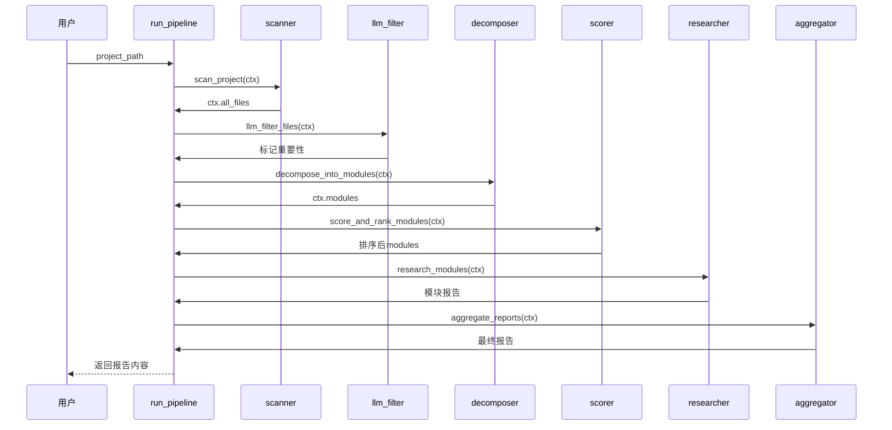

**依赖关系**：
- 引用：`settings.py`、`provider/llm.py`、`agent/react_agent.py`、`tool/fs_tool.py`、`base/types.py`、`prompt/pipeline_prompts.py`
- 被引用：`main.py`（直接入口）

**对外接口**：
1. `run_pipeline(project_path: str, settings_path: str | None = None) -> str` - 主流水线入口
2. `PipelineContext` 数据类 - 流水线执行上下文
3. 各阶段处理函数（可单独调用）：`scan_project()`、`llm_filter_files()` 等

### 2. core-agent（ReAct智能体引擎）
**模块定位**：项目的核心智能体引擎，实现 ReAct（Reasoning-Acting）模式的智能体循环。负责在代码深度分析流程中驱动子模块研究和最终报告汇总。

**核心架构图**：
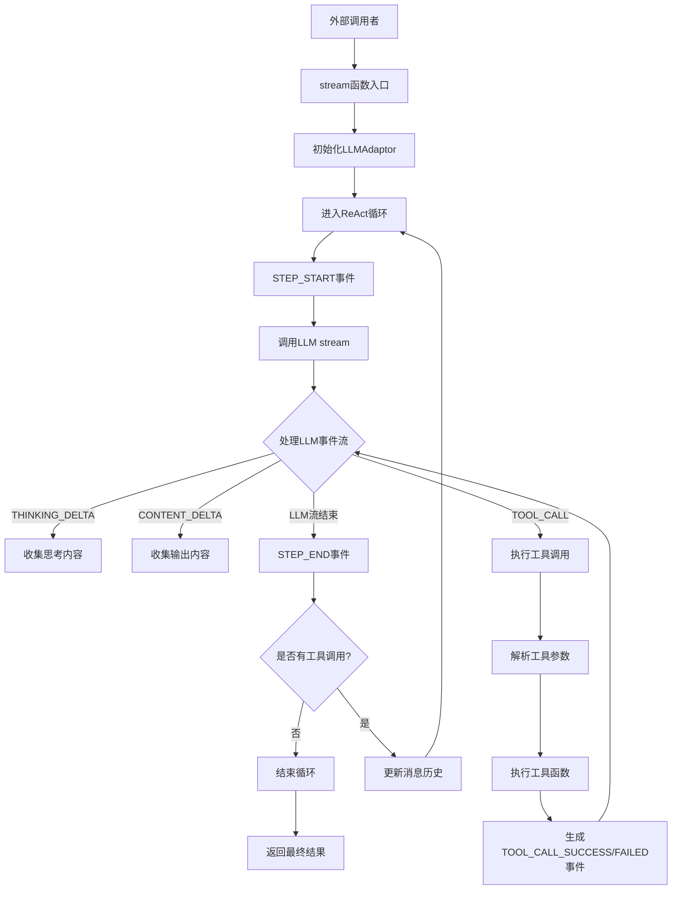

**关键实现**：
```python
# agent/react_agent.py - ReAct循环主逻辑
def stream(messages, tools, provider="anthropic", model=None, max_steps=MAX_STEP_CNT):
    """ReAct stream generator: yields events for each step."""
    adaptor = LLMAdaptor(provider=provider)
    react_finished = False
    step = 1

    while (not react_finished) and step <= max_steps:
        yield Event(type=EventType.STEP_START, step=step)
        
        content = ""
        thinking = ""
        raw_tool_calls = []
        tool_results = {}

        # LLM流式调用
        for event in _stream(adaptor, messages, tools, model):
            yield event
            if event.type == EventType.THINKING_DELTA:
                thinking += event.content or ""
            elif event.type == EventType.CONTENT_DELTA:
                content += event.content or ""
            elif event.type == EventType.TOOL_CALL:
                raw_tool_calls.append(event.raw)
                # 执行工具
                tool = next((t for t in tools if t.name == event.tool_name), None)
                result, error = _execute_tool(tool, event.tool_arguments)
                tool_results[event.tool_id] = {"result": result, "error": error}
                yield Event(type=EventType.TOOL_CALL_SUCCESS if not error else EventType.TOOL_CALL_FAILED, 
                           tool_id=event.tool_id, tool_name=event.tool_name, 
                           tool_arguments=event.tool_arguments, tool_result=result, tool_error=error)

        yield Event(type=EventType.STEP_END, content=content, step=step)

        if not raw_tool_calls:  # 无工具调用，结束循环
            react_finished = True
            break

        # 更新消息历史
        messages.append(AssistantMessage(content=content, tool_calls=raw_tool_calls, thinking=thinking))
        for raw_tc in raw_tool_calls:
            tid = raw_tc["id"]
            tr = tool_results[tid]
            messages.append(ToolMessage(tool_id=tid, tool_name=raw_tc["name"], 
                                       tool_result=tr["result"], tool_error=tr["error"]))
        step += 1
```

**设计技巧**：
1. **事件驱动架构**：使用 `Event` 对象流式传递所有状态变更，便于外部消费者实时处理
2. **工具执行与错误处理分离**：`_execute_tool()` 函数返回 `(result, error)` 元组，统一处理成功和失败场景
3. **消息历史自动维护**：自动将工具调用结果添加到消息历史中，实现完整的对话上下文
4. **流式迭代器设计**：使用生成器模式，支持实时处理长对话

**潜在问题**：
- 工具查找性能：每次工具调用都线性查找工具名称，工具数量多时可能影响性能
- 错误传播：工具执行异常仅记录到日志，没有提供重试机制
- 上下文长度限制：依赖底层 LLMAdaptor 的压缩机制，可能丢失重要历史信息

**数据流**：
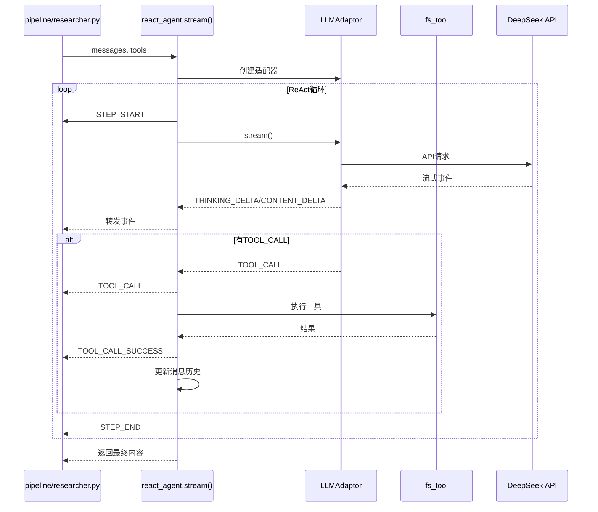

**依赖关系**：
- 引用：`base.types`（Event/ToolMessage/AssistantMessage）、`provider.adaptor`（LLMAdaptor）
- 被引用：`pipeline/researcher.py`、`pipeline/aggregator.py`

**对外接口**：
1. `stream(messages, tools, provider="anthropic", model=None, max_steps=MAX_STEP_CNT)` - ReAct智能体主入口
2. `_execute_tool(tool, tool_arguments: str)` - 安全执行工具函数（内部使用）

### 3. llm-provider（LLM统一适配器）
**模块定位**：项目的 LLM 统一接口层，负责封装 OpenAI 和 Anthropic 两种协议的 DeepSeek API 调用。提供协议适配、流式处理、上下文管理和错误处理等核心功能。

**核心架构图**：
```mermaid
flowchart TD
    A[LLMAdaptor.stream()] --> B{协议选择}
    B -->|OpenAI| C[openai/deepseek_api.py]
    B -->|Anthropic| D[anthropic/deepseek_api.py]
    
    C --> E[消息格式转换]
    D --> E
    
    F[工具调用] --> G[Tool格式转换]
    G -->|OpenAI格式| C
    G -->|Anthropic格式| D
    
    H[上下文压缩] --> I[智能摘要]
    I --> J[保留最近6条消息]
    J --> A
    
    K[流式响应] --> L[Event转换器]
    L -->|OpenAI事件| M[Event流]
    L -->|Anthropic事件| M
    M --> N[外部消费者]
```

**关键实现**：
```python
# provider/adaptor.py - 智能上下文压缩
def _compress_if_needed(self, messages) -> list:
    total_chars = sum(len(json.dumps(m, ensure_ascii=False)) for m in messages)
    if total_chars <= MAX_CONTEXT_CHARS:  # 200,000字符阈值
        return messages

    print(f"\n  [上下文压缩] {total_chars} 字符超过阈值 {MAX_CONTEXT_CHARS}，开始压缩...")

    # 分离系统消息和其他消息
    system_msgs = [m for m in messages if m.get("role") == "system"]
    other_msgs = [m for m in messages if m.get("role") != "system"]

    if len(other_msgs) <= COMPRESS_KEEP_RECENT:  # 保留最近6条
        return messages

    # 压缩历史消息，保留最近消息
    to_compress = other_msgs[:-COMPRESS_KEEP_RECENT]
    to_keep = other_msgs[-COMPRESS_KEEP_RECENT:]
    summary = self._summarize_messages(to_compress)  # LLM生成摘要

    # 重建压缩后的消息列表
    compressed = list(system_msgs)
    if summary:
        compressed.append({"role": "user", "content": f"[以下是之前对话的摘要]\n{summary}"})
        compressed.append({"role": "assistant", "content": "好的，我已了解之前的分析内容，继续进行。"})
    compressed.extend(to_keep)

    new_chars = sum(len(json.dumps(m, ensure_ascii=False)) for m in compressed)
    print(f"  [上下文压缩] 完成：{total_chars} → {new_chars} 字符")
    return compressed
```

**设计技巧**：
1. **协议抽象完善**：统一 OpenAI 和 Anthropic 两种协议的差异，提供一致的调用接口
2. **智能上下文管理**：自动检查上下文长度，超限时压缩历史对话，保留最近消息
3. **格式自动转换**：自动处理两种协议在消息格式、工具调用格式上的差异
4. **延迟导入**：根据 provider 动态导入对应的 API 模块，避免不必要的依赖

**潜在问题**：
- 压缩成本：上下文压缩会额外消耗一次 LLM 调用，增加成本和延迟
- 线程安全：`call_llm_sync` 使用多线程实现同步调用，需要注意线程安全问题
- 摘要精度：压缩摘要可能丢失细节信息，影响后续分析准确性

**数据流**：
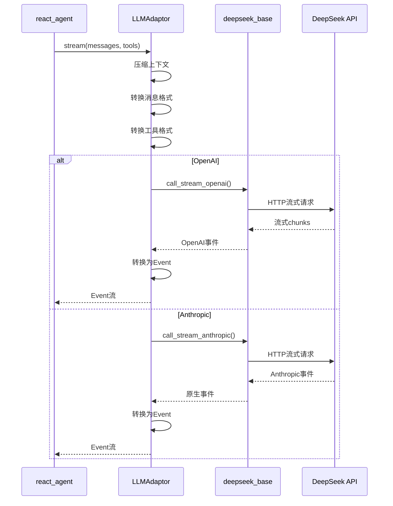

**依赖关系**：
- 引用：`base.types`（Event/Tool/normalize_messages）、`settings`（配置）、`prompt.pipeline_prompts`（压缩提示词）
- 被引用：`agent/react_agent.py`、`pipeline/decomposer.py`、`pipeline/llm_filter.py`、`pipeline/scorer.py` 等

**对外接口**：
1. `LLMAdaptor(provider="anthropic")` - 统一流式接口适配器
2. `call_llm(provider, system, user, model=None, timeout=DEFAULT_TIMEOUT, response_format=None)` - 简化同步调用
3. `call_llm_sync(adaptor, messages, timeout=DEFAULT_TIMEOUT, response_format=None)` - 流式转同步调用
4. `extract_json(text: str) -> str` - 从响应中提取 JSON

### 4. core-types（核心类型定义）
**模块定位**：项目的基础类型定义模块，定义所有基础数据类型、事件类型、消息类型和工具装饰器。是项目的数据模型层，为 LLM 交互、ReAct 代理、工具系统提供统一的数据结构和接口规范。

**核心架构图**：
```mermaid
flowchart TD
    A[EventType枚举] --> B[Event事件类]
    A --> C[Message消息体系]
    D[ToolProperty] --> E[Tool工具类]
    F[@tool装饰器] --> E
    E --> G[to_openai格式]
    E --> H[to_anthropic格式]
    C --> I[SystemMessage]
    C --> J[UserMessage]
    C --> K[AssistantMessage]
    C --> L[ToolMessage]
    
    B --> M[ReAct代理事件流]
    E --> N[工具系统]
    C --> O[LLM消息转换]
    
    M --> P[流式处理]
    N --> Q[工具执行]
    O --> R[协议适配]
```

**关键实现**：
```python
# base/types.py - Tool类的多协议适配设计
@dataclass
class Tool:
    name: str
    description: str
    parameters: Dict[str, ToolProperty] = field(default_factory=dict)
    required: List[str] = field(default_factory=list)
    func: Optional[Callable] = None

    def _build_schema(self) -> Dict[str, Any]:
        """构建参数 schema（OpenAI 和 Anthropic 共用）。"""
        properties = {}
        for key, prop in self.parameters.items():
            prop_dict = {"type": prop.type, "description": prop.description}
            if prop.enum:
                prop_dict["enum"] = prop.enum
            properties[key] = prop_dict
        return {"type": "object", "properties": properties, "required": self.required}

    def to_openai(self) -> dict:
        return {
            "type": "function",
            "function": {
                "name": self.name,
                "description": self.description,
                "parameters": self._build_schema(),
            },
        }

    def to_anthropic(self) -> dict:
        return {
            "name": self.name,
            "description": self.description,
            "input_schema": self._build_schema(),
        }
```

**设计技巧**：
1. **协议无关设计**：通过统一的 `Tool` 类支持 OpenAI 和 Anthropic 两种协议，具有良好的扩展性
2. **装饰器自动化**：`@tool` 装饰器自动从函数签名和文档生成完整的工具定义，减少样板代码
3. **事件驱动架构**：`Event` 系统为流式处理提供了标准化的数据格式
4. **类型安全**：使用 Python 类型注解和 dataclass 确保数据结构的正确性

**潜在问题**：
- 类型映射限制：`_TYPE_MAP` 只支持基本类型，复杂类型（如 `List[str]`）无法正确映射
- 文档解析脆弱：依赖特定的 docstring 格式（`Args:` 部分），对非标准格式支持不足
- 协议差异处理：OpenAI 和 Anthropic 的消息格式转换逻辑较复杂，可能隐藏错误

**数据流**：
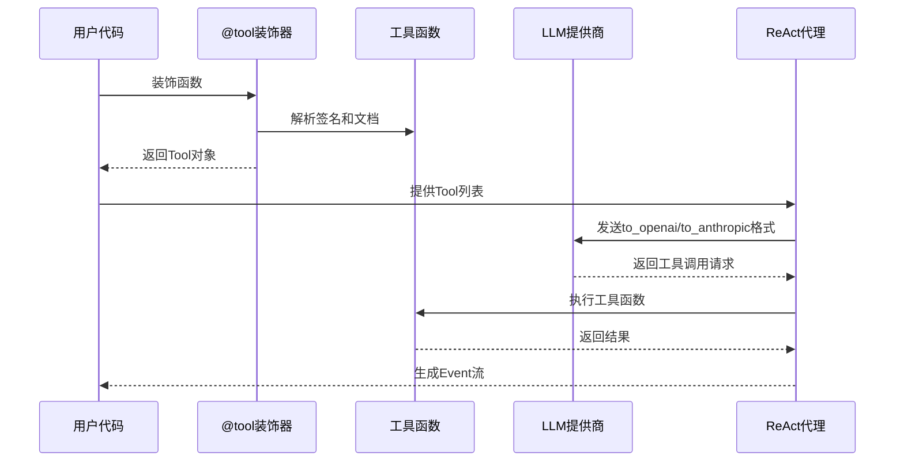

**依赖关系**：
- 引用：无外部模块依赖（纯类型定义）
- 被引用：`agent/react_agent.py`、`provider/adaptor.py`、所有 pipeline 模块、`tool/fs_tool.py` 等

**对外接口**：
1. `EventType` 枚举 - 事件类型定义
2. `Event`、`Tool`、`SystemMessage`、`UserMessage`、`AssistantMessage`、`ToolMessage` 数据类
3. `@tool` 装饰器 - 自动生成工具定义
4. `normalize_messages()` 函数 - 消息标准化

### 5. tool-integration（文件系统工具集成）
**模块定位**：文件系统工具集成模块，为 ReAct 智能体提供文件系统操作能力。封装文件读取、目录遍历、文件搜索等基础文件操作，通过 `@tool` 装饰器将这些功能标准化为可被 LLM 调用的工具。

**核心架构图**：
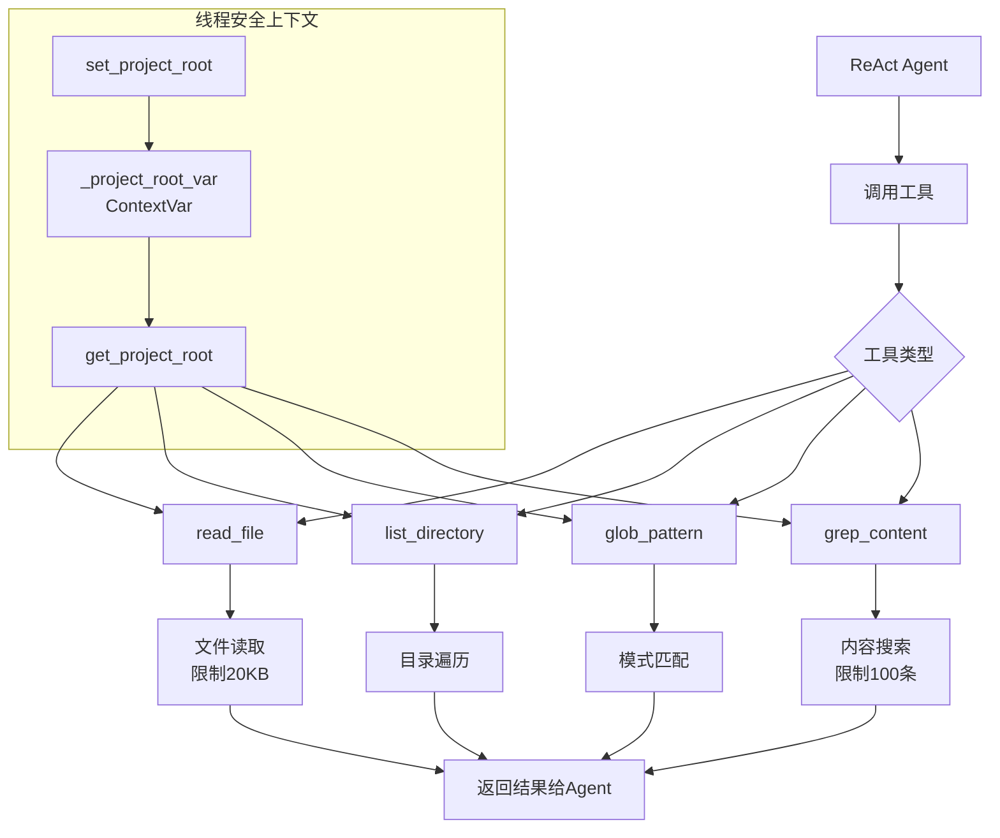

**关键实现**：
```python
# tool/fs_tool.py - 线程安全的项目根目录管理
from contextvars import ContextVar

_project_root_var: ContextVar[str] = ContextVar('project_root', default='')

def set_project_root(path: str) -> None:
    """设置当前研究会话的项目根目录（线程安全）。"""
    _project_root_var.set(path)

def get_project_root() -> str:
    """获取当前研究会话的项目根目录。"""
    return _project_root_var.get()

@tool
def read_file(file_path: str) -> str:
    """Read the full contents of a file."""
    project_root = get_project_root()
    full_path = os.path.join(project_root, file_path) if project_root else file_path
    try:
        with open(full_path, "r", encoding="utf-8", errors="replace") as f:
            content = f.read(MAX_READ_SIZE)  # 20KB限制
        if os.path.getsize(full_path) > MAX_READ_SIZE:
            content += f"\n\n... [truncated, file exceeds {MAX_READ_SIZE // 1024}KB]"
        return content
    except FileNotFoundError:
        return f"Error: File not found: {file_path}"
    except IsADirectoryError:
        return f"Error: {file_path} is a directory, not a file"
    except Exception as e:
        return f"Error reading file: {e}"
```

**设计技巧**：
1. **线程安全设计**：使用 `ContextVar` 实现多线程安全的项目根目录管理，支持并行研究
2. **资源控制**：文件大小限制（20KB）、搜索结果限制（100条）防止上下文爆炸
3. **错误处理完善**：区分不同类型的文件系统错误，提供明确错误信息
4. **隐藏文件过滤**：自动跳过 `.git`、`.DS_Store` 等隐藏文件，提高搜索效率

**潜在问题**：
- 路径解析：`glob_pattern` 使用 `Path.glob()` 可能在不同操作系统上有差异
- 编码处理：`errors="replace"` 可能丢失部分字符信息
- 性能考虑：`grep_content` 遍历所有文件时可能较慢，无缓存机制

**数据流**：
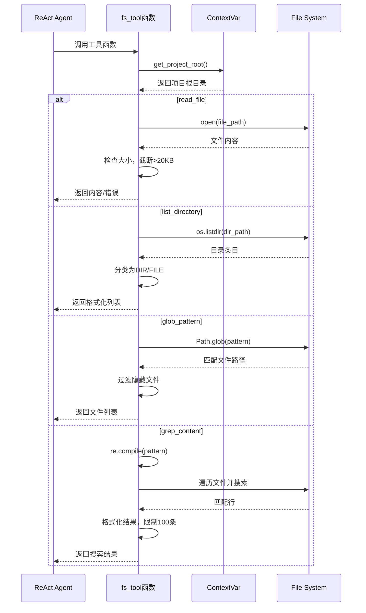

**依赖关系**：
- 引用：`base.types`（`@tool`装饰器）
- 被引用：`pipeline/researcher.py`、`pipeline/aggregator.py`

**对外接口**：
1. `set_project_root(path: str) -> None` - 设置项目根目录（线程安全）
2. `read_file(file_path: str) -> str` - 读取文件内容，限制20KB
3. `list_directory(dir_path: str) -> str` - 列出目录内容
4. `glob_pattern(pattern: str) -> str` - 按模式搜索文件
5. `grep_content(pattern: str, file_pattern: str = "**/*") -> str` - 搜索文件内容

### 6. prompt-management（提示词管理系统）
**模块定位**：项目的提示词管理系统，集中管理所有 LLM 流水线各阶段的系统提示词和用户提示词。通过统一的模块化设计为整个代码分析流水线提供标准化的提示词模板。

**核心架构图**：
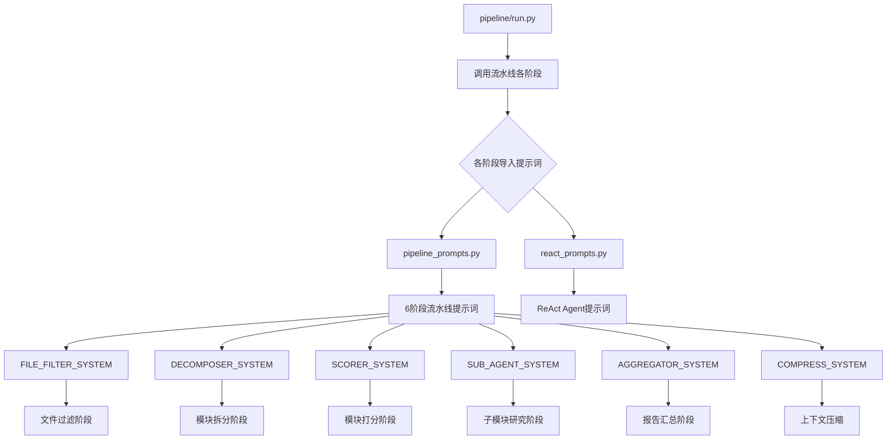

**关键实现**：
```python
# prompt/pipeline_prompts.py - SUB_AGENT_SYSTEM 提示词设计
SUB_AGENT_SYSTEM = """<role>资深软件工程师 & 代码架构分析师</role>
<task>对指定模块进行深度分析。</task>

## 工具
- read_file: 读取文件内容
- list_directory: 列出目录结构
- glob_pattern: 按模式搜索文件
- grep_content: 搜索文件内容
**批量调用，每次最多 10 个。**

## 分析思路
1. **读懂模块**：批量读取本模块所有文件，理解代码逻辑
2. **找关键代码**：识别核心类/函数，理解设计意图
3. **分析关系**：用 grep 查 import 引用，确认调用关系
4. **生成报告**：按结构输出，附代码片段和 Mermaid 图

## 报告结构
### 模块：（见用户提示词中的模块名）
#### 一、模块定位
#### 二、核心架构图（Mermaid）
#### 三、关键实现（必须有代码）
#### 四、数据流
#### 五、依赖关系
#### 六、对外接口
#### 七、总结

## 质量要求
- 必须有实际代码片段
- Mermaid 图必须与代码对应
- 依赖关系要精确到函数级别
- 必须分析到函数级别
- 不能泛泛而谈

## 输出要求
- 直接输出 markdown 报告内容，不要加任何铺垫、解释性文字
- 开头即报告正文，第一行是用户提示词中指定的模块标题
- 不能有"基于深度分析"、"下面我来"、"生成报告如下"等废话
- ❌ 不能有任何铺垫句"""
```

**设计技巧**：
1. **结构化模板设计**：确保所有子模块分析报告格式统一、内容完整
2. **详细分析指导**：提供具体的分析步骤和工具使用规范，避免分析师迷失方向
3. **强制质量要求**：通过严格的"质量要求"和"输出要求"强制分析师提供高质量报告
4. **模块化分离**：`pipeline_prompts.py` 和 `react_prompts.py` 分离，职责清晰

**潜在问题**：
- 提示词长度较长（约2000字符），可能超出某些LLM的上下文限制
- `pipeline_prompts_backup.py` 文件是废弃的备份，可能造成混淆
- 文档更新依赖人工维护，可能存在与代码不同步的问题

**数据流**：
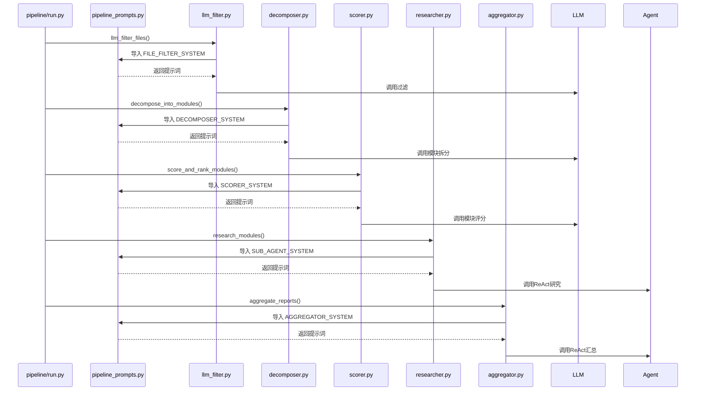

**依赖关系**：
- 引用：无外部模块依赖
- 被引用：`pipeline/aggregator.py`、`pipeline/decomposer.py`、`pipeline/llm_filter.py`、`pipeline/researcher.py`、`pipeline/scorer.py`、`provider/adaptor.py`

**对外接口**：
1. `FILE_FILTER_SYSTEM/FILE_FILTER_USER` - 文件过滤阶段提示词
2. `DECOMPOSER_SYSTEM/DECOMPOSER_USER` - 模块拆分阶段提示词
3. `SCORER_SYSTEM/SCORER_USER` - 模块评分阶段提示词
4. `SUB_AGENT_SYSTEM/SUB_AGENT_USER` - 子模块深度分析提示词
5. `AGGREGATOR_SYSTEM/AGGREGATOR_USER` - 最终报告汇总提示词
6. `COMPRESS_SYSTEM/COMPRESS_USER` - 对话压缩提示词

### 7. config-management（配置管理）
**模块定位**：项目的配置管理模块，负责统一管理项目的运行时配置。采用"默认配置 + 用户自定义配置"的模式，支持从 JSON 文件加载配置，并提供缓存机制提高性能。

**核心架构图**：
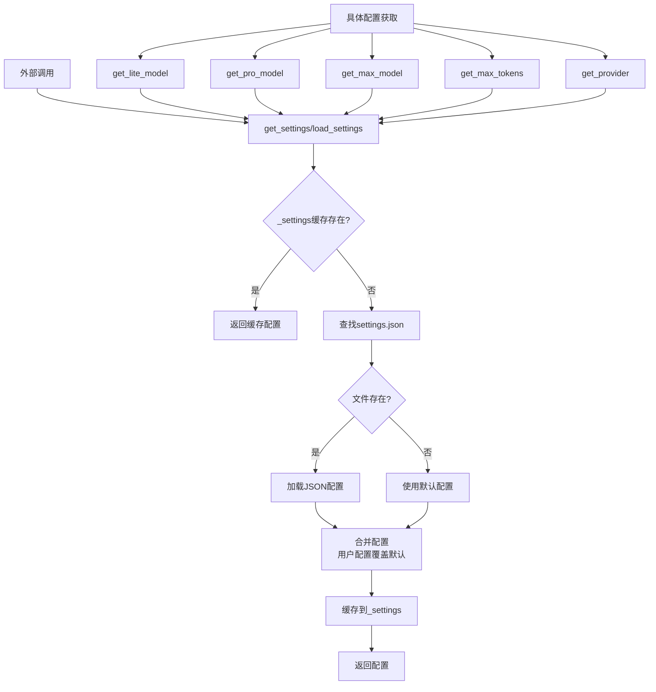

**关键实现**：
```python
# settings.py - 配置加载与缓存机制
_DEFAULTS = {
    "provider": "anthropic",
    "lite_model": "deepseek-chat",
    "pro_model": "deepseek-chat",
    "max_model": "deepseek-reasoner",
    "max_tokens": 16384,
    "max_sub_agent_steps": 30,
    "research_parallel": False,
    "research_threads": 4,
}

_settings = None  # 全局缓存

def load_settings(path: str | None = None) -> dict:
    """Load settings from JSON file, falling back to defaults."""
    global _settings
    if _settings is not None:  # 缓存命中
        return _settings

    if path is None:  # 智能路径查找
        candidates = [
            os.path.join(os.getcwd(), "settings.json"),
            os.path.join(os.path.dirname(os.path.abspath(__file__)), "settings.json"),
        ]
        for candidate in candidates:
            if os.path.exists(candidate):
                path = candidate
                break

    if path and os.path.exists(path):  # 加载用户配置
        with open(path, "r", encoding="utf-8") as f:
            user_settings = json.load(f)
        _settings = {**_DEFAULTS, **user_settings}  # 用户配置覆盖默认
    else:  # 使用默认配置
        _settings = dict(_DEFAULTS)

    return _settings
```

**设计技巧**：
1. **全局缓存**：使用 `_settings` 全局变量缓存配置，避免重复文件 I/O
2. **智能路径查找**：自动在当前目录和模块目录查找配置文件
3. **配置合并策略**：使用 `{**_DEFAULTS, **user_settings}` 确保用户配置覆盖默认值
4. **惰性加载**：首次调用时才加载配置，减少启动开销
5. **分层模型配置**：支持 lite/pro/max 三级模型，适应不同计算需求

**潜在问题**：
- 全局缓存在多线程环境下可能有问题，但本项目主要是单线程运行
- 配置变更后需要调用 `reset_settings()` 才能生效
- JSON 解析错误时直接抛出异常，没有优雅降级

**数据流**：
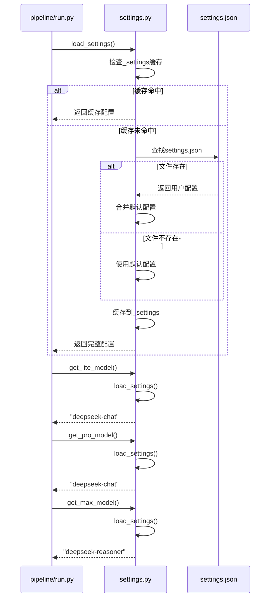

**依赖关系**：
- 引用：标准库 `json`、`os`
- 被引用：`pipeline/run.py`、`provider/deepseek_base.py`

**对外接口**：
1. `load_settings(path: str | None = None) -> dict` - 加载配置（带缓存）
2. `get_settings() -> dict` - 获取完整配置字典
3. `get_provider() -> str` - 获取 API 提供商
4. `get_lite_model() -> str`、`get_pro_model() -> str`、`get_max_model() -> str` - 获取三级模型
5. `get_max_tokens() -> int` - 获取最大 token 数
6. `reset_settings() -> None` - 重置配置缓存

### 8. documentation（项目文档）
**模块定位**：项目的文档模块，包含项目的核心文档文件。提供项目的使用说明、架构设计、快速入门指南和开发指导。是项目对外展示和内部开发的重要文档资源。

**核心架构图**：
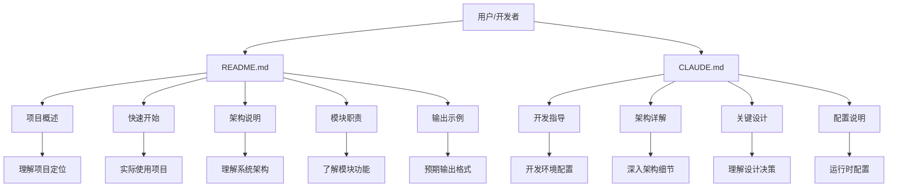

**关键实现**：
```markdown
# README.md - 核心结构设计
# CodeDeepResearch

LLM 驱动的自动化代码深度分析引擎。输入任意代码仓库路径，输出结构化的中文项目分析报告...

## 核心能力
- **全自动化分析**：无需人工干预...
- **智能文件筛选**：硬编码 + LLM 两层过滤...
- **并行模块研究**：对 top N 重要模块并行深度研究...

## 架构
```
输入: /path/to/project
  │
  ▼
阶段 1: 扫描项目 ── 遍历文件，收集大小/扩展名/路径
  │         排除 node_modules/.git/test/docs 等目录
  │
  ▼
阶段 2: LLM 智能过滤 ── 基于项目类型判断文件重要性
...
```

## 快速开始
### 安装依赖
```bash
uv sync
```

### 配置
编辑 `settings.json`：
```json
{
  "provider": "anthropic",
  "lite_model": "deepseek-chat",
  "pro_model": "deepseek-reasoner",
  "max_model": "deepseek-reasoner",
  "max_tokens": 16384,
  "max_sub_agent_steps": 30
}
```

### 运行
```bash
uv run python main.py /path/to/project
```
```

**设计技巧**：
1. **渐进式信息展示**：从项目概述 → 核心能力 → 架构 → 使用步骤，符合用户认知路径
2. **可视化架构图**：使用 ASCII 图表展示 6 阶段 pipeline，直观展示数据流
3. **分层信息结构**：将复杂系统分解为模块职责表，便于快速查找和理解
4. **实用示例驱动**：提供完整的命令行示例和输出示例，降低使用门槛
5. **双文档策略**：README.md 面向普通用户，CLAUDE.md 面向开发者，目标明确

**潜在问题**：
- 文档与代码可能存在同步问题，当代码变更时文档需要手动更新
- 缺少 API 文档自动生成机制
- 文档主要为中文，限制了国际用户的使用

**数据流**：
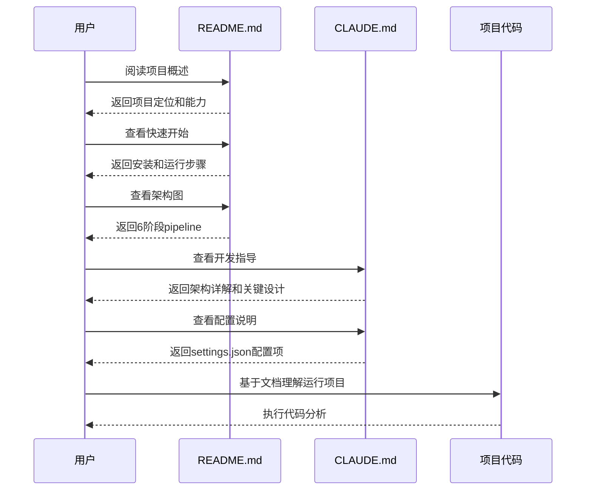

**依赖关系**：
- 引用：无直接代码依赖（纯文档文件）
- 被引用：`pipeline/scanner.py`（硬编码过滤中排除文档文件）、`prompt/pipeline_prompts.py`（提示词中定义文档重要性规则）

**对外接口**：
1. `README.md` - 项目概述、使用指南、架构说明（面向所有用户）
2. `CLAUDE.md` - 开发指导、架构详解、配置说明（面向开发者和 Claude Code 用户）

## 四、跨模块洞察

### 模块间共享的设计模式
1. **事件驱动架构**：贯穿整个系统，从 LLMAdaptor 的流式事件到 react_agent 的 STEP 事件，再到外部消费者的处理
   - `base/types.py` 定义统一的 `Event` 和 `EventType`
   - `provider/adaptor.py` 将 LLM 原生事件转换为标准 `Event`
   - `agent/react_agent.py` 产生额外的 ReAct 事件（STEP_START/STEP_END）
   - 所有模块通过消费 `Event` 流实现松耦合交互

2. **上下文传递模式**：使用数据类作为共享上下文，避免函数参数爆炸
   - `pipeline/types.py` 定义 `PipelineContext`，贯穿流水线6个阶段
   - `tool/fs_tool.py` 使用 `ContextVar` 实现线程安全的项目根目录管理
   - `settings.py` 使用全局缓存 `_settings` 共享配置状态

3. **协议适配器模式**：统一处理不同协议的差异，提供一致接口
   - `base/types.py` 的 `Tool` 类提供 `to_openai()` 和 `to_anthropic()` 方法
   - `provider/adaptor.py` 的 `LLMAdaptor` 统一 OpenAI 和 Anthropic 协议的调用
   - 上层模块（如 `react_agent`）无需关心底层协议实现

### 关键的依赖链和数据流
1. **核心执行链**：
   ```
   main.py → pipeline/run.py → PipelineContext → 
   6阶段流水线 → LLM调用 → 文件工具交互 → 报告生成
   ```

2. **LLM调用链**：
   ```
   pipeline各阶段 → provider/llm.py → 
   provider/adaptor.py → deepseek_base.py → DeepSeek API
   ```

3. **工具执行链**：
   ```
   react_agent.py → 工具调用 → 
   tool/fs_tool.py → 文件系统操作 → 返回结果
   ```

4. **事件传播链**：
   ```
   DeepSeek API → adaptor.py → Event转换 → 
   react_agent.py → 转发/处理 → 外部消费者
   ```

### 架构上的亮点和特色
1. **三级模型分层策略**：
   - **轻量模型（lite）**：用于文件过滤、模块拆分、打分等简单分类任务
   - **专业模型（pro）**：用于子模块深度分析，需要较强推理能力
   - **最大模型（max）**：用于最终报告汇总，需要最强综合分析能力
   - **优势**：平衡成本与效果，不同复杂度任务使用不同级别模型

2. **智能上下文压缩机制**：
   - 当对话历史超过 200,000 字符时自动触发压缩
   - 保留最近 6 条消息，使用 LLM 生成历史对话摘要
   - 保护系统消息不受压缩影响，确保核心指令完整
   - 提供压缩前后的字符数对比，便于调试监控

3. **并行研究能力**：
   - 支持并行和串行两种研究模式，根据配置动态切换
   - 使用 `ThreadPoolExecutor` 控制并发度，避免资源耗尽
   - 每个模块研究独立捕获异常，避免单个模块失败影响整体
   - 线程安全的文件工具支持多线程并发访问

4. **渐进式过滤策略**：
   - **第1层**：硬编码过滤（排除 node_modules/.git/test/docs 等目录）
   - **第2层**：LLM智能过滤（基于项目类型判断文件重要性）
   - **第3层**：模块拆分（按目录结构+import关系划分）
   - **第4层**：模块打分（核心度/依赖度/入口/领域独特性评分）
   - **优势**：逐步缩小分析范围，确保分析焦点精确

5. **统一的工具系统**：
   - `@tool` 装饰器自动从函数签名和文档生成完整工具定义
   - 支持参数类型推断、默认值处理、文档解析
   - 自动生成 OpenAI 和 Anthropic 两种协议的工具格式
   - 线程安全的文件系统工具，支持多线程并行研究

## 五、总结与建议

### 项目的架构优势
1. **模块化设计清晰**：各模块职责单一，边界明确，便于理解、维护和扩展
2. **事件驱动架构灵活**：通过统一的 `Event` 系统实现松耦合，支持实时流式处理
3. **协议抽象完善**：完美统一 OpenAI 和 Anthropic 两种协议差异，上层调用者无需关心底层实现
4. **智能资源管理**：三级模型分层、上下文压缩、并行研究等策略优化资源使用
5. **渐进式处理策略**：从文件扫描到模块研究的渐进式过滤，确保分析质量逐步提升

### 值得关注的技术决策
1. **使用 ContextVar 实现线程安全**：在文件工具中采用线程安全的项目根目录管理，支持多线程并行研究
2. **装饰器自动化工具生成**：`@tool` 装饰器自动从函数签名和文档生成完整工具定义，减少样板代码
3. **PipelineContext 数据总线模式**：使用数据类作为共享上下文，避免函数参数传递混乱
4. **ASCII 图表文档展示**：在 README 中使用 ASCII 图表直观展示 6 阶段流水线，降低理解门槛
5. **双文档策略**：README.md 面向用户，CLAUDE.md 面向开发者，目标明确，信息分层

### 可优化的方向
1. **错误处理与容错机制**：
   - 当前某个阶段失败会导致整个流水线中断，缺乏容错和重试机制
   - 建议：实现检查点机制，每个阶段完成后保存中间状态，支持从失败点恢复
   - 建议：为工具执行添加可配置的重试策略，提高系统稳定性

2. **内存与性能优化**：
   - `ctx.all_files` 存储所有文件对象，大型项目可能内存占用较高
   - 建议：使用惰性加载或分页处理大型文件列表
   - 建议：为频繁读取的文件添加内存缓存，减少文件 I/O

3. **配置与扩展性**：
   - 部分路径和常量硬编码在代码中，缺乏配置化
   - 建议：将更多参数提取到配置文件中，支持动态调整
   - 建议：增加环境变量支持，提供更灵活的配置方式

4. **监控与调试支持**：
   - 缺乏详细的执行指标和监控数据
   - 建议：添加每个阶段的执行时间、资源使用情况等监控指标
   - 建议：实现更详细的进度事件和日志，便于外部监控和调试

5. **增量分析与缓存**：
   - 每次分析都从头开始，不支持增量分析
   - 建议：实现增量分析机制，对于已分析过的项目只分析变更部分
   - 建议：添加 LLM 响应缓存层，减少重复调用和 API 成本

6. **国际化与文档**：
   - 文档主要为中文，限制了国际用户的使用
   - 建议：增加英文版本文档，支持国际化
   - 建议：引入文档自动化测试，确保示例代码可运行且文档与代码同步

7. **测试覆盖与质量保障**：
   - 缺乏完整的单元测试和集成测试
   - 建议：增加关键模块的单元测试，特别是协议适配器和工具系统
   - 建议：建立端到端的集成测试，确保整个流水线正确运行

### 整体评价
CodeDeepResearch 是一个设计精良、架构清晰的自动化代码分析系统。它成功地将复杂的代码分析任务分解为可管理的6阶段流水线，通过智能的 LLM 调用、文件系统工具和 ReAct 智能体协同工作，实现了高质量的自动化代码分析。项目在协议抽象、事件驱动、资源管理等方面表现出色，展现了现代 LLM 应用系统的优秀设计实践。虽然在一些细节上（如错误处理、内存优化等）还有改进空间，但整体架构设计为未来的扩展和优化提供了良好的基础。