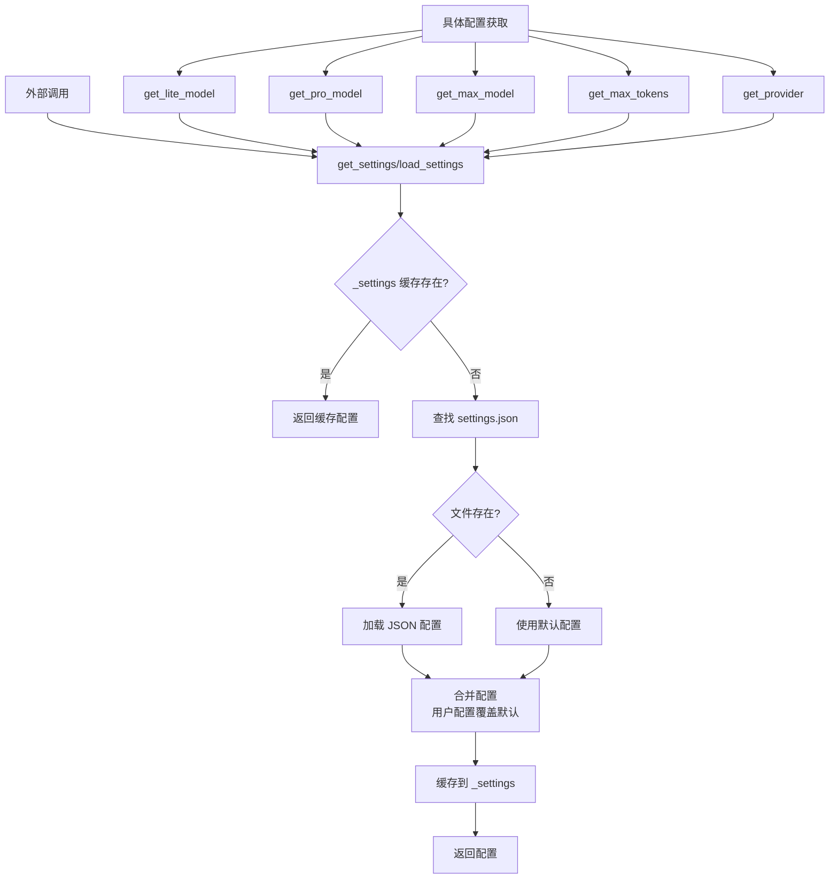
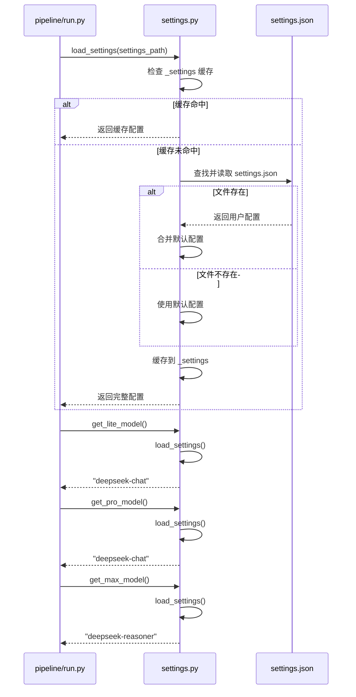

# config-management

## 一、模块定位
本模块是 CodeDeepResearch 项目的配置管理模块，负责统一管理项目的运行时配置。它采用"默认配置 + 用户自定义配置"的模式，支持从 JSON 文件加载配置，并提供缓存机制提高性能。该模块是整个项目的基础设施，为 LLM 模型选择、API 提供商配置、并发控制等关键参数提供统一的访问接口。

## 二、核心架构图



## 三、关键实现

### 1. 配置加载与缓存机制

```python
def load_settings(path: str | None = None) -> dict:
    """Load settings from JSON file, falling back to defaults."""
    global _settings
    if _settings is not None:
        return _settings

    if path is None:
        candidates = [
            os.path.join(os.getcwd(), "settings.json"),
            os.path.join(os.path.dirname(os.path.abspath(__file__)), "settings.json"),
        ]
        for candidate in candidates:
            if os.path.exists(candidate):
                path = candidate
                break

    if path and os.path.exists(path):
        with open(path, "r", encoding="utf-8") as f:
            user_settings = json.load(f)
        _settings = {**_DEFAULTS, **user_settings}
    else:
        _settings = dict(_DEFAULTS)

    return _settings
```

**设计技巧：**
1. **全局缓存**：使用 `_settings` 全局变量缓存配置，避免重复文件 I/O
2. **智能路径查找**：自动在当前目录和模块目录查找配置文件
3. **配置合并策略**：使用 `{**_DEFAULTS, **user_settings}` 确保用户配置覆盖默认值
4. **惰性加载**：首次调用时才加载配置，减少启动开销

**潜在问题：**
- 全局缓存在多线程环境下可能有问题，但本项目主要是单线程运行
- 配置变更后需要调用 `reset_settings()` 才能生效

### 2. 向后兼容的模型获取函数

```python
def get_model() -> str:
    """Legacy function - returns lite model for backward compatibility."""
    return get_lite_model()

def get_lite_model() -> str:
    return load_settings().get("lite_model", _DEFAULTS["lite_model"])

def get_pro_model() -> str:
    return load_settings().get("pro_model", _DEFAULTS["pro_model"])

def get_max_model() -> str:
    return load_settings().get("max_model", _DEFAULTS["max_model"])
```

**设计技巧：**
1. **分层模型配置**：支持 lite/pro/max 三级模型，适应不同计算需求
2. **向后兼容**：`get_model()` 作为旧接口返回 lite 模型
3. **默认值保护**：使用 `.get(key, default)` 防止配置缺失

## 四、数据流



## 五、依赖关系

### 本模块引用的外部模块
- **标准库**：`json`, `os` - 用于文件操作和 JSON 解析

### 其他模块如何调用本模块

```python
# pipeline/run.py - 主流水线入口
from settings import load_settings, get_lite_model, get_pro_model, get_max_model

# provider/deepseek_base.py - LLM 客户端
from settings import get_model, get_max_tokens
```

**调用统计：**
- `load_settings()`: 被所有获取函数间接调用
- `get_lite_model()`: 在 pipeline/run.py 中调用
- `get_pro_model()`: 在 pipeline/run.py 中调用  
- `get_max_model()`: 在 pipeline/run.py 中调用
- `get_model()`: 在 provider/deepseek_base.py 中调用（向后兼容）
- `get_max_tokens()`: 在 provider/deepseek_base.py 中调用

## 六、对外接口

### 公共 API 清单

| 函数签名 | 用途 | 示例 |
|---------|------|------|
| `load_settings(path: str | None = None) -> dict` | 加载配置（带缓存） | `settings = load_settings("custom.json")` |
| `get_settings() -> dict` | 获取完整配置字典 | `config = get_settings()` |
| `get_provider() -> str` | 获取 API 提供商 | `provider = get_provider()` # "anthropic" |
| `get_model() -> str` | 获取模型（向后兼容） | `model = get_model()` # "deepseek-chat" |
| `get_lite_model() -> str` | 获取轻量级模型 | `lite = get_lite_model()` # "deepseek-chat" |
| `get_pro_model() -> str` | 获取专业模型 | `pro = get_pro_model()` # "deepseek-chat" |
| `get_max_model() -> str` | 获取最大模型 | `max = get_max_model()` # "deepseek-reasoner" |
| `get_max_tokens() -> int` | 获取最大 token 数 | `tokens = get_max_tokens()` # 16384 |
| `reset_settings() -> None` | 重置配置缓存 | `reset_settings()` |

### 配置项说明
```json
{
  "provider": "anthropic",           // API 提供商：anthropic 或 openai
  "lite_model": "deepseek-chat",     // 轻量级模型（用于过滤等简单任务）
  "pro_model": "deepseek-chat",      // 专业模型（用于模块分析）
  "max_model": "deepseek-reasoner",  // 最大模型（用于深度研究）
  "max_tokens": 16384,               // 每次调用的最大 token 数
  "max_sub_agent_steps": 30,         // 子代理最大步数
  "research_parallel": true,         // 是否并行研究
  "research_threads": 10             // 研究线程数
}
```

## 七、总结

### 设计亮点
1. **简洁高效**：单文件实现，代码不到 100 行，但功能完整
2. **智能默认值**：内置合理的默认配置，用户只需覆盖需要的部分
3. **缓存优化**：全局缓存避免重复文件读取，提高性能
4. **向后兼容**：保留 `get_model()` 接口，确保旧代码正常工作
5. **分层模型**：lite/pro/max 三级模型设计，支持资源按需分配

### 值得注意的问题
1. **线程安全**：全局缓存 `_settings` 在多线程环境下需要同步机制
2. **配置热更新**：修改 settings.json 后需要重启或调用 `reset_settings()`
3. **错误处理**：JSON 解析错误时直接抛出异常，没有优雅降级

### 改进方向
1. **环境变量支持**：增加环境变量覆盖配置的能力
2. **配置验证**：添加配置项类型和范围验证
3. **多格式支持**：支持 YAML、TOML 等其他配置格式
4. **配置变更监听**：实现文件变更自动重载配置