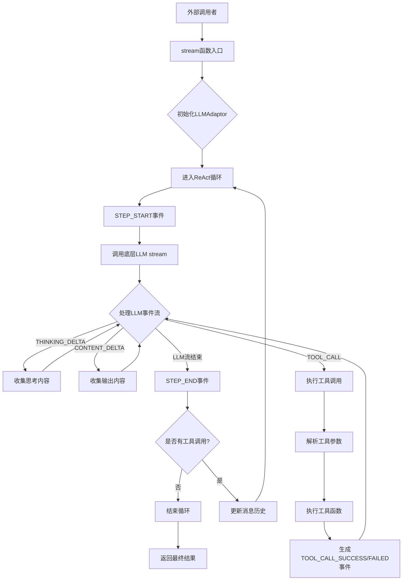
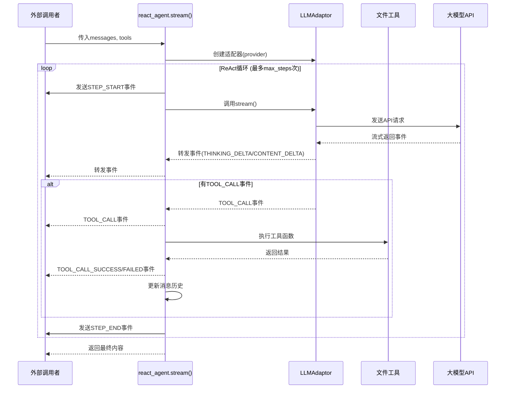

### 模块：core-agent

#### 一、模块定位
本模块是 CodeDeepResearch 项目的核心智能体引擎，实现了 ReAct（Reasoning-Acting）模式的智能体循环。它负责在代码深度分析流程中驱动子模块研究和最终报告汇总，通过观察→思考→行动的循环与文件系统工具交互，生成结构化分析报告。在项目架构中处于核心执行层，为 pipeline 的研究阶段和汇总阶段提供智能体能力。

#### 二、核心架构图（Mermaid）



#### 三、关键实现（必须有代码）

**核心函数 `stream()` - ReAct 循环主逻辑：**

```python
def stream(messages, tools, provider="anthropic", model=None, max_steps=MAX_STEP_CNT):
    """ReAct stream generator: yields events for each step."""
    logger.debug(f"[ReAct] 开始 (provider={provider}, model={model}, max_steps={max_steps})")
    
    adaptor = LLMAdaptor(provider=provider)
    react_finished = False
    step = 1

    while (not react_finished) and step <= max_steps:
        cur_step = step
        yield Event(type=EventType.STEP_START, step=cur_step)
        step = step + 1

        content = ""
        thinking = ""
        raw_tool_calls = []
        tool_results = {}

        logger.debug(f"[ReAct] 步骤 {cur_step} 开始")

        for event in _stream(adaptor, messages, tools, model):
            yield event
            if event.type == EventType.THINKING_DELTA:
                thinking += event.content or ""
            elif event.type == EventType.CONTENT_DELTA:
                content += event.content or ""
            elif event.type == EventType.TOOL_CALL:
                raw_tool_calls.append(event.raw)
                tool = next((t for t in tools if t.name == event.tool_name), None)
                if tool is None:
                    raise RuntimeError(f"Tool '{event.tool_name}' not found")
                result, error = _execute_tool(tool, event.tool_arguments)
                tool_results[event.tool_id] = {"result": result, "error": error}
                yield Event(type=EventType.TOOL_CALL_SUCCESS if not error else EventType.TOOL_CALL_FAILED, 
                           tool_id=event.tool_id, tool_name=event.tool_name, 
                           tool_arguments=event.tool_arguments, tool_result=result, tool_error=error)

        logger.debug(f"[ReAct] 步骤 {cur_step} 结束，输出长度: {len(content)}")
        yield Event(type=EventType.STEP_END, content=content, step=cur_step)

        if not raw_tool_calls:
            react_finished = True
            break

        messages.append(AssistantMessage(content=content, tool_calls=raw_tool_calls, thinking=thinking))
        for raw_tc in raw_tool_calls:
            tid = raw_tc["id"]
            tr = tool_results[tid]
            messages.append(ToolMessage(tool_id=tid, tool_name=raw_tc["name"], 
                                       tool_result=tr["result"], tool_error=tr["error"]))

    logger.debug(f"[ReAct] 结束")
```

**设计技巧：**
1. **事件驱动架构**：使用 `Event` 对象流式传递所有状态变更，便于外部消费者实时处理
2. **工具执行与错误处理分离**：`_execute_tool()` 函数返回 `(result, error)` 元组，统一处理成功和失败场景
3. **消息历史自动维护**：自动将工具调用结果添加到消息历史中，实现完整的对话上下文
4. **流式迭代器设计**：使用生成器模式，支持实时处理长对话，避免内存爆炸

**潜在问题：**
1. **工具查找性能**：每次工具调用都使用 `next((t for t in tools if t.name == event.tool_name), None)` 线性查找，工具数量多时可能影响性能
2. **错误传播**：工具执行异常仅记录到日志，没有提供重试机制
3. **上下文长度限制**：依赖底层 LLMAdaptor 的压缩机制，可能丢失重要历史信息

#### 四、数据流



#### 五、依赖关系

**本模块引用的外部模块/函数：**
1. `base.types`：`Event`, `EventType`, `ToolMessage`, `AssistantMessage`
2. `provider.adaptor`：`LLMAdaptor` - 统一的大模型流式接口
3. `log.logger`：`logger` - 日志记录器

**其他模块如何调用本模块：**
1. `pipeline/researcher.py`：`from agent.react_agent import stream as react_stream` - 用于子模块深度研究
2. `pipeline/aggregator.py`：`from agent.react_agent import stream as react_stream` - 用于最终报告汇总
3. `test/llm_test.py`：`from agent import react_agent` - 用于测试

**精确调用关系：**
- `pipeline/researcher.py`:_research_one() → `react_stream(messages=messages, tools=tools, provider=ctx.provider, model=ctx.pro_model, max_steps=ctx.max_sub_agent_steps)`
- `pipeline/aggregator.py`:`aggregate_reports()` → `react_stream(messages=messages, tools=tools, provider=ctx.provider, model=ctx.max_model, max_steps=ctx.max_sub_agent_steps)`

#### 六、对外接口

**公共 API 清单：**

1. **`stream(messages, tools, provider="anthropic", model=None, max_steps=MAX_STEP_CNT)`**
   - **用途**：ReAct 智能体主入口，执行观察→思考→行动循环
   - **参数**：
     - `messages`: 对话消息列表（支持 `Message` 对象或字典）
     - `tools`: `Tool` 对象列表，定义可用的工具函数
     - `provider`: 大模型提供商，支持 "anthropic" 或 "openai"
     - `model`: 可选模型名称
     - `max_steps`: 最大循环步数，默认 30
   - **返回**：生成器，产生 `Event` 对象流
   - **示例**：
     ```python
     from agent.react_agent import stream
     from base.types import SystemMessage, UserMessage
     
     messages = [SystemMessage("你是一个代码分析助手"), UserMessage("分析这个项目")]
     tools = [read_file, list_directory]
     
     for event in stream(messages, tools, provider="anthropic"):
         if event.type == EventType.STEP_END:
             print(f"步骤 {event.step} 完成: {event.content[:100]}...")
     ```

2. **`_execute_tool(tool, tool_arguments: str)`**（内部函数，但可被测试使用）
   - **用途**：安全执行工具函数，解析 JSON 参数
   - **参数**：
     - `tool`: `Tool` 对象
     - `tool_arguments`: JSON 格式的参数字符串
   - **返回**：`(result, error)` 元组

#### 七、总结

**设计亮点：**
1. **完整的 ReAct 模式实现**：严格遵循观察→思考→行动循环，支持多轮工具调用
2. **统一的事件系统**：与底层 LLMAdaptor 的事件系统无缝集成，提供一致的消费接口
3. **工具执行安全机制**：JSON 参数解析有错误处理，避免无效参数导致崩溃
4. **上下文自动管理**：智能维护对话历史，简化调用者负担

**值得注意的问题：**
1. **工具查找效率**：当前线性查找工具名称，可考虑使用字典优化
2. **错误恢复机制**：工具执行失败后没有重试策略，可能导致分析中断
3. **内存管理**：长时间运行的对话可能积累大量消息，依赖底层压缩机制

**改进方向：**
1. **工具缓存**：将工具列表转换为 `{name: tool}` 字典，提高查找效率
2. **重试机制**：为工具执行添加可配置的重试策略
3. **进度追踪**：添加更详细的进度事件，便于外部监控
4. **配置化**：将最大步数、超时时间等参数提取为可配置选项