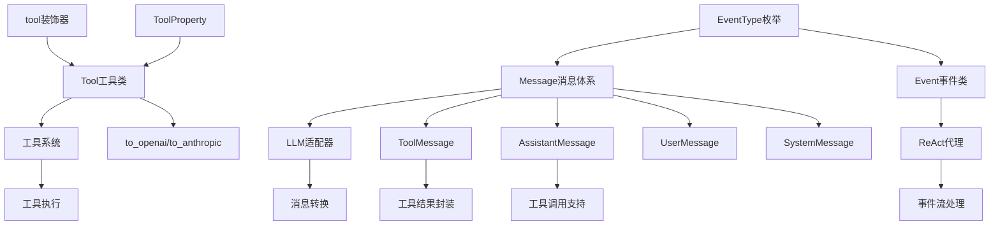
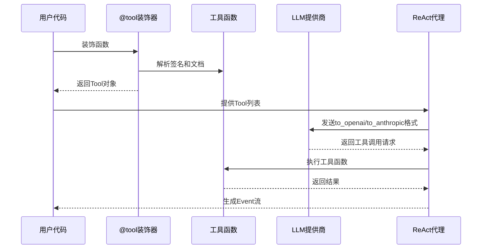

### 模块：core-types

#### 一、模块定位
`core-types` 模块是整个 CodeDeepResearch 项目的核心类型定义模块，负责定义项目中所有的基础数据类型、事件类型、消息类型和工具装饰器。它位于 `base/types.py` 文件中，是项目的数据模型层，为 LLM 交互、ReAct 代理、工具系统等提供统一的数据结构和接口规范。

#### 二、核心架构图（Mermaid）



#### 三、关键实现（必须有代码）

**1. Tool 类的多协议适配设计**

```python
@dataclass
class Tool:
    name: str
    description: str
    parameters: Dict[str, ToolProperty] = field(default_factory=dict)
    required: List[str] = field(default_factory=list)
    func: Optional[Callable] = None

    def _build_schema(self) -> Dict[str, Any]:
        """构建参数 schema（OpenAI 和 Anthropic 共用）。"""
        properties = {}
        for key, prop in self.parameters.items():
            prop_dict = {"type": prop.type, "description": prop.description}
            if prop.enum:
                prop_dict["enum"] = prop.enum
            properties[key] = prop_dict
        return {"type": "object", "properties": properties, "required": self.required}

    def to_openai(self) -> dict:
        return {
            "type": "function",
            "function": {
                "name": self.name,
                "description": self.description,
                "parameters": self._build_schema(),
            },
        }

    def to_anthropic(self) -> dict:
        return {
            "name": self.name,
            "description": self.description,
            "input_schema": self._build_schema(),
        }
```

**设计分析**：
- **统一接口设计**：通过 `_build_schema()` 方法构建通用的参数 schema，避免为每个协议重复实现
- **协议适配模式**：`to_openai()` 和 `to_anthropic()` 方法提供协议特定的格式转换，支持多 LLM 提供商
- **类型安全**：使用 `ToolProperty` 封装参数元数据，支持枚举类型约束

**2. @tool 装饰器的智能参数解析**

```python
def tool(func: Callable = None, *, name: str = None, description: str = None):
    """Decorator that converts a function into a Tool object."""
    def decorator(f: Callable) -> Tool:
        tool_name = name or f.__name__
        tool_description = description or (f.__doc__ or "").strip().split('\n')[0] or tool_name

        sig = inspect.signature(f)
        parameters = {}
        required = []
        param_descriptions = _parse_param_descriptions(f.__doc__ or "")

        for param_name, param in sig.parameters.items():
            if param_name == "self":
                continue
            param_type = _TYPE_MAP.get(param.annotation, "string") if param.annotation != inspect.Parameter.empty else "string"
            if param.default == inspect.Parameter.empty:
                required.append(param_name)
            parameters[param_name] = ToolProperty(
                type=param_type,
                description=param_descriptions.get(param_name, param_name),
            )

        return Tool(
            name=tool_name,
            description=tool_description,
            parameters=parameters,
            required=required,
            func=f,
        )
```

**设计技巧**：
- **智能文档解析**：从函数 docstring 的 `Args:` 部分自动提取参数描述
- **类型推断**：通过 `inspect.signature` 自动推断参数类型和默认值
- **灵活配置**：支持通过装饰器参数覆盖默认名称和描述

#### 四、数据流



#### 五、依赖关系

**本模块被引用情况（grep 确认）：**

1. **agent/react_agent.py**：
   ```python
   from base.types import Event, EventType, ToolMessage, AssistantMessage
   ```
   - 使用 Event 系统处理 ReAct 步骤
   - 使用 ToolMessage 封装工具执行结果

2. **provider/adaptor.py**：
   ```python
   from base.types import EventType, Event, Tool, normalize_messages
   ```
   - 核心依赖：Event 系统、Tool 类、消息规范化

3. **pipeline 模块**：
   - `aggregator.py`: `EventType, SystemMessage, UserMessage`
   - `llm_filter.py`: `SystemMessage, UserMessage`
   - `researcher.py`: `EventType, SystemMessage, UserMessage`

4. **工具系统**：
   - `tool/fs_tool.py`: `from base.types import tool`
   - `tool/test_tool.py`: `from base.types import tool`

5. **其他**：
   - `log/printer.py`: `EventType`
   - `provider/llm.py`: `EventType, SystemMessage, UserMessage`

#### 六、对外接口

**公共 API 清单**：

1. **EventType 枚举**：
   ```python
   EventType.MESSAGE_START  # 消息开始
   EventType.THINKING_START # 思考开始
   EventType.TOOL_CALL      # 工具调用
   EventType.STEP_START     # ReAct步骤开始
   ```

2. **核心数据类**：
   ```python
   Event(type: EventType, content: str = None, ...)  # 事件对象
   Tool(name: str, description: str, ...)            # 工具定义
   SystemMessage(content: str)                       # 系统消息
   UserMessage(content: str)                         # 用户消息
   AssistantMessage(content: str, tool_calls: List)  # 助手消息
   ToolMessage(tool_id: str, tool_name: str, ...)    # 工具消息
   ```

3. **装饰器函数**：
   ```python
   @tool(name="custom_name", description="custom_desc")
   def my_function(param: str) -> str:
       """函数文档"""
   ```

4. **工具函数**：
   ```python
   normalize_messages(messages: List[Union[Message, dict]]) -> List[dict]
   ```

**使用示例**：
```python
from base.types import tool, SystemMessage, UserMessage

@tool
def read_file(file_path: str) -> str:
    """读取文件内容"""
    with open(file_path) as f:
        return f.read()

messages = [
    SystemMessage("你是一个代码分析助手"),
    UserMessage("分析这个文件")
]
```

#### 七、总结

**设计亮点**：
1. **协议无关设计**：通过统一的 `Tool` 类支持 OpenAI 和 Anthropic 两种协议，具有良好的扩展性
2. **事件驱动架构**：`Event` 系统为流式处理提供了标准化的数据格式
3. **装饰器自动化**：`@tool` 装饰器自动从函数签名和文档生成完整的工具定义，减少样板代码
4. **类型安全**：使用 Python 类型注解和 dataclass 确保数据结构的正确性

**潜在问题**：
1. **类型映射限制**：`_TYPE_MAP` 只支持基本类型，复杂类型（如 `List[str]`）无法正确映射
2. **文档解析脆弱**：依赖特定的 docstring 格式（`Args:` 部分），对非标准格式支持不足
3. **协议差异处理**：OpenAI 和 Anthropic 的消息格式转换逻辑较复杂，可能隐藏错误

**改进方向**：
1. 支持更丰富的类型注解（如 `List[str]`, `Dict[str, int]`）
2. 增强文档解析的容错性，支持多种文档格式
3. 添加协议适配器的单元测试，确保格式转换的正确性
4. 考虑支持更多 LLM 提供商（如 Google Gemini）