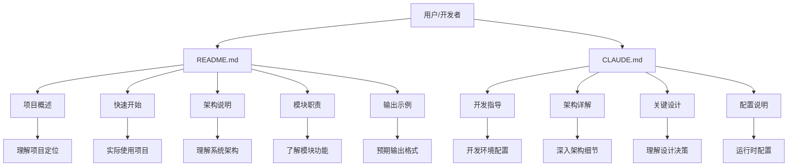
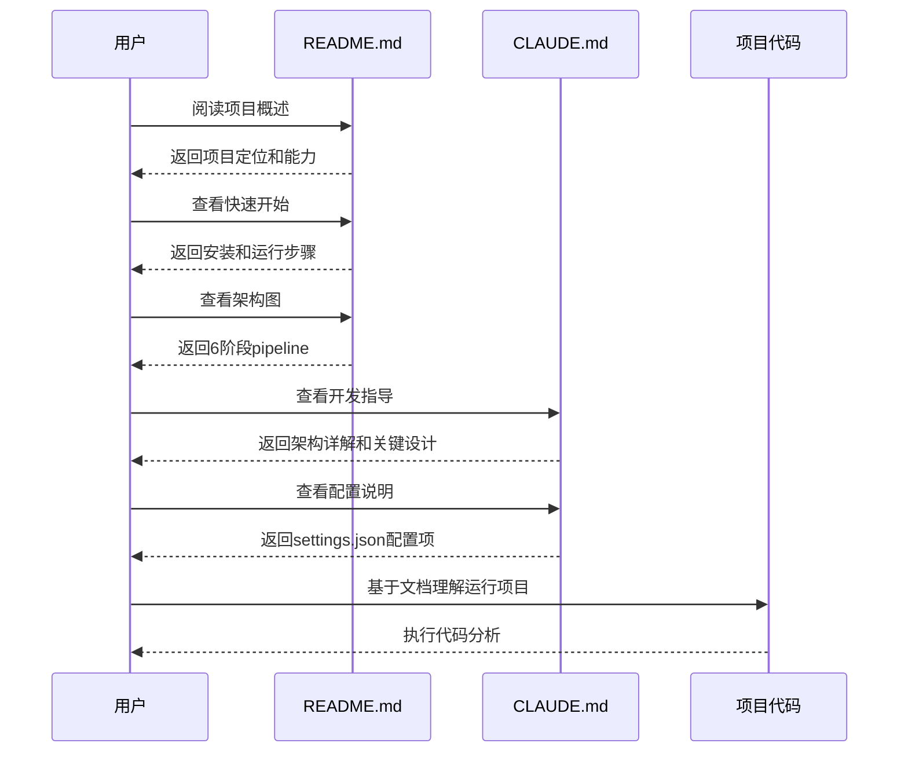

### 模块：documentation

#### 一、模块定位
本模块是 CodeDeepResearch 项目的文档模块，包含项目的核心文档文件。主要职责是提供项目的使用说明、架构设计、快速入门指南和开发指导。在项目中处于用户入口和开发者参考的核心地位，是项目对外展示和内部开发的重要文档资源。

#### 二、核心架构图（Mermaid）


#### 三、关键实现（必须有代码）
虽然 documentation 模块主要是 Markdown 文件，但其内容结构和组织体现了重要的设计思想：

**README.md 的核心结构设计：**
```markdown
# CodeDeepResearch

LLM 驱动的自动化代码深度分析引擎。输入任意代码仓库路径，输出结构化的中文项目分析报告...

## 核心能力
- **全自动化分析**：无需人工干预...
- **智能文件筛选**：硬编码 + LLM 两层过滤...
- **并行模块研究**：对 top N 重要模块并行深度研究...

## 架构
```
输入: /path/to/project
  │
  ▼
阶段 1: 扫描项目 ── 遍历文件，收集大小/扩展名/路径
  │         排除 node_modules/.git/test/docs 等目录
  │
  ▼
阶段 2: LLM 智能过滤 ── 基于项目类型判断文件重要性
...
```

**设计技巧：**
1. **渐进式信息展示**：从项目概述 → 核心能力 → 架构 → 使用步骤，符合用户认知路径
2. **可视化架构图**：使用 ASCII 图表展示 6 阶段 pipeline，直观展示数据流
3. **分层信息结构**：将复杂系统分解为模块职责表，便于快速查找和理解
4. **实用示例驱动**：提供完整的命令行示例和输出示例，降低使用门槛

**潜在问题：**
1. 文档与代码可能存在同步问题，当代码变更时文档需要手动更新
2. 缺少 API 文档自动生成机制
3. 文档版本管理依赖人工维护

#### 四、数据流


#### 五、依赖关系
**本模块引用的外部模块/函数：**
- 无直接代码依赖（纯文档文件）

**其他模块如何调用本模块：**
1. **pipeline/scanner.py**：在硬编码过滤中排除文档文件
   ```python
   # scanner.py 第13行
   IGNORED_FILENAMES = [".DS_Store", ".gitignore", "CLAUDE.md", "__init__.py"]
   ```

2. **prompt/pipeline_prompts.py**：在 LLM 过滤提示词中定义文档重要性规则
   ```python
   # 第17行：定义重要文档
   - **重要文档**：README.md（项目介绍和使用说明）
   
   # 第22行：定义不重要文档  
   - **不重要文档**：CHANGELOG、LICENSE、CONTRIBUTING 等（README.md 除外）
   
   # 第33行：示例中展示 README.md
   {"path": "README.md", "type": "doc", "size": 512}
   
   # 第36行：输出示例中排除 README.md
   {"unimportant_paths": ["tests/test_main.py", "README.md"]}
   ```

#### 六、对外接口
**公共 API 清单：**

| 文档文件 | 用途 | 目标用户 |
|---------|------|----------|
| README.md | 项目概述、使用指南、架构说明 | 所有用户和开发者 |
| CLAUDE.md | 开发指导、架构详解、配置说明 | Claude Code 用户和开发者 |

**示例使用：**
1. **新用户入门**：阅读 README.md → 了解项目 → 安装依赖 → 运行示例
2. **开发者贡献**：阅读 CLAUDE.md → 理解架构 → 配置环境 → 开发调试
3. **代码分析**：系统自动过滤文档文件，但保留 README.md 作为重要参考

#### 七、总结
**设计亮点：**
1. **双文档策略**：README.md 面向普通用户，CLAUDE.md 面向开发者，目标明确
2. **结构化内容**：采用标准化的文档结构，便于信息查找和更新
3. **与代码集成**：文档内容在代码中有明确引用（过滤规则、提示词定义）
4. **实用导向**：提供完整的命令行示例和输出示例，降低使用门槛

**值得注意的问题：**
1. **文档代码同步**：文档更新依赖人工维护，可能存在滞后
2. **国际化限制**：文档主要为中文，限制了国际用户的使用
3. **测试覆盖缺失**：文档内容没有自动化测试验证

**改进方向：**
1. 引入文档自动化测试，确保示例代码可运行
2. 增加英文版本文档，支持国际化
3. 建立文档与代码的关联机制，自动检测文档过期
4. 增加 API 文档自动生成，基于代码注释生成接口文档