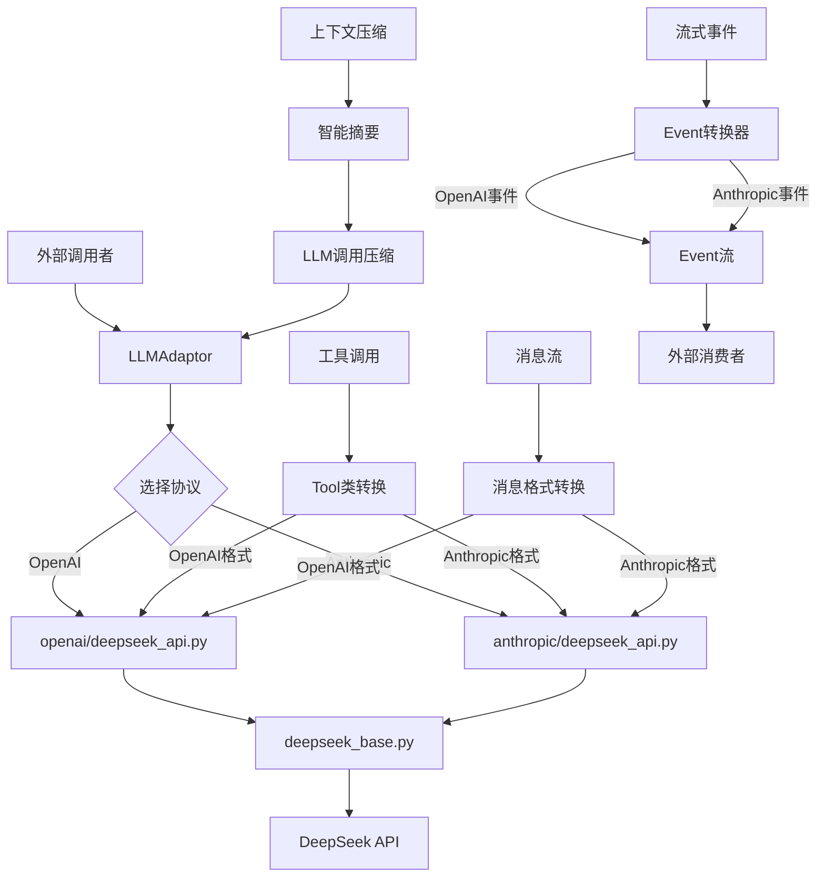
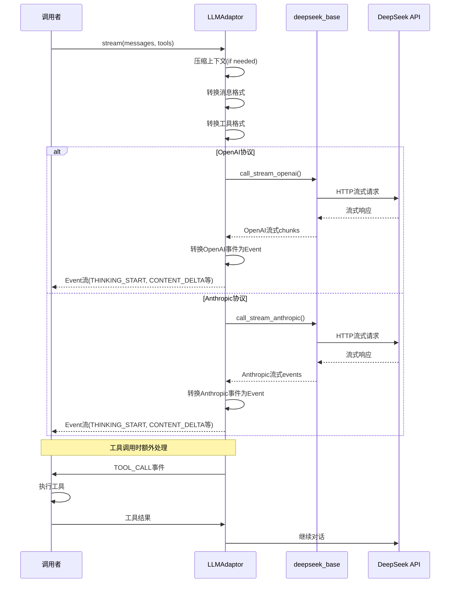

# llm-provider

## 一、模块定位
llm-provider 模块是 CodeDeepResearch 项目的 LLM 统一接口层，负责封装 OpenAI 和 Anthropic 两种协议的 DeepSeek API 调用。该模块的核心职责是：
1. **协议适配**：统一 OpenAI 和 Anthropic 两种 API 协议的差异，提供一致的调用接口
2. **流式处理**：支持实时流式响应，包括思考过程、内容生成和工具调用
3. **上下文管理**：智能压缩长对话上下文，避免 token 超限
4. **错误处理**：内置重试机制和超时处理，提高系统稳定性
5. **工具调用**：统一工具调用格式，支持两种协议的工具调用规范

该模块是项目的基础设施层，被 pipeline 模块、agent 模块等多个上层组件依赖，是整个系统的 LLM 通信核心。

## 二、核心架构图



## 三、关键实现

### 1. LLMAdaptor.stream() - 核心流式接口

```python
def stream(self, messages, tools=None, response_format=None, **kwargs):
    messages = normalize_messages(messages)
    params = {}

    # 智能上下文压缩
    messages = self._compress_if_needed(messages)

    # 协议特定的消息格式转换
    if self._provider == "anthropic":
        messages = self._convert_messages_anthropic(messages, params)
    else:
        messages = self._convert_messages_openai(messages)

    # 工具调用格式转换
    if tools:
        if all(isinstance(t, Tool) for t in tools):
            tools_dict = [t.to_openai() if self._provider == "openai" else t.to_anthropic() for t in tools]
            params["tools"] = tools_dict
        else:
            params["tools"] = tools

    # 协议特定的流式处理
    if self._provider == "openai":
        yield from self._stream_openai(messages, params, **kwargs)
    else:
        yield from self._stream_anthropic(messages, params, **kwargs)
```

**设计技巧**：
1. **延迟导入**：在 `__init__` 中根据 provider 动态导入对应的 API 模块，避免不必要的依赖
2. **统一接口**：无论底层是 OpenAI 还是 Anthropic 协议，对外提供完全相同的 `stream()` 接口
3. **智能压缩**：在消息发送前自动检查上下文长度，超限时自动压缩历史对话
4. **格式转换**：自动处理两种协议在消息格式、工具调用格式上的差异

### 2. _compress_if_needed() - 智能上下文压缩

```python
def _compress_if_needed(self, messages) -> list:
    total_chars = sum(len(json.dumps(m, ensure_ascii=False)) for m in messages)
    if total_chars <= MAX_CONTEXT_CHARS:
        return messages

    print(f"\n  [上下文压缩] {total_chars} 字符超过阈值 {MAX_CONTEXT_CHARS}，开始压缩...")

    system_msgs = [m for m in messages if m.get("role") == "system"]
    other_msgs = [m for m in messages if m.get("role") != "system"]

    if len(other_msgs) <= COMPRESS_KEEP_RECENT:
        return messages

    to_compress = other_msgs[:-COMPRESS_KEEP_RECENT]
    to_keep = other_msgs[-COMPRESS_KEEP_RECENT:]
    summary = self._summarize_messages(to_compress)

    compressed = list(system_msgs)
    if summary:
        compressed.append({"role": "user", "content": f"[以下是之前对话的摘要]\n{summary}"})
        compressed.append({"role": "assistant", "content": "好的，我已了解之前的分析内容，继续进行。"})
    compressed.extend(to_keep)

    new_chars = sum(len(json.dumps(m, ensure_ascii=False)) for m in compressed)
    print(f"  [上下文压缩] 完成：{total_chars} → {new_chars} 字符")
    return compressed
```

**设计亮点**：
1. **智能保留策略**：保留最近的 6 条消息，压缩历史消息
2. **摘要生成**：使用 LLM 自动生成历史对话摘要，保持上下文连贯性
3. **系统消息保护**：系统提示词不受压缩影响，确保核心指令完整
4. **透明反馈**：打印压缩前后的字符数对比，便于调试

**潜在问题**：
1. 压缩过程会额外消耗一次 LLM 调用，增加成本和延迟
2. 摘要可能丢失细节信息，影响后续分析的准确性

## 四、数据流



## 五、依赖关系

### 本模块引用的外部模块：
1. **base.types**：核心数据类型定义
   - `EventType`：事件类型枚举
   - `Event`：流式事件数据结构
   - `Tool`：工具定义类
   - `normalize_messages()`：消息标准化函数

2. **settings**：配置管理
   - `get_model()`：获取模型配置
   - `get_max_tokens()`：获取最大token数

3. **prompt.pipeline_prompts**：提示词模板
   - `COMPRESS_USER`：上下文压缩提示词

4. **第三方库**：
   - `openai`：OpenAI SDK
   - `anthropic`：Anthropic SDK
   - `json`：JSON处理
   - `threading`：多线程支持
   - `queue`：线程安全队列

### 其他模块如何调用本模块：

1. **agent/react_agent.py**：ReAct智能体
   ```python
   from provider.adaptor import LLMAdaptor
   adaptor = LLMAdaptor(provider=provider)
   ```

2. **pipeline/decomposer.py**：任务分解器
   ```python
   from provider.llm import call_llm, extract_json
   response = call_llm(ctx.provider, DECOMPOSER_SYSTEM, user_msg, ...)
   ```

3. **pipeline/llm_filter.py**：文件过滤器
   ```python
   from provider.llm import call_llm, extract_json
   response = call_llm(ctx.provider, FILE_FILTER_SYSTEM, user_msg, ...)
   ```

4. **pipeline/scorer.py**：评分器
   ```python
   from provider.llm import call_llm, extract_json
   response = call_llm(ctx.provider, SCORER_SYSTEM, user_msg, ...)
   ```

## 六、对外接口

### 1. LLMAdaptor 类
```python
class LLMAdaptor:
    def __init__(self, provider="anthropic")
    def stream(self, messages, tools=None, response_format=None, **kwargs)
```

**用途**：统一的流式 LLM 调用接口，支持 OpenAI 和 Anthropic 两种协议。

**示例**：
```python
from provider.adaptor import LLMAdaptor
adaptor = LLMAdaptor(provider="anthropic")
for event in adaptor.stream(messages, tools=tools):
    if event.type == EventType.CONTENT_DELTA:
        print(event.content, end="")
```

### 2. call_llm() 函数
```python
def call_llm(provider: str, system: str, user: str, model: str | None = None, 
             timeout: int = DEFAULT_TIMEOUT, response_format=None) -> str
```

**用途**：简化的同步 LLM 调用封装，适合不需要流式响应的场景。

**示例**：
```python
from provider.llm import call_llm
response = call_llm("anthropic", "你是代码分析助手", "分析这个函数", response_format={"type": "json_object"})
```

### 3. call_llm_sync() 函数
```python
def call_llm_sync(adaptor, messages, timeout=DEFAULT_TIMEOUT, response_format=None)
```

**用途**：将流式接口转换为同步调用，内部使用多线程实现。

**示例**：
```python
from provider.llm import call_llm_sync
content = call_llm_sync(adaptor, messages, timeout=60)
```

### 4. extract_json() 函数
```python
def extract_json(text: str) -> str
```

**用途**：从 LLM 响应中提取 JSON，自动处理 markdown 代码块包裹。

**示例**：
```python
from provider.llm import extract_json
json_str = extract_json(llm_response)
```

## 七、总结

### 设计亮点：
1. **协议抽象完善**：完美统一了 OpenAI 和 Anthropic 两种协议的差异，上层调用者无需关心底层实现
2. **流式处理优雅**：Event 机制设计合理，支持思考过程、内容生成、工具调用的完整生命周期
3. **智能上下文管理**：自动压缩长对话，平衡了上下文长度和成本效率
4. **错误处理健壮**：内置重试机制和超时处理，提高了系统稳定性
5. **工具调用统一**：Tool 类设计巧妙，支持两种协议的工具调用格式转换

### 值得注意的问题：
1. **压缩成本**：上下文压缩会额外消耗一次 LLM 调用，可能增加成本和延迟
2. **线程安全**：`call_llm_sync` 使用多线程实现同步调用，需要注意线程安全问题
3. **错误传播**：流式调用中的异常处理需要更精细的设计，避免部分成功的情况

### 改进方向：
1. **缓存机制**：可以为压缩摘要添加缓存，避免重复压缩相同的历史对话
2. **配置化**：压缩阈值、保留消息数等参数可以配置化，适应不同场景
3. **监控指标**：添加调用统计、成功率、延迟等监控指标，便于运维
4. **批量调用**：支持批量异步调用，提高并发处理能力