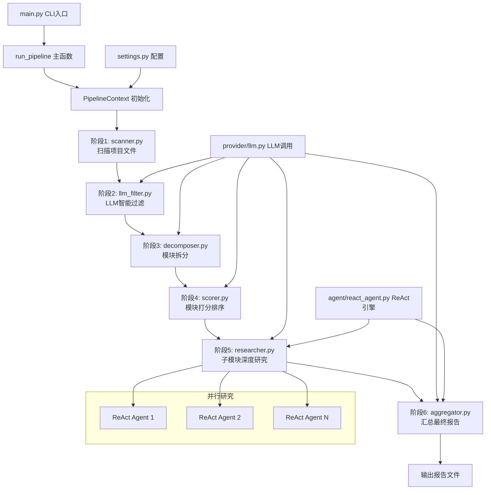
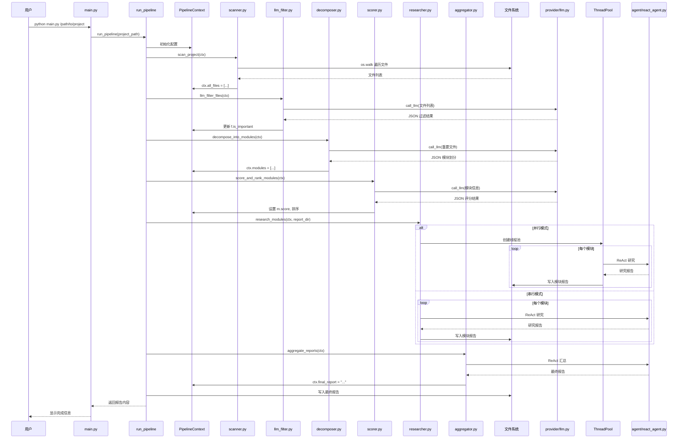

# pipeline-orchestration

## 一、模块定位
本模块是 CodeDeepResearch 项目的核心编排引擎，负责自动化代码深度分析的完整流水线。它通过 6 个阶段（扫描→过滤→拆分→打分→研究→汇总）将复杂的代码分析任务分解为可管理的子任务，协调多个 LLM 智能体协同工作，最终生成结构化的深度分析报告。在项目中处于核心地位，是连接用户输入、LLM 智能体、文件系统和报告生成的关键枢纽。

## 二、核心架构图



## 三、关键实现

### 核心函数 `run_pipeline()` (pipeline/run.py)

```python
def run_pipeline(
    project_path: str,
    settings_path: str | None = None,
) -> str:
    """运行完整分析流水线。"""
    settings = load_settings(settings_path)
    project_path = os.path.abspath(project_path)
    project_name = os.path.basename(project_path)

    provider = settings["provider"]
    max_sub_agent_steps = settings["max_sub_agent_steps"]
    research_parallel = settings["research_parallel"]
    research_threads = settings["research_threads"]
    lite_model = get_lite_model()
    pro_model = get_pro_model()
    max_model = get_max_model()

    print(f"模型配置: lite={lite_model}, pro={pro_model}, max={max_model}")

    ctx = PipelineContext(
        project_path=project_path,
        project_name=project_name,
        provider=provider,
        lite_model=lite_model,
        pro_model=pro_model,
        max_model=max_model,
        max_sub_agent_steps=max_sub_agent_steps,
        research_parallel=research_parallel,
        research_threads=research_threads,
        settings=settings,
    )

    timestamp = datetime.now().strftime("%Y%m%d%H%M")
    report_dir = os.path.join(os.getcwd(), "report", project_name, timestamp)
    os.makedirs(report_dir, exist_ok=True)
    print(f"报告输出目录: {report_dir}")

    # ====== 阶段 1: 扫描 ======
    print(f"\n{'='*60}\n阶段 1/6: 扫描项目 [{project_name}]\n{'='*60}")
    scan_project(ctx)
    print(f"  扫描到 {len(ctx.all_files)} 个文件")

    # ====== 阶段 2: LLM 过滤 ======
    print(f"\n{'='*60}\n阶段 2/6: LLM 智能过滤\n{'='*60}")
    llm_filter_files(ctx)
    important_count = sum(1 for f in ctx.all_files if f.is_important)
    print(f"  保留 {important_count} 个重要文件")

    # ====== 阶段 3: 模块拆分 ======
    print(f"\n{'='*60}\n阶段 3/6: 模块拆分\n{'='*60}")
    decompose_into_modules(ctx)
    print(f"  识别到 {len(ctx.modules)} 个模块:")
    for m in ctx.modules:
        print(f"    - {m.name}: {m.description} ({len(m.files)} 个文件)")

    # ====== 阶段 4: 模块打分 ======
    print(f"\n{'='*60}\n阶段 4/6: 模块重要性打分\n{'='*60}")
    score_and_rank_modules(ctx)
    print(f"  模块评分（从高到低）:")
    for m in ctx.modules:
        print(f"    - {m.name}: {m.score:.0f}分")
    print(f"  共 {len(ctx.modules)} 个模块，全部进行深度研究")

    # ====== 阶段 5: 深度研究 ======
    print(f"\n{'='*60}\n阶段 5/6: 子模块深度研究\n{'='*60}")
    research_modules(ctx, report_dir, ctx.modules)

    # ====== 阶段 6: 汇总报告 ======
    print(f"\n{'='*60}\n阶段 6/6: 汇总最终报告\n{'='*60}")
    aggregate_reports(ctx, ctx.modules)

    final_path = os.path.join(report_dir, f"最终报告-{ctx.project_name}.md")
    with open(final_path, "w", encoding="utf-8") as f:
        f.write(ctx.final_report)

    return ctx.final_report
```

**设计技巧分析：**
1. **上下文传递模式**：使用 `PipelineContext` 数据类贯穿所有阶段，避免函数参数爆炸，确保状态一致性
2. **渐进式过滤**：采用"扫描→LLM过滤→模块拆分→打分"的渐进式策略，逐步缩小分析范围
3. **模型分级使用**：`lite_model` 用于简单分类任务，`pro_model` 用于模块研究，`max_model` 用于最终汇总，优化成本与效果平衡
4. **时间戳目录**：为每次分析创建唯一的时间戳目录，避免报告覆盖，支持历史记录

**潜在问题：**
1. 内存占用：`ctx.all_files` 存储所有文件信息，大型项目可能内存压力大
2. 错误传播：某个阶段失败会影响后续所有阶段，缺乏容错机制
3. 硬编码路径：`report_dir` 使用 `os.getcwd()`，在多线程或服务化部署中可能有问题

### 核心函数 `research_modules()` (pipeline/researcher.py)

```python
def research_modules(ctx: PipelineContext, report_dir: str, selected: list[Module]) -> None:
    set_project_root(ctx.project_path)
    tools = [read_file, list_directory, glob_pattern, grep_content]
    file_tree = _build_file_tree(ctx.all_files)

    if ctx.research_parallel:
        print(f"  并行模式: {ctx.research_threads} 线程, {len(selected)} 个模块")
        with ThreadPoolExecutor(max_workers=ctx.research_threads) as executor:
            futures = {
                executor.submit(_research_one, ctx, module, tools, report_dir, file_tree): module
                for module in selected
            }
            for future in as_completed(futures):
                module = futures[future]
                try:
                    future.result()
                    print(f"  ✓ 模块完成: {module.name}")
                except Exception as e:
                    print(f"  ✗ 模块失败: {module.name} - {e}")
    else:
        print(f"  串行模式: {len(selected)} 个模块")
        for module in selected:
            _research_one(ctx, module, tools, report_dir, file_tree)
```

**设计技巧：**
1. **并行/串行切换**：根据配置动态选择执行模式，适应不同资源环境
2. **线程池管理**：使用 `ThreadPoolExecutor` 控制并发度，避免资源耗尽
3. **异常隔离**：每个模块研究独立捕获异常，避免单个模块失败影响整体
4. **工具集统一**：为所有研究任务提供相同的文件系统工具集

## 四、数据流



## 五、依赖关系

### 本模块引用的外部模块/函数：

1. **settings.py** (3处调用)
   - `load_settings()` - 加载配置文件
   - `get_lite_model()` - 获取轻量模型
   - `get_pro_model()` - 获取专业模型
   - `get_max_model()` - 获取最大模型

2. **provider/llm.py** (4处调用)
   - `call_llm()` - 调用 LLM API (llm_filter.py, decomposer.py, scorer.py, researcher.py, aggregator.py)
   - `extract_json()` - 提取 JSON 响应

3. **agent/react_agent.py** (2处调用)
   - `stream()` - ReAct 智能体流式执行 (researcher.py, aggregator.py)

4. **tool/fs_tool.py** (2处调用)
   - `set_project_root()` - 设置项目根目录
   - `read_file()`, `list_directory()`, `glob_pattern()`, `grep_content()` - 文件系统工具

5. **base/types.py** (2处调用)
   - `SystemMessage`, `UserMessage` - 消息类型
   - `EventType` - 事件类型枚举

6. **prompt/pipeline_prompts.py** (6处调用)
   - `FILE_FILTER_SYSTEM/USER` - 文件过滤提示词
   - `DECOMPOSER_SYSTEM/USER` - 模块拆分提示词
   - `SCORER_SYSTEM/USER` - 模块打分提示词
   - `SUB_AGENT_SYSTEM/USER` - 子模块研究提示词
   - `AGGREGATOR_SYSTEM/USER` - 报告汇总提示词

### 其他模块如何调用本模块：

1. **main.py** - 直接入口
   ```python
   from pipeline import run_pipeline
   report = run_pipeline(project_path=project_path, settings_path=args.settings)
   ```

2. **pipeline/__init__.py** - 模块导出
   ```python
   from pipeline.run import run_pipeline
   __all__ = ["run_pipeline"]
   ```

## 六、对外接口

### 公共 API 清单：

1. **`run_pipeline(project_path: str, settings_path: str | None = None) -> str`**
   - **用途**: 执行完整的代码分析流水线
   - **参数**:
     - `project_path`: 要分析的项目目录路径
     - `settings_path`: 可选配置文件路径，默认使用当前目录的 settings.json
   - **返回**: 最终分析报告的 Markdown 字符串
   - **示例**:
     ```python
     from pipeline import run_pipeline
     report = run_pipeline("/path/to/your/project")
     ```

2. **`PipelineContext` 数据类** (pipeline/types.py)
   - **用途**: 流水线执行上下文，存储所有阶段的状态数据
   - **关键字段**:
     - `project_path`, `project_name`: 项目信息
     - `provider`, `lite_model`, `pro_model`, `max_model`: LLM 配置
     - `all_files`: 扫描到的所有文件列表
     - `modules`: 识别出的模块列表
     - `final_report`: 最终报告内容

3. **各阶段处理函数** (内部使用，但可单独调用)
   - `scan_project(ctx: PipelineContext) -> None`
   - `llm_filter_files(ctx: PipelineContext) -> None`
   - `decompose_into_modules(ctx: PipelineContext) -> None`
   - `score_and_rank_modules(ctx: PipelineContext) -> None`
   - `research_modules(ctx: PipelineContext, report_dir: str, selected: list[Module]) -> None`
   - `aggregate_reports(ctx: PipelineContext, selected: list) -> None`

## 七、总结

### 设计亮点：
1. **六阶段流水线设计**：将复杂任务分解为清晰的阶段，每个阶段职责单一，便于调试和扩展
2. **上下文共享模式**：`PipelineContext` 作为数据总线，避免函数参数传递混乱
3. **智能分级处理**：根据任务复杂度使用不同级别的 LLM 模型，平衡成本与效果
4. **并行研究能力**：支持多线程并行研究模块，大幅提升大型项目分析速度
5. **渐进式过滤策略**：从文件扫描到模块研究的渐进式过滤，确保分析焦点逐步精确

### 值得注意的问题：
1. **错误处理不足**：各阶段缺乏完善的错误恢复机制，某个阶段失败会导致整个流水线中断
2. **内存效率**：`ctx.all_files` 存储所有文件对象，大型项目可能内存占用较高
3. **配置硬编码**：部分路径和常量硬编码在代码中，缺乏配置化
4. **LLM 调用频繁**：每个阶段都依赖 LLM 调用，API 成本较高且可能遇到速率限制

### 改进方向：
1. **增加检查点机制**：每个阶段完成后保存中间状态，支持从失败点恢复
2. **实现增量分析**：对于已分析过的项目，只分析变更部分
3. **优化内存使用**：使用惰性加载或分页处理大型文件列表
4. **添加缓存层**：缓存 LLM 响应，减少重复调用和成本
5. **增强配置灵活性**：将更多参数提取到配置文件中，支持动态调整