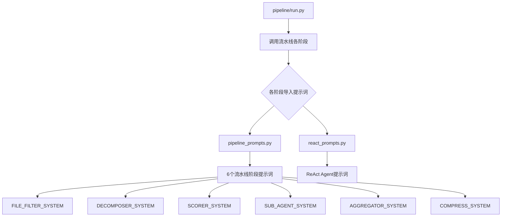
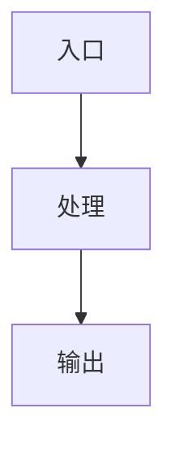
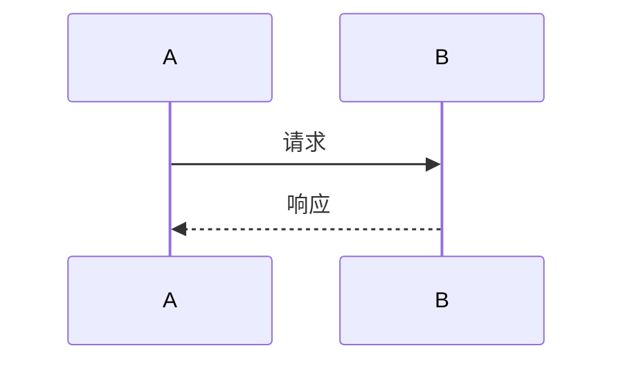
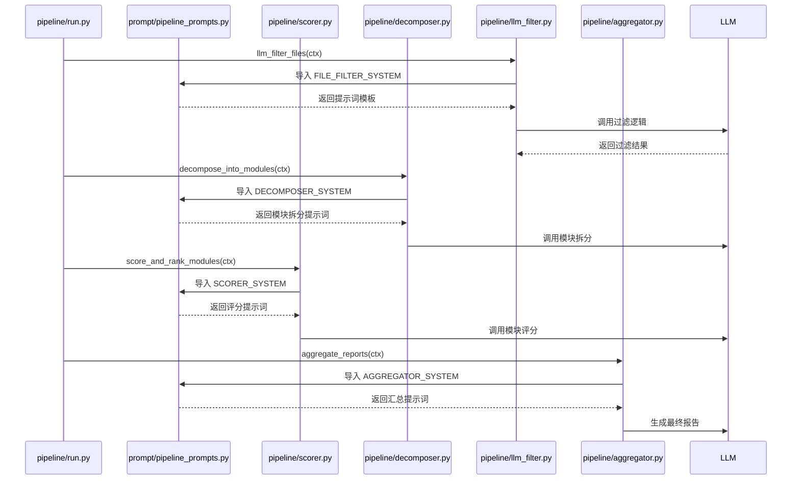

### 模块：prompt-management

#### 一、模块定位
本模块是 CodeDeepResearch 项目的提示词管理系统，负责集中管理所有 LLM 流水线各阶段的系统提示词和用户提示词。它解决了项目中提示词分散、难以维护的问题，通过统一的模块化设计为整个代码分析流水线提供标准化的提示词模板。在项目中处于核心支撑地位，是所有 LLM 调用的配置中心。

#### 二、核心架构图（Mermaid）


#### 三、关键实现（必须有代码）
**核心函数：SUB_AGENT_SYSTEM 提示词设计**

```python
SUB_AGENT_SYSTEM = """<role>资深软件工程师 & 代码架构分析师</role>
<task>对指定模块进行深度分析。</task>

## 工具
- read_file: 读取文件内容
- list_directory: 列出目录结构
- glob_pattern: 按模式搜索文件
- grep_content: 搜索文件内容
**批量调用，每次最多 10 个。**

## 分析思路

1. **读懂模块**：批量读取本模块所有文件，理解代码逻辑
2. **找关键代码**：识别核心类/函数，理解设计意图
3. **分析关系**：用 grep 查 import 引用，确认调用关系
4. **生成报告**：按结构输出，附代码片段和 Mermaid 图

## 报告结构

### 模块：（见用户提示词中的模块名）

#### 一、模块定位
本模块的职责、解决的问题、在项目中的地位。

#### 二、核心架构图（Mermaid）
用 Mermaid flowchart/sequenceDiagram 画出：
- 模块内部的关键调用链
- 数据如何在类/函数间流转
- 与外部模块的交互关系



#### 三、关键实现（必须有代码）
选取 1-2 个核心函数，展示关键代码，解释：
- 为什么这样实现
- 有什么设计技巧
- 可能的潜在问题

#### 四、数据流
用 Mermaid sequenceDiagram 描述：
- 输入 → 处理 → 输出的完整过程
- 关键状态变更



#### 五、依赖关系
- 本模块引用了哪些外部模块/函数（grep 确认）
- 其他模块如何调用本模块

#### 六、对外接口
公共 API 清单：函数签名 → 用途 → 示例

#### 七、总结
设计亮点、值得注意的问题、可能的改进方向。

## 质量要求
- 必须有实际代码片段
- Mermaid 图必须与代码对应
- 依赖关系要精确到函数级别
- 必须分析到函数级别
- 不能泛泛而谈
- ❌ 不能泛泛而谈

## 输出要求
- 直接输出 markdown 报告内容，不要加任何铺垫、解释性文字
- 开头即报告正文，第一行是用户提示词中指定的模块标题
- 不能有"基于深度分析"、"下面我来"、"生成报告如下"等废话
- ❌ 不能有任何铺垫句"""
```

**设计分析**：
1. **为什么这样实现**：采用结构化模板设计，确保所有子模块分析报告格式统一、内容完整。通过严格的"质量要求"和"输出要求"强制分析师提供高质量报告。
2. **设计技巧**：
   - 使用 XML 风格的 `<role>` 和 `<task>` 标签明确角色和任务
   - 提供具体的工具列表和调用限制（每次最多 10 个）
   - 详细的分析思路指导，避免分析师迷失方向
   - 强制要求 Mermaid 图和代码片段，确保分析深度
3. **潜在问题**：提示词长度较长（约 2000 字符），可能超出某些 LLM 的上下文限制。但考虑到分析任务的复杂性，这种详细程度是必要的。

#### 四、数据流


#### 五、依赖关系
**本模块被引用情况（grep 确认）：**
```python
# pipeline/aggregator.py:8
from prompt.pipeline_prompts import AGGREGATOR_SYSTEM, AGGREGATOR_USER

# pipeline/decomposer.py:6
from prompt.pipeline_prompts import DECOMPOSER_SYSTEM, DECOMPOSER_USER

# pipeline/llm_filter.py:7
from prompt.pipeline_prompts import FILE_FILTER_SYSTEM, FILE_FILTER_USER

# pipeline/researcher.py:10
from prompt.pipeline_prompts import SUB_AGENT_SYSTEM, SUB_AGENT_USER

# pipeline/scorer.py:6
from prompt.pipeline_prompts import SCORER_SYSTEM, SCORER_USER

# provider/adaptor.py:79
from prompt.pipeline_prompts import COMPRESS_USER

# test/llm_test.py:3
from prompt.test_system_prompt import SYSTEM_PROMPT
```

**本模块引用外部模块**：无。本模块是纯数据/配置模块，不依赖其他模块。

#### 六、对外接口
**公共 API 清单：**

1. **FILE_FILTER_SYSTEM/FILE_FILTER_USER**
   - 用途：LLM 文件过滤阶段的系统提示词和用户提示词
   - 示例：`from prompt.pipeline_prompts import FILE_FILTER_SYSTEM, FILE_FILTER_USER`

2. **DECOMPOSER_SYSTEM/DECOMPOSER_USER**
   - 用途：模块拆分阶段的提示词
   - 示例：`from prompt.pipeline_prompts import DECOMPOSER_SYSTEM, DECOMPOSER_USER`

3. **SCORER_SYSTEM/SCORER_USER**
   - 用途：模块评分阶段的提示词
   - 示例：`from prompt.pipeline_prompts import SCORER_SYSTEM, SCORER_USER`

4. **SUB_AGENT_SYSTEM/SUB_AGENT_USER**
   - 用途：子模块深度分析阶段的提示词
   - 示例：`from prompt.pipeline_prompts import SUB_AGENT_SYSTEM, SUB_AGENT_USER`

5. **AGGREGATOR_SYSTEM/AGGREGATOR_USER**
   - 用途：最终报告汇总阶段的提示词
   - 示例：`from prompt.pipeline_prompts import AGGREGATOR_SYSTEM, AGGREGATOR_USER`

6. **COMPRESS_SYSTEM/COMPRESS_USER**
   - 用途：对话压缩提示词（在 react_prompts.py 中）
   - 示例：`from prompt.react_prompts import COMPRESS_SYSTEM, COMPRESS_USER`

#### 七、总结
**设计亮点**：
1. **集中化管理**：将所有提示词集中在一个模块，便于维护和版本控制
2. **结构化设计**：每个提示词都有清晰的 SYSTEM 和 USER 部分，符合 LLM 调用规范
3. **详细指导**：特别是 SUB_AGENT_SYSTEM 提供了极其详细的分析指导，确保分析质量
4. **模块化分离**：pipeline_prompts.py 和 react_prompts.py 分离，职责清晰

**值得注意的问题**：
1. **pipeline_prompts_backup.py** 文件似乎是废弃的备份，包含已停用的评估提示词，可能造成混淆
2. **test_system_prompt.py** 文件仅包含一个简单的测试提示词，与主模块功能关联较弱
3. 提示词长度较长，可能在某些场景下需要优化

**可能的改进方向**：
1. 考虑将过长的提示词拆分为多个文件，按功能分类
2. 添加提示词版本管理，支持不同版本的提示词切换
3. 考虑引入提示词模板引擎，支持动态变量替换
4. 清理废弃的 backup 文件，保持代码库整洁