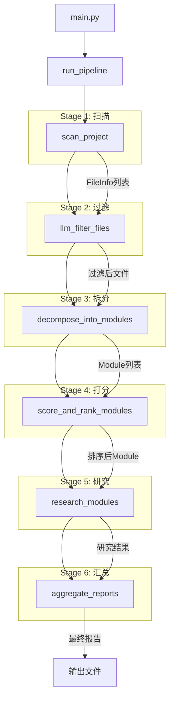
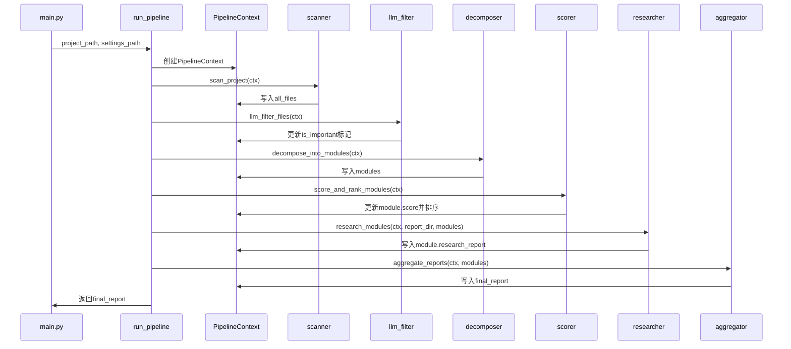

# research-pipeline

## 一、模块定位
research-pipeline 模块是 CodeDeepResearch 项目的核心流水线编排系统，负责自动化代码深度分析的完整流程。该模块实现了6阶段分析流水线：项目扫描 → LLM智能过滤 → 模块拆分 → 模块打分 → 深度研究 → 报告汇总。它作为项目的"大脑"，协调所有分析组件，将原始代码库转化为结构化的深度分析报告。

## 二、核心架构图



## 三、关键实现

### 1. run_pipeline 函数（pipeline/run.py）
```python
def run_pipeline(
    project_path: str,
    settings_path: str | None = None,
) -> str:
    """运行完整分析流水线。"""
    settings = load_settings(settings_path)
    project_path = os.path.abspath(project_path)
    project_name = os.path.basename(project_path)

    provider = settings["provider"]
    max_sub_agent_steps = settings["max_sub_agent_steps"]
    research_parallel = settings["research_parallel"]
    research_threads = settings["research_threads"]
    lite_model = get_lite_model()
    pro_model = get_pro_model()
    max_model = get_max_model()

    print(f"模型配置: lite={lite_model}, pro={pro_model}, max={max_model}")

    ctx = PipelineContext(
        project_path=project_path,
        project_name=project_name,
        provider=provider,
        lite_model=lite_model,
        pro_model=pro_model,
        max_model=max_model,
        max_sub_agent_steps=max_sub_agent_steps,
        research_parallel=research_parallel,
        research_threads=research_threads,
        settings=settings,
    )
```

**设计技巧**：
- 使用 `PipelineContext` 作为共享数据容器，贯穿整个流水线
- 支持并行研究模式（`research_parallel` 和 `research_threads` 配置）
- 分阶段打印进度，提供清晰的执行日志
- 自动创建带时间戳的报告目录，避免覆盖

**潜在问题**：
- 如果某个阶段失败，整个流水线会中断，没有容错机制
- 内存占用可能较大，因为所有文件内容和中间结果都保存在内存中

### 2. research_modules 函数（pipeline/researcher.py）
```python
def research_modules(ctx: PipelineContext, report_dir: str, selected: list[Module]) -> None:
    set_project_root(ctx.project_path)
    tools = [read_file, list_directory, glob_pattern, grep_content]
    file_tree = _build_file_tree(ctx.all_files)

    if ctx.research_parallel:
        print(f"  并行模式: {ctx.research_threads} 线程, {len(selected)} 个模块")
        with ThreadPoolExecutor(max_workers=ctx.research_threads) as executor:
            futures = {
                executor.submit(_research_one, ctx, module, tools, report_dir, file_tree): module
                for module in selected
            }
            for future in as_completed(futures):
                module = futures[future]
                try:
                    future.result()
                    print(f"  ✓ 模块完成: {module.name}")
                except Exception as e:
                    print(f"  ✗ 模块失败: {module.name} - {e}")
    else:
        print(f"  串行模式: {len(selected)} 个模块")
        for module in selected:
            _research_one(ctx, module, tools, report_dir, file_tree)
```

**设计技巧**：
- 支持并行和串行两种研究模式，适应不同资源环境
- 使用 `ThreadPoolExecutor` 实现真正的并行处理
- 每个模块独立研究，互不干扰
- 提供详细的成功/失败日志

**潜在问题**：
- 并行模式下可能遇到LLM API的并发限制
- 异常处理不够完善，模块失败不会影响其他模块，但也没有重试机制

## 四、数据流



## 五、依赖关系

### 本模块引用的外部模块/函数：
1. **provider.llm**：
   - `call_llm()` - 在 decomposer.py, llm_filter.py, scorer.py 中调用
   - `extract_json()` - 在 decomposer.py, llm_filter.py, scorer.py 中调用

2. **base.types**：
   - `EventType` - 在 researcher.py, aggregator.py 中引用
   - `SystemMessage`, `UserMessage` - 在 researcher.py, aggregator.py 中引用

3. **agent.react_agent**：
   - `stream()` - 在 researcher.py, aggregator.py 中调用

4. **prompt.pipeline_prompts**：
   - `DECOMPOSER_SYSTEM`, `DECOMPOSER_USER` - 在 decomposer.py 中引用
   - `FILE_FILTER_SYSTEM`, `FILE_FILTER_USER` - 在 llm_filter.py 中引用
   - `SCORER_SYSTEM`, `SCORER_USER` - 在 scorer.py 中引用
   - `SUB_AGENT_SYSTEM`, `SUB_AGENT_USER` - 在 researcher.py 中引用
   - `AGGREGATOR_SYSTEM`, `AGGREGATOR_USER` - 在 aggregator.py 中引用

5. **tool.fs_tool**：
   - `set_project_root()`, `read_file()`, `list_directory()`, `glob_pattern()`, `grep_content()` - 在 researcher.py, aggregator.py 中调用

6. **settings**：
   - `load_settings()`, `get_lite_model()`, `get_pro_model()`, `get_max_model()` - 在 run.py 中调用

### 其他模块如何调用本模块：
1. **main.py**：
   ```python
   from pipeline import run_pipeline
   report = run_pipeline(project_path=project_path, settings_path=args.settings)
   ```

2. **pipeline/__init__.py**：
   ```python
   from pipeline.run import run_pipeline
   ```

## 六、对外接口

### 公共 API 清单：

1. **run_pipeline(project_path: str, settings_path: str | None = None) -> str**
   - **用途**：执行完整的6阶段分析流水线
   - **示例**：
     ```python
     from pipeline import run_pipeline
     report = run_pipeline("/path/to/project", "settings.json")
     ```

2. **scan_project(ctx: PipelineContext) -> None**
   - **用途**：扫描项目目录，收集文件信息
   - **示例**：
     ```python
     from pipeline.scanner import scan_project
     from pipeline.types import PipelineContext
     ctx = PipelineContext(project_path="/path", project_name="test")
     scan_project(ctx)
     ```

3. **llm_filter_files(ctx: PipelineContext) -> None**
   - **用途**：使用LLM智能过滤不重要文件
   - **示例**：
     ```python
     from pipeline.llm_filter import llm_filter_files
     llm_filter_files(ctx)
     ```

4. **decompose_into_modules(ctx: PipelineContext) -> None**
   - **用途**：将项目拆分为逻辑模块
   - **示例**：
     ```python
     from pipeline.decomposer import decompose_into_modules
     decompose_into_modules(ctx)
     ```

5. **score_and_rank_modules(ctx: PipelineContext) -> None**
   - **用途**：为模块打分并按重要性排序
   - **示例**：
     ```python
     from pipeline.scorer import score_and_rank_modules
     score_and_rank_modules(ctx)
     ```

6. **research_modules(ctx: PipelineContext, report_dir: str, selected: list[Module]) -> None**
   - **用途**：深度研究指定模块
   - **示例**：
     ```python
     from pipeline.researcher import research_modules
     research_modules(ctx, "/report/dir", ctx.modules[:3])
     ```

7. **aggregate_reports(ctx: PipelineContext, selected: list) -> None**
   - **用途**：汇总所有模块报告为最终报告
   - **示例**：
     ```python
     from pipeline.aggregator import aggregate_reports
     aggregate_reports(ctx, ctx.modules)
     ```

## 七、总结

### 设计亮点：
1. **清晰的6阶段流水线设计**：每个阶段职责单一，易于理解和维护
2. **PipelineContext共享数据模式**：避免函数间传递大量参数，简化接口
3. **支持并行研究**：利用多线程加速大规模项目分析
4. **模块化设计**：每个阶段可独立测试和替换
5. **详细的执行日志**：提供完整的进度反馈

### 值得注意的问题：
1. **错误处理不足**：某个阶段失败会导致整个流水线中断，缺乏容错和重试机制
2. **内存占用**：所有文件内容和中间结果都保存在内存中，可能对大项目造成压力
3. **硬编码依赖**：对特定LLM API和工具集的依赖较强
4. **配置复杂**：需要正确设置多个模型和参数才能正常工作

### 改进方向：
1. **增加容错机制**：实现阶段失败时的降级处理或跳过机制
2. **优化内存使用**：考虑流式处理或磁盘缓存大型文件
3. **增加配置验证**：在流水线开始前验证所有必要配置
4. **添加监控指标**：记录每个阶段的执行时间和资源使用情况
5. **支持增量分析**：只分析变更的部分，提高重复分析的效率