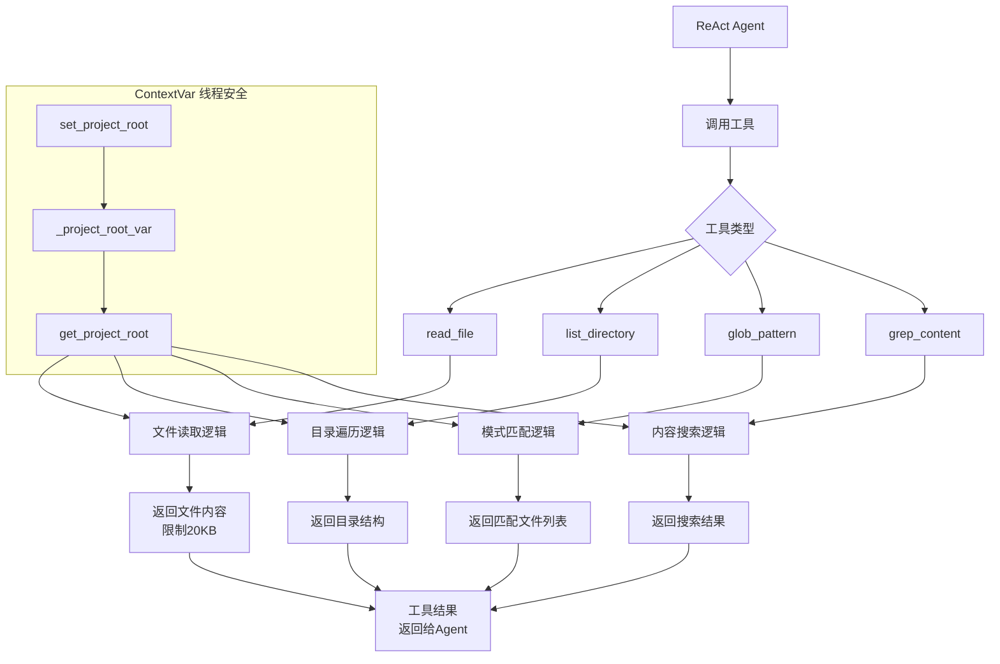
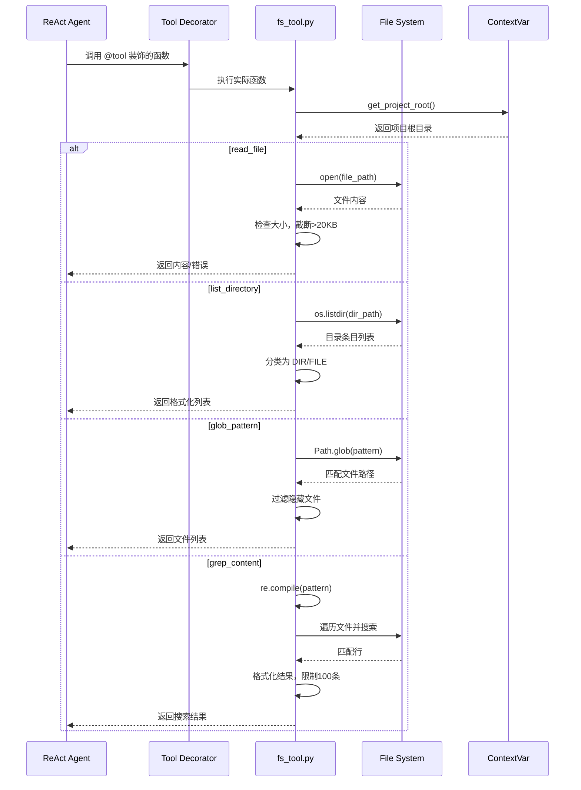

# tool-integration

## 一、模块定位
本模块是文件系统工具集成模块，为 ReAct 智能体提供文件系统操作能力。核心职责是封装文件读取、目录遍历、文件搜索等基础文件操作，通过 `@tool` 装饰器将这些功能标准化为可被 LLM 调用的工具。在项目中处于基础设施层，为 `pipeline/researcher.py` 和 `pipeline/aggregator.py` 提供文件访问能力，支持模块深度分析和最终报告汇总。

## 二、核心架构图（Mermaid）



## 三、关键实现（必须有代码）

### 1. `@tool` 装饰器集成
```python
@tool
def read_file(file_path: str) -> str:
    """Read the full contents of a file.

    Args:
        file_path: Relative path from the project root
    """
    project_root = get_project_root()
    full_path = os.path.join(project_root, file_path) if project_root else file_path
    try:
        with open(full_path, "r", encoding="utf-8", errors="replace") as f:
            content = f.read(MAX_READ_SIZE)
        if os.path.getsize(full_path) > MAX_READ_SIZE:
            content += f"\n\n... [truncated, file exceeds {MAX_READ_SIZE // 1024}KB]"
        return content
    except FileNotFoundError:
        return f"Error: File not found: {file_path}"
    except IsADirectoryError:
        return f"Error: {file_path} is a directory, not a file"
    except Exception as e:
        return f"Error reading file: {e}"
```

**设计技巧**：
1. **上下文感知**：通过 `ContextVar` 实现线程安全的项目根目录管理，支持多线程并行研究
2. **安全限制**：`MAX_READ_SIZE = 20 * 1024` 防止上下文膨胀，大文件自动截断
3. **错误处理**：区分 `FileNotFoundError`、`IsADirectoryError` 等不同错误类型，提供明确错误信息
4. **编码安全**：使用 `errors="replace"` 处理编码问题，避免解码失败

### 2. `grep_content` 工具实现
```python
@tool
def grep_content(pattern: str, file_pattern: str = "**/*") -> str:
    """Search for a regex pattern across files.

    Args:
        pattern: Regular expression pattern to search for
        file_pattern: Glob pattern to limit which files to search, default all files
    """
    project_root = get_project_root()
    root = Path(project_root) if project_root else Path.cwd()
    try:
        regex = re.compile(pattern)
    except re.error as e:
        return f"Invalid regex pattern: {e}"

    results = []
    for match_path in sorted(root.glob(file_pattern)):
        if not match_path.is_file():
            continue
        rel = os.path.relpath(match_path, project_root) if project_root else match_path
        if any(part.startswith(".") for part in Path(rel).parts):
            continue
        try:
            with open(match_path, "r", encoding="utf-8", errors="ignore") as f:
                for line_no, line in enumerate(f, 1):
                    if regex.search(line):
                        results.append(f"{rel}:{line_no}: {line.rstrip()}")
                        if len(results) >= MAX_GREP_RESULTS:
                            return "\n".join(results) + f"\n... [truncated at {MAX_GREP_RESULTS} results]"
        except Exception:
            continue

    if not results:
        return "No matches found."
    return "\n".join(results)
```

**设计技巧**：
1. **双重过滤**：`file_pattern` 控制搜索范围，`pattern` 控制搜索内容
2. **隐藏文件排除**：自动跳过以 `.` 开头的隐藏文件/目录
3. **结果限制**：`MAX_GREP_RESULTS = 100` 防止返回过多结果
4. **错误容忍**：使用 `errors="ignore"` 和 `try-except` 处理文件读取异常

## 四、数据流



## 五、依赖关系

### 本模块引用外部模块：
1. **base/types.py**：
   - `from base.types import tool` - 核心装饰器
   - `Tool` 类定义和 `@tool` 装饰器实现

2. **agent/react_agent.py**：
   - 通过 `react_stream` 函数被调用，提供工具执行环境

### 其他模块调用本模块：
1. **pipeline/researcher.py**：
   ```python
   from tool.fs_tool import set_project_root, read_file, list_directory, glob_pattern, grep_content
   tools = [read_file, list_directory, glob_pattern, grep_content]
   ```

2. **pipeline/aggregator.py**：
   ```python
   from tool.fs_tool import set_project_root, read_file, list_directory, glob_pattern, grep_content
   tools = [read_file, list_directory, glob_pattern, grep_content]
   ```

3. **prompt/pipeline_prompts.py**：
   - 在系统提示中描述工具功能和使用方法

## 六、对外接口

### 公共 API 清单：

| 函数签名 | 用途 | 示例 |
|---------|------|------|
| `set_project_root(path: str) -> None` | 设置项目根目录（线程安全） | `set_project_root("/path/to/project")` |
| `read_file(file_path: str) -> str` | 读取文件内容，限制20KB | `read_file("src/main.py")` |
| `list_directory(dir_path: str) -> str` | 列出目录内容 | `list_directory("src/")` |
| `glob_pattern(pattern: str) -> str` | 按模式搜索文件 | `glob_pattern("**/*.py")` |
| `grep_content(pattern: str, file_pattern: str = "**/*") -> str` | 搜索文件内容 | `grep_content("def.*test", "**/*.py")` |

### 工具元数据（通过 @tool 自动生成）：
```python
# read_file 工具定义
Tool(
    name="read_file",
    description="Read the full contents of a file.",
    parameters={
        "file_path": ToolProperty(
            type="string", 
            description="Relative path from the project root"
        )
    },
    required=["file_path"],
    func=<function read_file>
)
```

## 七、总结

### 设计亮点：
1. **线程安全设计**：使用 `ContextVar` 实现多线程安全的项目根目录管理，支持并行研究
2. **资源控制**：文件大小限制（20KB）、搜索结果限制（100条）防止上下文爆炸
3. **错误处理完善**：区分不同类型的文件系统错误，提供明确错误信息
4. **隐藏文件过滤**：自动跳过 `.git`、`.DS_Store` 等隐藏文件，提高搜索效率

### 潜在问题：
1. **路径解析**：`glob_pattern` 使用 `Path.glob()` 可能在不同操作系统上有差异
2. **编码处理**：`errors="replace"` 可能丢失部分字符信息
3. **性能考虑**：`grep_content` 遍历所有文件时可能较慢，无缓存机制

### 改进方向：
1. **添加缓存**：对频繁读取的文件添加内存缓存
2. **增量搜索**：支持从上次搜索结果继续搜索
3. **文件类型过滤**：支持按文件扩展名过滤搜索范围
4. **异步支持**：提供异步版本的工具函数，提高并发性能